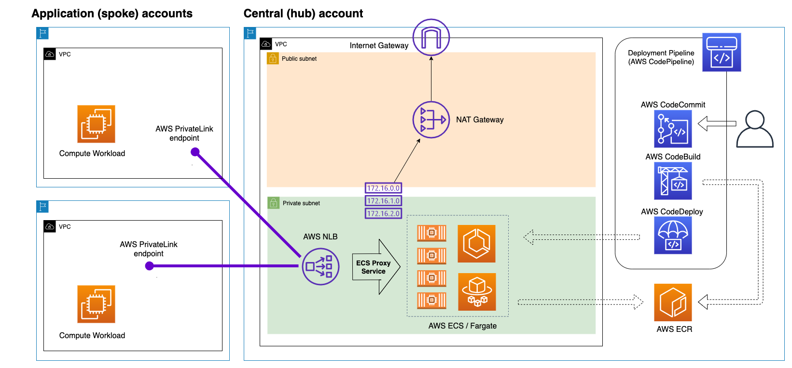
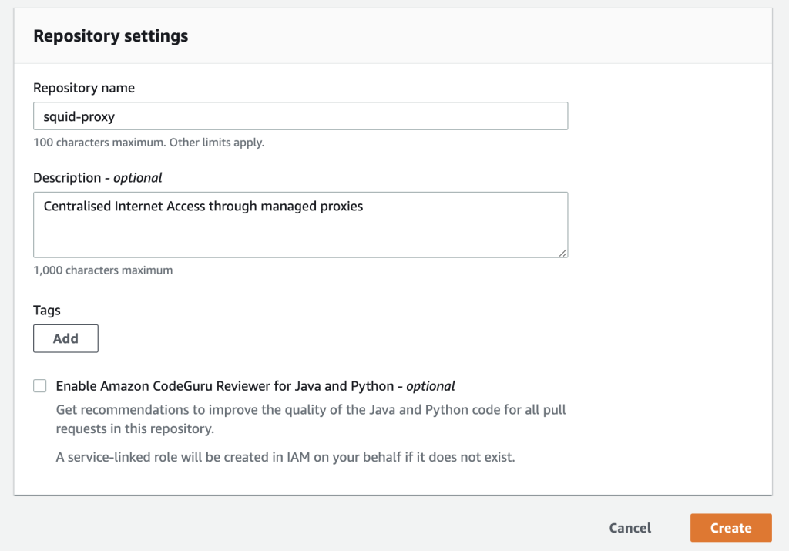
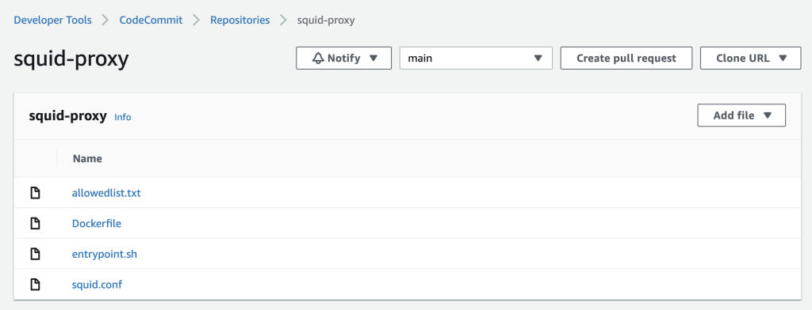

[Providing controlled internet access through centralised proxy servers using AWS Fargate and PrivateLink by Sanjay Dandeker and Saurabh Kothari ](https://aws.amazon.com/blogs/networking-and-content-delivery/providing-controlled-internet-access-through-centralised-proxy-servers-using-aws-fargate-and-privatelink/)

# Summary

1. NLB fronting ECS
2. VPC endpoint fronting NLB

# Demo



# 1. Create Codecommit repo



# 2. Upload files to the Repo



# 3. Create the ECS Service Linked Role

```bash
aws iam create-service-linked-role --aws-service-name ecs.amazonaws.com
```