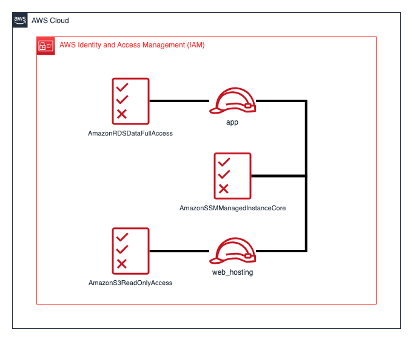
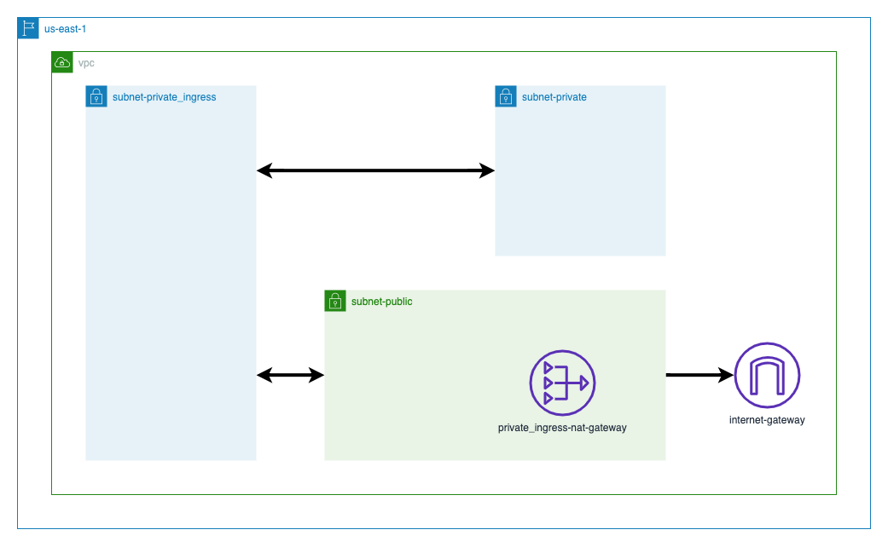
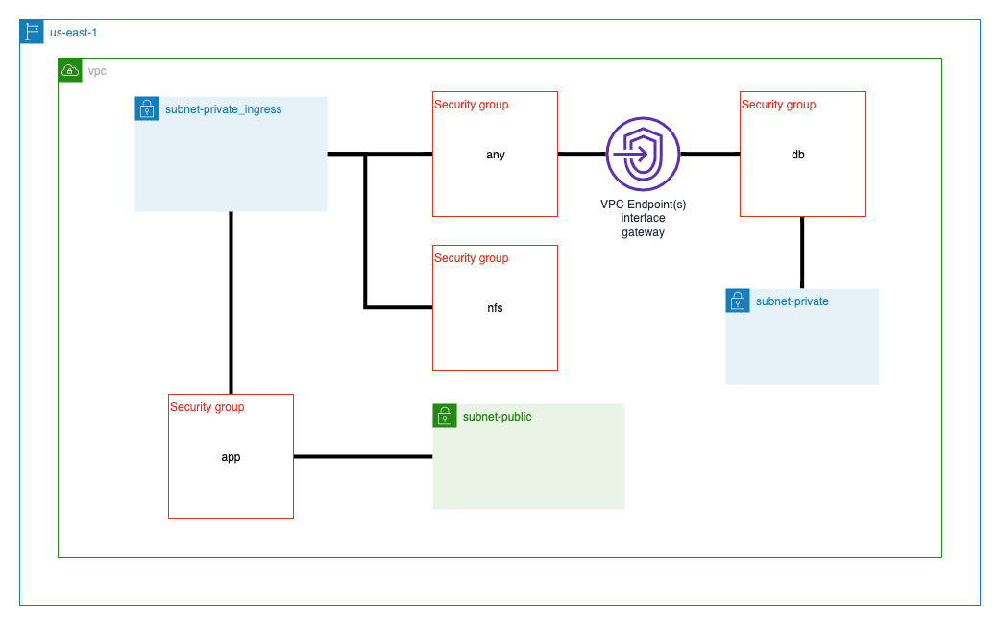
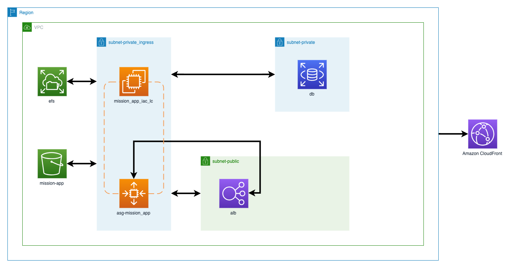

<!-- TOC -->

- [1. Create IAM Resources](#1-create-iam-resources)
  - [1.1. confirm the successful creation of the instance profiles](#11-confirm-the-successful-creation-of-the-instance-profiles)
- [Create Networking resources](#create-networking-resources)
- [Create Security Resources](#create-security-resources)
- [Create Resources for Application](#create-resources-for-application)

<!-- /TOC -->

In this project we see how to create networking resources using core constructs and not use any 3rd party modules. For module approach see Kalyan's course `/Volumes/Lexar/git-repos/aws-repo/courses/eks/udemy/aws-eks-kubernetes-masterclass-v3`

# 1. Create IAM Resources

```bash
cd /Volumes/Lexar/git-repos/aws-repo/my-aws-workshops/terraform/terraform101/terraform

terraform init
terraform validate
terraform plan
terraform apply --auto-approve
```

## 1.1. confirm the successful creation of the instance profiles



```bash
aws iam get-instance-profile --instance-profile-name app-profile | grep InstanceProfile -q && echo "Successfully created app-profile" || echo "Creation of app-profile was unsuccessful"

aws iam get-instance-profile --instance-profile-name web-hosting-profile | grep InstanceProfile -q && echo "Successfully created web-hosting-profile" || echo "Creation of web-hosting-profile was unsuccessful"
```

# Create Networking resources

see section `Creating Networking resources` of main.tf



# Create Security Resources

We create Security Groups and VPC endpoints in your VPC.



# Create Resources for Application



**aws_db_subnet_group** - Create a subnet group for database across availability zones
**random_password** - Create a random password
**aws_secretsmanager_secret** - Create a Secrets Manager entry
**aws_secretsmanager_secret_version** - Create a value for the Secrets Manager entry
**aws_db_instance** - Create a MySQL database
**aws_efs_file_system** - Create an EFS volume
**aws_efs_mount_target** - Create a configuration where the EFS volume to a set of instances
**aws_instance** - Create an EC2 that bootstrap the Wordpress application
**aws_ami_copy** - Create a copy of the Amazon Machine Image (AMI) being used
**aws_lb** - Create a application load balancer (ALB) for the Wordpress web application
**aws_launch_template** - Create a launch template that hosts the Wordpress web application
**aws_autoscaling_group** - Create a auto-scaler group that scale the Wordpress web application instances
**aws_autoscaling_policy** - Create a auto scaling policy
**aws_cloudwatch_metric_alarm** - Create a CloudWatch Metric Alarm
**aws_lb_target_group** - Create a target group to attach the load balancer for the Wordpress web application
**aws_lb_listener** - Create a load balancer listener for the ALB
**tls_private_key** - Create a TLS private key
**tls_self_signed_cert** - Create a public TLS certificate signed by the private key
**aws_acm_certificate** - Create an ACM certificate entry with the TLS public certificate and private key
**aws_s3_bucket** - Create a private S3 Bucket
**aws_s3_bucket_public_access_block** - Create a public access block which disable public access for the private S3 Bucket
**aws_s3_object** - An object of S3, typically represent data similar file
**aws_cloudfront_distribution** - Create a CloudFront distribution for the Wordpress web application
**aws_cloudfront_cache_policy** - Create a CloudFront cache policy for the Wordpress web application