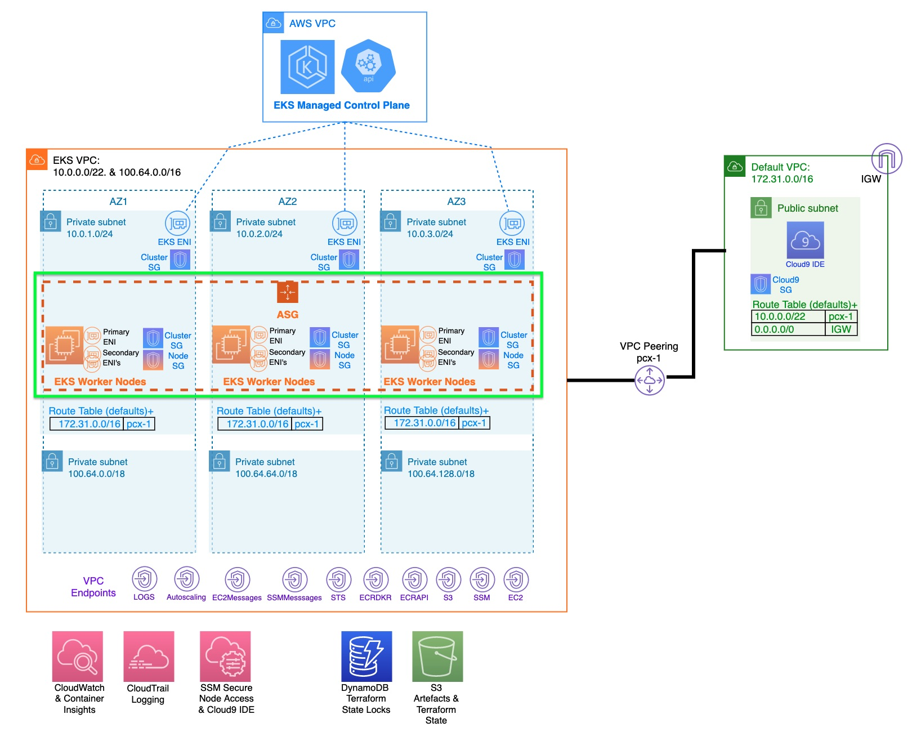
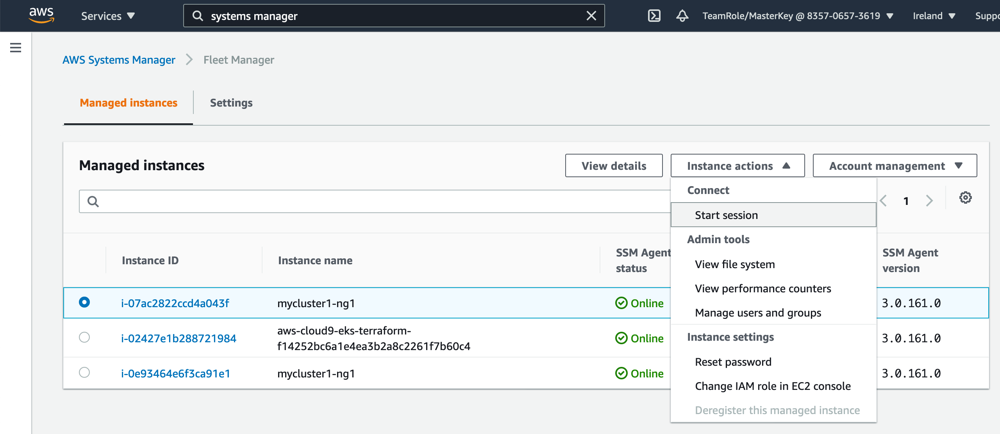

<h1>8. Create a customized managed Node Group</h1>

we will use Terraform to deploy a customized Managed Node Group using an AMI we specify and a SSM agent as a demonstration of deploying custom software to the worker nodes

Following resources created

* A Launch template
* A NodeGroup using the launch template above
* A null resource (this will auth us to the cluster)



```bash

cd ~/environment/tfekscode/nodeg

terraform init
terraform validate
terraform plan -out tfplan

terraform apply tfplan
```

# Test connectivity to node

Systems Manager -> Fleet Manager



# Test Networking


# Files

1. data-eks-cluster.tf:
2. user_data.tf
3. ssm-param-ami.tf
4. launch_template.tf
5. aws_eks_node_group_ng1.tf: sets up an EKS node group with specified configurations, dependencies, and scaling parameters within an AWS environment.
6. null_resource.tf
7. c9-auth.sh
8. auth-cicd.sh
9. outputs.tf

annotate-nodes.sh
aws_eks-addons.tf.sav
backend-nodeg.tf: defines terraform version, s3 bucket for state, dynamodb table for locks and aws credentials local location
data-aws.tf
data-params-cluster.tf
data-params-iam.tf
data-params-net.tf
data-params-setup.tf
data-subnet-i.tf
null_annotate.tf
reannotate-nodes.sh
vars-dynamodb.tf.sav
vars-main.tf

# net/ssm-params-net.tf: for resource aws_ssm_parameter

eks-vpc=aws_vpc.cluster.id
eks-cidr=aws_vpc.cluster.cidr_block
sub-isol1=aws_subnet.subnet-i1.id
sub-isol2=aws_subnet.subnet-i2.id
sub-isol3=aws_subnet.subnet-i3.id
sub-p1=aws_subnet.subnet-p1.id
sub-priv1=aws_subnet.subnet-p1.id
sub-priv2=aws_subnet.subnet-p2.id
sub-priv3=aws_subnet.subnet-p1.id
cicd-vpc=aws_vpc.vpc-cicd.id
cicd-cidr=aws_vpc.vpc-cicd.cidr_block
net-cluster-sg=aws_security_group.cluster-sg.id
allnodes-sg=aws_security_group.allnodes-sg.id
rtb-isol=aws_route_table.rtb-i.id
rtb-priv1=aws_route_table.rtb-p1.id
rtb-priv2=aws_route_table.rtb-p2.id
rtb-priv3=aws_route_table.rtb-p3.id
