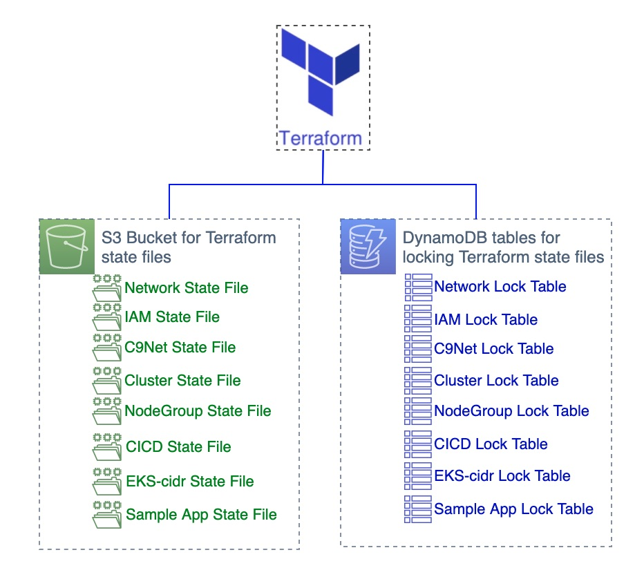

```javascript {.line-numbers}
data.aws_region.current: Reading...
data.aws_availability_zones.az: Reading...
data.aws_caller_identity.current: Reading...
data.aws_region.current: Read complete after 0s [id=us-east-1]
data.aws_caller_identity.current: Read complete after 1s [id=113534181560]
data.aws_availability_zones.az: Read complete after 1s [id=us-east-1]

Terraform used the selected providers to generate the following execution plan. Resource actions are indicated with the following symbols:
  + create

Terraform will perform the following actions:

  # ---------------------------------------------------- see /tfekscode/tf-setup/dynamodb-tables.tf

  # aws_dynamodb_table.terraform_locks[0] will be created
  + resource "aws_dynamodb_table" "terraform_locks" {
      + arn              = (known after apply)
      + billing_mode     = "PAY_PER_REQUEST"
      + hash_key         = "LockID"
      + id               = (known after apply)
      + name             = "terraform_locks_tf-setup"
      + read_capacity    = (known after apply)
      + stream_arn       = (known after apply)
      + stream_label     = (known after apply)
      + stream_view_type = (known after apply)
      + tags_all         = (known after apply)
      + write_capacity   = (known after apply)

      + attribute {
          + name = "LockID"
          + type = "S"
        }

      + point_in_time_recovery {
          + enabled = true
        }

      + server_side_encryption {
          + enabled     = true
          + kms_key_arn = (known after apply)
        }
    }

  # aws_dynamodb_table.terraform_locks[1] will be created
  + resource "aws_dynamodb_table" "terraform_locks" {
      + arn              = (known after apply)
      + billing_mode     = "PAY_PER_REQUEST"
      + hash_key         = "LockID"
      + id               = (known after apply)
      + name             = "terraform_locks_net"
      + read_capacity    = (known after apply)
      + stream_arn       = (known after apply)
      + stream_label     = (known after apply)
      + stream_view_type = (known after apply)
      + tags_all         = (known after apply)
      + write_capacity   = (known after apply)

      + attribute {
          + name = "LockID"
          + type = "S"
        }

      + point_in_time_recovery {
          + enabled = true
        }

      + server_side_encryption {
          + enabled     = true
          + kms_key_arn = (known after apply)
        }
    }

  # aws_dynamodb_table.terraform_locks[2] will be created
  + resource "aws_dynamodb_table" "terraform_locks" {
      + arn              = (known after apply)
      + billing_mode     = "PAY_PER_REQUEST"
      + hash_key         = "LockID"
      + id               = (known after apply)
      + name             = "terraform_locks_iam"
      + read_capacity    = (known after apply)
      + stream_arn       = (known after apply)
      + stream_label     = (known after apply)
      + stream_view_type = (known after apply)
      + tags_all         = (known after apply)
      + write_capacity   = (known after apply)

      + attribute {
          + name = "LockID"
          + type = "S"
        }

      + point_in_time_recovery {
          + enabled = true
        }

      + server_side_encryption {
          + enabled     = true
          + kms_key_arn = (known after apply)
        }
    }

  # aws_dynamodb_table.terraform_locks[3] will be created
  + resource "aws_dynamodb_table" "terraform_locks" {
      + arn              = (known after apply)
      + billing_mode     = "PAY_PER_REQUEST"
      + hash_key         = "LockID"
      + id               = (known after apply)
      + name             = "terraform_locks_c9net"
      + read_capacity    = (known after apply)
      + stream_arn       = (known after apply)
      + stream_label     = (known after apply)
      + stream_view_type = (known after apply)
      + tags_all         = (known after apply)
      + write_capacity   = (known after apply)

      + attribute {
          + name = "LockID"
          + type = "S"
        }

      + point_in_time_recovery {
          + enabled = true
        }

      + server_side_encryption {
          + enabled     = true
          + kms_key_arn = (known after apply)
        }
    }

  # aws_dynamodb_table.terraform_locks[4] will be created
  + resource "aws_dynamodb_table" "terraform_locks" {
      + arn              = (known after apply)
      + billing_mode     = "PAY_PER_REQUEST"
      + hash_key         = "LockID"
      + id               = (known after apply)
      + name             = "terraform_locks_cluster"
      + read_capacity    = (known after apply)
      + stream_arn       = (known after apply)
      + stream_label     = (known after apply)
      + stream_view_type = (known after apply)
      + tags_all         = (known after apply)
      + write_capacity   = (known after apply)

      + attribute {
          + name = "LockID"
          + type = "S"
        }

      + point_in_time_recovery {
          + enabled = true
        }

      + server_side_encryption {
          + enabled     = true
          + kms_key_arn = (known after apply)
        }
    }

  # aws_dynamodb_table.terraform_locks[5] will be created
  + resource "aws_dynamodb_table" "terraform_locks" {
      + arn              = (known after apply)
      + billing_mode     = "PAY_PER_REQUEST"
      + hash_key         = "LockID"
      + id               = (known after apply)
      + name             = "terraform_locks_nodeg"
      + read_capacity    = (known after apply)
      + stream_arn       = (known after apply)
      + stream_label     = (known after apply)
      + stream_view_type = (known after apply)
      + tags_all         = (known after apply)
      + write_capacity   = (known after apply)

      + attribute {
          + name = "LockID"
          + type = "S"
        }

      + point_in_time_recovery {
          + enabled = true
        }

      + server_side_encryption {
          + enabled     = true
          + kms_key_arn = (known after apply)
        }
    }

  # aws_dynamodb_table.terraform_locks[6] will be created
  + resource "aws_dynamodb_table" "terraform_locks" {
      + arn              = (known after apply)
      + billing_mode     = "PAY_PER_REQUEST"
      + hash_key         = "LockID"
      + id               = (known after apply)
      + name             = "terraform_locks_cicd"
      + read_capacity    = (known after apply)
      + stream_arn       = (known after apply)
      + stream_label     = (known after apply)
      + stream_view_type = (known after apply)
      + tags_all         = (known after apply)
      + write_capacity   = (known after apply)

      + attribute {
          + name = "LockID"
          + type = "S"
        }

      + point_in_time_recovery {
          + enabled = true
        }

      + server_side_encryption {
          + enabled     = true
          + kms_key_arn = (known after apply)
        }
    }

  # aws_dynamodb_table.terraform_locks[7] will be created
  + resource "aws_dynamodb_table" "terraform_locks" {
      + arn              = (known after apply)
      + billing_mode     = "PAY_PER_REQUEST"
      + hash_key         = "LockID"
      + id               = (known after apply)
      + name             = "terraform_locks_sampleapp"
      + read_capacity    = (known after apply)
      + stream_arn       = (known after apply)
      + stream_label     = (known after apply)
      + stream_view_type = (known after apply)
      + tags_all         = (known after apply)
      + write_capacity   = (known after apply)

      + attribute {
          + name = "LockID"
          + type = "S"
        }

      + point_in_time_recovery {
          + enabled = true
        }

      + server_side_encryption {
          + enabled     = true
          + kms_key_arn = (known after apply)
        }
    }

  # aws_dynamodb_table.terraform_locks[8] will be created
  + resource "aws_dynamodb_table" "terraform_locks" {
      + arn              = (known after apply)
      + billing_mode     = "PAY_PER_REQUEST"
      + hash_key         = "LockID"
      + id               = (known after apply)
      + name             = "terraform_locks_fargate"
      + read_capacity    = (known after apply)
      + stream_arn       = (known after apply)
      + stream_label     = (known after apply)
      + stream_view_type = (known after apply)
      + tags_all         = (known after apply)
      + write_capacity   = (known after apply)

      + attribute {
          + name = "LockID"
          + type = "S"
        }

      + point_in_time_recovery {
          + enabled = true
        }

      + server_side_encryption {
          + enabled     = true
          + kms_key_arn = (known after apply)
        }
    }

  # ---------------------------------------------------- see kms.tf
  # aws_kms_key.ekskey will be created
  + resource "aws_kms_key" "ekskey" {
      + arn                                = (known after apply)
      + bypass_policy_lockout_safety_check = false
      + customer_master_key_spec           = "SYMMETRIC_DEFAULT"
      + description                        = "EKS KMS Key 2 mycluster1"
      + enable_key_rotation                = false
      + id                                 = (known after apply)
      + is_enabled                         = true
      + key_id                             = (known after apply)
      + key_usage                          = "ENCRYPT_DECRYPT"
      + multi_region                       = (known after apply)
      + policy                             = (known after apply)
      + tags_all                           = (known after apply)
    }

 # ---------------------------------------------------- s3-bucket.tf

  # aws_s3_bucket.terraform_state will be created
  + resource "aws_s3_bucket" "terraform_state" {
      + acceleration_status         = (known after apply)
      + acl                         = (known after apply)
      + arn                         = (known after apply)
      + bucket                      = (known after apply)
      + bucket_domain_name          = (known after apply)
      + bucket_prefix               = (known after apply)
      + bucket_regional_domain_name = (known after apply)
      + force_destroy               = true
      + hosted_zone_id              = (known after apply)
      + id                          = (known after apply)
      + object_lock_enabled         = (known after apply)
      + policy                      = (known after apply)
      + region                      = (known after apply)
      + request_payer               = (known after apply)
      + tags_all                    = (known after apply)
      + website_domain              = (known after apply)
      + website_endpoint            = (known after apply)
    }

 # ---------------------------------------------------- s3-bucket.tf

  # aws_s3_bucket_public_access_block.pub_block_state will be created
  + resource "aws_s3_bucket_public_access_block" "pub_block_state" {
      + block_public_acls       = true
      + block_public_policy     = true
      + bucket                  = (known after apply)
      + id                      = (known after apply)
      + ignore_public_acls      = true
      + restrict_public_buckets = true
    }

  # aws_s3_bucket_server_side_encryption_configuration.terraform_state will be created
  + resource "aws_s3_bucket_server_side_encryption_configuration" "terraform_state" {
      + bucket = (known after apply)
      + id     = (known after apply)

      + rule {
          + bucket_key_enabled = false

          + apply_server_side_encryption_by_default {
              + kms_master_key_id = (known after apply)
              + sse_algorithm     = "aws:kms"
            }
        }
    }

  # aws_s3_bucket_versioning.terraform_state will be created
  + resource "aws_s3_bucket_versioning" "terraform_state" {
      + bucket = (known after apply)
      + id     = (known after apply)

      + versioning_configuration {
          + mfa_delete = (known after apply)
          + status     = "Enabled"
        }
    }

 # ---------------------------------------------------- ssm-params-setup.tf

  # aws_ssm_parameter.tf-eks-buck-name will be created
  + resource "aws_ssm_parameter" "tf-eks-buck-name" {
      + arn            = (known after apply)
      + data_type      = (known after apply)
      + description    = "The Terraform State bucket name for the workshop"
      + id             = (known after apply)
      + insecure_value = (known after apply)
      + key_id         = (known after apply)
      + name           = "/workshop/tf-eks/bucket-name"
      + tags           = {
          + "workshop" = "tf-eks-workshop"
        }
      + tags_all       = {
          + "workshop" = "tf-eks-workshop"
        }
      + tier           = (known after apply)
      + type           = "String"
      + value          = (sensitive value)
      + version        = (known after apply)
    }

  # aws_ssm_parameter.tf-eks-cluster-name will be created
  + resource "aws_ssm_parameter" "tf-eks-cluster-name" {
      + arn            = (known after apply)
      + data_type      = (known after apply)
      + description    = "The EKS cluster name for the workshop"
      + id             = (known after apply)
      + insecure_value = (known after apply)
      + key_id         = (known after apply)
      + name           = "/workshop/tf-eks/cluster-name"
      + tags           = {
          + "workshop" = "tf-eks-workshop"
        }
      + tags_all       = {
          + "workshop" = "tf-eks-workshop"
        }
      + tier           = (known after apply)
      + type           = "String"
      + value          = (sensitive value)
      + version        = (known after apply)
    }

  # aws_ssm_parameter.tf-eks-id will be created
  + resource "aws_ssm_parameter" "tf-eks-id" {
      + arn            = (known after apply)
      + data_type      = (known after apply)
      + description    = "The unique id for the workshop"
      + id             = (known after apply)
      + insecure_value = (known after apply)
      + key_id         = (known after apply)
      + name           = "/workshop/tf-eks/id"
      + tags           = {
          + "workshop" = "tf-eks-workshop"
        }
      + tags_all       = {
          + "workshop" = "tf-eks-workshop"
        }
      + tier           = (known after apply)
      + type           = "String"
      + value          = (sensitive value)
      + version        = (known after apply)
    }

  # aws_ssm_parameter.tf-eks-keyarn will be created
  + resource "aws_ssm_parameter" "tf-eks-keyarn" {
      + arn            = (known after apply)
      + data_type      = (known after apply)
      + description    = "The keyid for the workshop"
      + id             = (known after apply)
      + insecure_value = (known after apply)
      + key_id         = (known after apply)
      + name           = "/workshop/tf-eks/keyarn"
      + tags           = {
          + "workshop" = "tf-eks-workshop"
        }
      + tags_all       = {
          + "workshop" = "tf-eks-workshop"
        }
      + tier           = (known after apply)
      + type           = "String"
      + value          = (sensitive value)
      + version        = (known after apply)
    }

  # aws_ssm_parameter.tf-eks-keyid will be created
  + resource "aws_ssm_parameter" "tf-eks-keyid" {
      + arn            = (known after apply)
      + data_type      = (known after apply)
      + description    = "The keyid for the workshop"
      + id             = (known after apply)
      + insecure_value = (known after apply)
      + key_id         = (known after apply)
      + name           = "/workshop/tf-eks/keyid"
      + tags           = {
          + "workshop" = "tf-eks-workshop"
        }
      + tags_all       = {
          + "workshop" = "tf-eks-workshop"
        }
      + tier           = (known after apply)
      + type           = "String"
      + value          = (sensitive value)
      + version        = (known after apply)
    }

  # aws_ssm_parameter.tf-eks-region will be created
  + resource "aws_ssm_parameter" "tf-eks-region" {
      + arn            = (known after apply)
      + data_type      = (known after apply)
      + description    = "The region for the workshop"
      + id             = (known after apply)
      + insecure_value = (known after apply)
      + key_id         = (known after apply)
      + name           = "/workshop/tf-eks/region"
      + tags           = {
          + "workshop" = "tf-eks-workshop"
        }
      + tags_all       = {
          + "workshop" = "tf-eks-workshop"
        }
      + tier           = (known after apply)
      + type           = "String"
      + value          = (sensitive value)
      + version        = (known after apply)
    }

  # aws_ssm_parameter.tf-eks-version will be created
  + resource "aws_ssm_parameter" "tf-eks-version" {
      + arn            = (known after apply)
      + data_type      = (known after apply)
      + description    = "The EKS Version"
      + id             = (known after apply)
      + insecure_value = (known after apply)
      + key_id         = (known after apply)
      + name           = "/workshop/tf-eks/eks-version"
      + tags           = {
          + "workshop" = "tf-eks-workshop"
        }
      + tags_all       = {
          + "workshop" = "tf-eks-workshop"
        }
      + tier           = (known after apply)
      + type           = "String"
      + value          = (sensitive value)
      + version        = (known after apply)
    }

# ------------------------------------------- null_resource.tf

  # null_resource.gen_backend will be created
  + resource "null_resource" "gen_backend" {
      + id       = (known after apply)
      + triggers = (known after apply)
    }

  # random_id.id1 will be created
  + resource "random_id" "id1" {
      + b64_std     = (known after apply)
      + b64_url     = (known after apply)
      + byte_length = 8
      + dec         = (known after apply)
      + hex         = (known after apply)
      + id          = (known after apply)
    }

Plan: 23 to add, 0 to change, 0 to destroy.

Changes to Outputs:
  + keyid     = (known after apply)
  + region    = [
      + (known after apply),
    ]
  + s3_bucket = [
      + (known after apply),
    ]
  + tfid      = (known after apply)
```
