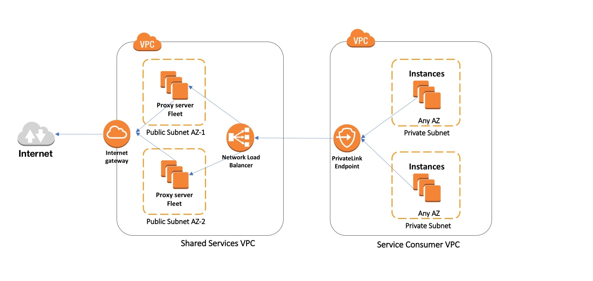

<h1>[How to use AWS PrivateLink to secure and scale web filtering using explicit proxy by Vinod Madabushi and Sahil Thapar](https://aws.amazon.com/blogs/networking-and-content-delivery/how-to-use-aws-privatelink-to-secure-and-scale-web-filtering-using-explicit-proxy/)</h1>



# Demo

```bash
aws cloudformation create-stack \
  --stack-name privatelink \
  --template-body file://./private-link-for-vpc-vpc.yaml  \
  --parameters \
    ParameterKey="KeyName",ParameterValue="2023iamadmin" \
  --capabilities CAPABILITY_NAMED_IAM
```

# Cleanup

```bash
aws cloudformation delete-stack \
  --stack-name privatelink
```

# FAQs

1. VPC endpoints support IPv4 traffic only.
1. Endpoints are supported within the same Region only.
1. You cannot create an endpoint between a VPC and a service in a different Region.