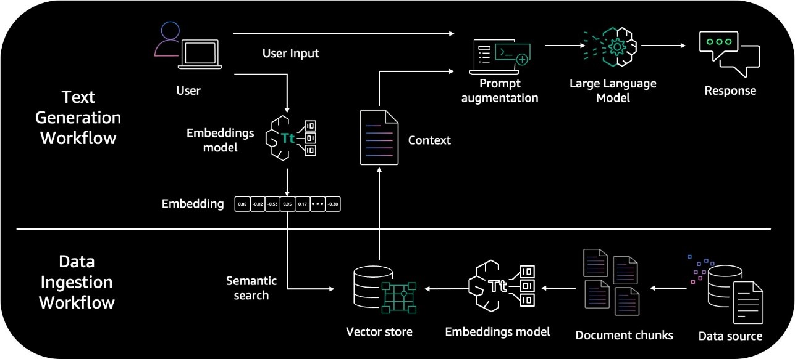
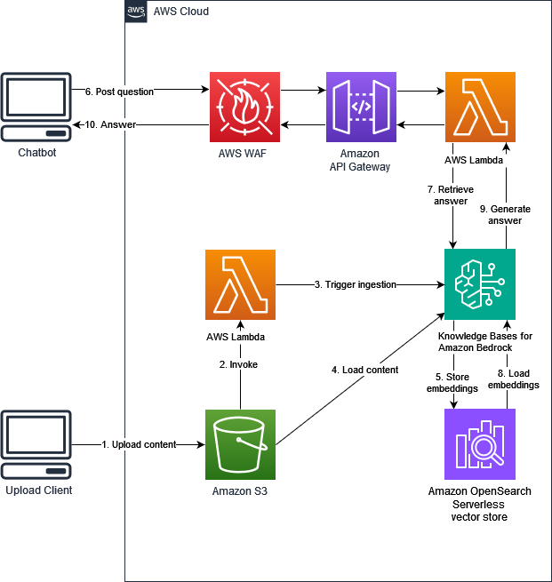
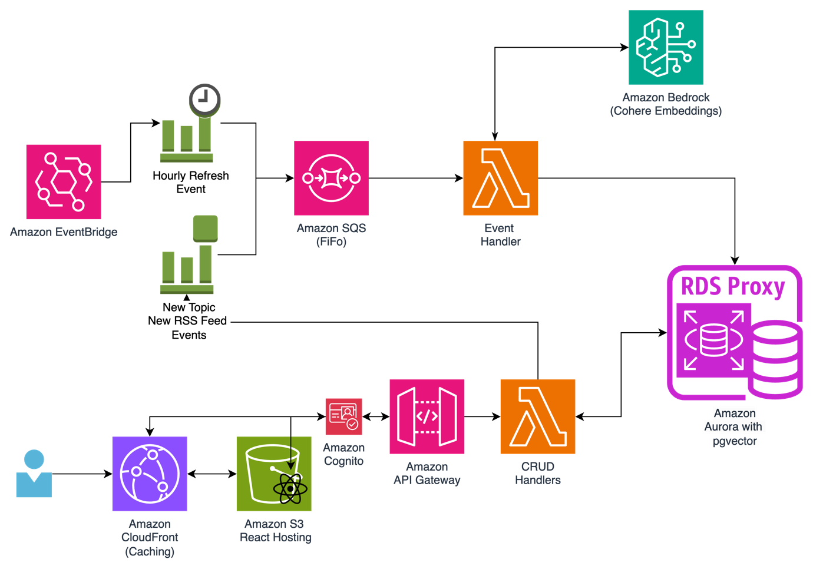
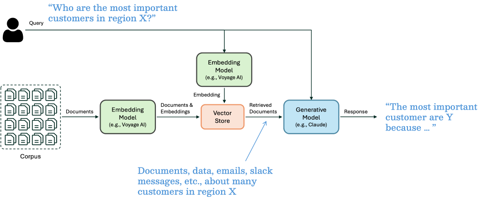

<h1> Bedrock and KnowledgeBases (RAG) </h1>

## 1. Architecture

## 2. Getting Started

1. [Preview – Connect Foundation Models to Your Company Data Sources with Agents for Amazon Bedrock by Antje Barth ](https://aws.amazon.com/blogs/aws/preview-connect-foundation-models-to-your-company-data-sources-with-agents-for-amazon-bedrock/)
1. [[_**MUST_SEE**_] Build a contextual chatbot application using Amazon Bedrock Knowledge Bases by Manish Chugh, Anand Komandooru, Mani Khanuja, Fabiano Meneses, and Pallavi Nargund](https://aws.amazon.com/blogs/machine-learning/build-a-contextual-chatbot-application-using-knowledge-bases-for-amazon-bedrock/)
    - git clone https://github.com/aws-samples/amazon-bedrock-rag.git

    

## RAG vs Fine Tuning

[Retrieval-augmented generation (RAG) vs. fine-tuning](https://www.redhat.com/en/topics/ai/rag-vs-fine-tuning)

## OpenSearch Embeddings

1. [Generate vector embeddings for your data using AWS Lambda as a processor for Amazon OpenSearch Ingestion by Jagadish Kumar, Sam Selvan, and Srikanth Govindarajan ](https://aws.amazon.com/blogs/big-data/generate-vector-embeddings-for-your-data-using-aws-lambda-as-a-processor-for-amazon-opensearch-ingestion/)

## Aurora as Vector Store + Cohere embeddings

1. [[_**MUST_SEE**_] Use language embeddings for zero-shot classification and semantic search with Amazon Bedrock by Tom Rogers](https://aws.amazon.com/blogs/machine-learning/use-language-embeddings-for-zero-shot-classification-and-semantic-search-with-amazon-bedrock/)

    

    - https://github.com/aws-samples/rss-aggregator-using-cohere-embeddings-bedrock
    - Zero-shot classification vs Semantic search
    - Amazon Bedrock with Cohere v3 Embed
    - Using Amazon Aurora PostgreSQL as vector store using pgvector

# OpenSearch Videos

1. [Amazon OpenSearch Service for Vector Search: Demo | Amazon Web Services](https://www.youtube.com/watch?v=uLQPyvzdTVQ)

# Tutorials

1. [Implementing RAG with Amazon Bedrock and Amazon Titan - Part 1](https://www.youtube.com/watch?v=RIw_Ivvrp8g)
2. [Implementing RAG with Amazon Bedrock and Amazon Titan - Part 2](https://www.youtube.com/watch?v=BXgaK8PPZAE)
3. [Implementing RAG with Amazon Bedrock and Amazon Titan - Part 3](https://www.youtube.com/watch?v=Lq0JuIOX4jM)
- tutorials-bite-sized/bedrock/rag/rag-bedrock-titan/my-readme.md

# Workshops

1. [Amazon Bedrock Retrieval-Augmented Generation (RAG) Workshop](https://catalog.us-east-1.prod.workshops.aws/workshops/77e0888c-7086-478b-af44-4562c55b1faf/en-US)
    * Semantic Similarity Search
    * Semantic Similarity Search with Metadata Filtering
    * Semantic Similarity Search with Document Summaries
    * Semantic Similarity Search with Reranking
    * RAG Integrations
1. [RAG workshop using Amazon Bedrock](https://catalog.us-east-1.prod.workshops.aws/workshops/c6b88897-84a7-4885-b9f0-855e2fc61378/en-US)
    * Module 1 - RAG Concepts
        * Lab 1 - Create Knowledge Base
        * Lab 2 - RetrieveAndGenerate API - Fully managed RAG
        * Lab 3 - Building Q&A application using Knowledge Bases for Amazon Bedrock - Retrieve API
        * Lab 4 - Building and evaluating Q&A Application using Knowledge Bases for Amazon Bedrock using RAG Assessment (RAGAS) framework

    * Module 2 - Optimizing Accuracy
        * Lab 1 - Advanced Chunking Options with Knowledge Bases for Amazon Bedrock
        * Lab 2 - Query Reformulation for complex queries
        * Lab 3 - CSV Metadata Customization with Knowledge Bases for Amazon Bedrock

    * Module 3 - Advanced concepts
        * Lab 1 - Dynamic metadata filtering

### Curate

1. [Building scalable, secure, and reliable RAG applications using Amazon Bedrock Knowledge Bases by Mani Khanuja, Nitin Eusebius, and Pallavi Nargund](https://aws.amazon.com/blogs/machine-learning/building-scalable-secure-and-reliable-rag-applications-using-amazon-bedrock-knowledge-bases/)
1. [From concept to reality: Navigating the Journey of RAG from proof of concept to production by Vivek Mittal, Nitin Eusebius, and Mani Khanuja](https://aws.amazon.com/blogs/machine-learning/from-concept-to-reality-navigating-the-journey-of-rag-from-proof-of-concept-to-production/)
1. [[**_LAB_**][**_MUST_SEE_**] Build your gen AI–based text-to-SQL application using RAG, powered by Amazon Bedrock (Claude 3 Sonnet and Amazon Titan for embedding) by Rajendra Choudhary](https://aws.amazon.com/blogs/machine-learning/build-your-gen-ai-based-text-to-sql-application-using-rag-powered-by-amazon-bedrock-claude-3-sonnet-and-amazon-titan-for-embedding/)
    - Amazon Titan for embedding
    - Claude 3 Sonnet
    - Architecture
        
    - RAG
        
    - Embeddings
        

### Voyage AI Embeddings

1. [RAG architecture with Voyage AI embedding models on Amazon SageMaker JumpStart and Anthropic Claude 3 models by Tengyu Ma, Vivek Gangasani, and Wen Phan](https://aws.amazon.com/blogs/machine-learning/rag-architecture-with-voyage-ai-embedding-models-on-amazon-sagemaker-jumpstart-and-anthropic-claude-3-models/)
        