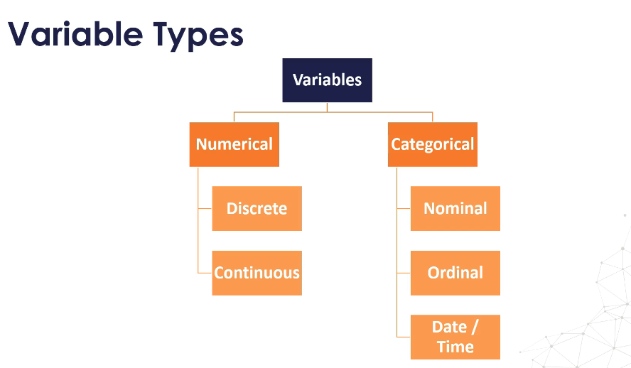
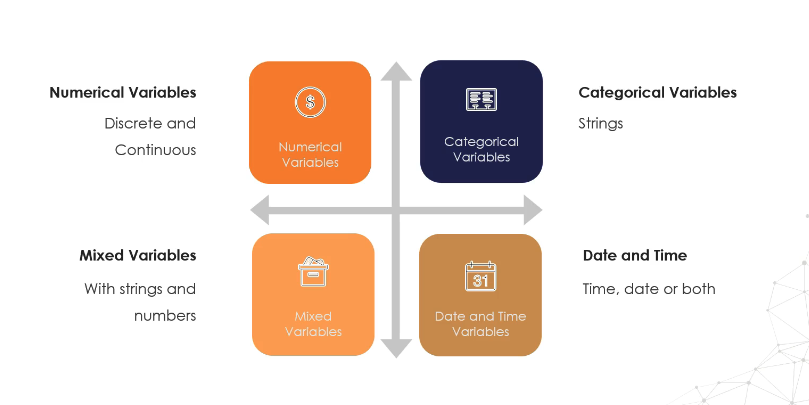

## 📊 Study Guide: Variable Types in Data Science

---

### 1. What is a Variable?

A **variable** is any characteristic, number, or attribute that can be measured or counted. In datasets, variables represent columns that hold different types of information about each data point (row).

---

### 2. **Examples of Variables**

Here are some real-world examples of variables:

| Example          | Sample Values                           |
| ---------------- | --------------------------------------- |
| Age              | 21, 35, 62, ...                         |
| Gender           | Male, Female                            |
| Income           | GBP 20,000; GBP 35,000; GBP 45,000; ... |
| House Price      | GBP 350,000; GBP 570,000; ...           |
| Country of Birth | China, Russia, Costa Rica, ...          |
| Eye Colour       | Brown, Green, Blue, ...                 |
| Vehicle Make     | Ford, Volkswagen, ...                   |

*These are called “variables” because their values change from one data point (person, transaction, etc.) to another.*

---

### 3. **Main Types of Variables**





Variables can be classified into the following main types:

#### **A. Numerical Variables**

* **Represent:** Quantities you can count or measure.
* **Examples:** Age, Income, House Price
* **Subtypes:**

  * **Discrete:** Whole numbers only (e.g., number of children, count of items)
  * **Continuous:** Can take any value within a range (e.g., height, income)

#### **B. Categorical Variables**

* **Represent:** Categories or groups.
* **Examples:** Gender, Country, Eye Colour, Vehicle Make
* **Subtypes:**

  * **Nominal:** Categories with no natural order (e.g., eye color, car brand)
  * **Ordinal:** Categories with a defined order (e.g., education level: High School < Bachelor < Master)
  * **Date/Time:** Special categorical type for date and time values

#### **C. Mixed Variables**

* **Represent:** Values that include both numbers and text.
* **Example:** Product codes like "A100", "B205", etc.

#### **D. Date and Time Variables**

* **Represent:** Time, date, or both.
* **Examples:** Transaction date, birth date, timestamp

---

### 4. **Variable Type Map**

<figure>
  
</figure>

Here’s a visual overview:

```
Variables
├── Numerical
│   ├── Discrete
│   └── Continuous
└── Categorical
    ├── Nominal
    ├── Ordinal
    └── Date / Time
```

---

### 5. **Quick Reference Table**

*(Inspired by Image 3)*

| Variable Type | What It Contains                 | Example                    |
| ------------- | -------------------------------- | -------------------------- |
| Numerical     | Numbers (discrete/continuous)    | Age, Income, House Price   |
| Categorical   | Strings, groups, categories      | Gender, Country, Car Brand |
| Date and Time | Dates or timestamps              | 2023-01-01, 15:34:00       |
| Mixed         | Numbers + Strings (alphanumeric) | "Room 101", "A200", "X5"   |

---

### 6. **Why Does This Matter?**

Understanding variable types helps you:

* Choose the right data preprocessing steps
* Select the appropriate visualization (bar chart vs histogram, etc.)
* Decide which machine learning algorithms are suitable
* Avoid common data science mistakes

---

### 7. **Key Takeaways**

* **Variables** are attributes describing your data points.
* They can be **numerical** (count/measured), **categorical** (groups/labels), **date/time**, or **mixed**.
* Knowing variable types is essential for proper data analysis and modeling.

---

#### **Next Steps:**

* Try identifying the variable types in your own datasets.
* Practice visualizing each type with Python (e.g., using Pandas, Matplotlib, or Seaborn).
* Explore how variable types affect model choice in machine learning!

---

Let me know if you’d like a sample dataset or Python notebook to practice identifying and working with variable types!
