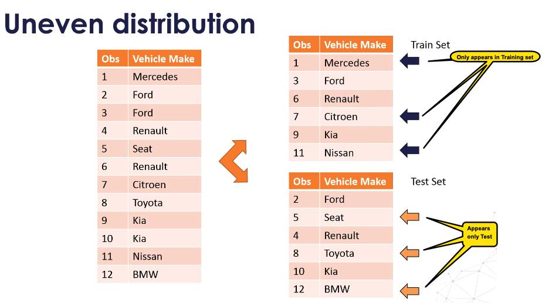

## How do you prevent uneven distribution of categorical labels between training and test set

You’re talking about **preventing uneven distribution of categorical labels between the training and test set** — that’s a **stratification problem**.



---

## **How to Handle It**

### 1. **Stratified Split**

* Use stratification when splitting the dataset so that the **proportion of each label** in a categorical variable is the same in both training and test sets.
* Works for both classification targets and important categorical predictors.

**Example (scikit-learn, classification target)**

```python
from sklearn.model_selection import train_test_split

X_train, X_test, y_train, y_test = train_test_split(
    X, y,
    test_size=0.2,
    stratify=y,  # keeps label distribution consistent
    random_state=42
)
```

---

### 2. **When Stratify Supports Only the Target**

If you want to balance based on a **categorical feature** that is not the target:

* **Option A:** Temporarily treat that feature as the “y” in `train_test_split` just for splitting, then ignore it afterward.
* **Option B:** Use **GroupShuffleSplit** or **StratifiedShuffleSplit** with custom logic.

```python
from sklearn.model_selection import StratifiedShuffleSplit
import pandas as pd

split = StratifiedShuffleSplit(n_splits=1, test_size=0.2, random_state=42)
for train_idx, test_idx in split.split(df, df["CategoryFeature"]):
    strat_train = df.loc[train_idx]
    strat_test = df.loc[test_idx]
```

---

### 3. **For Multi-Class or Multi-Feature Stratification**

* Combine multiple categorical features into a single “strata” column, then stratify on that.

```python
df["strata"] = df["FeatureA"].astype(str) + "_" + df["FeatureB"].astype(str)
```

---

### 4. **If Dataset is Small**

* Consider **oversampling/undersampling** the minority categories in the train set after splitting.
* But avoid touching the test set distribution — it should reflect the real world.

---

✅ **Best Practice:** Always stratify on the **target variable** if it’s categorical.
If a non-target categorical feature is critical, ensure its distribution is also maintained, especially if it’s correlated with the target.

---

