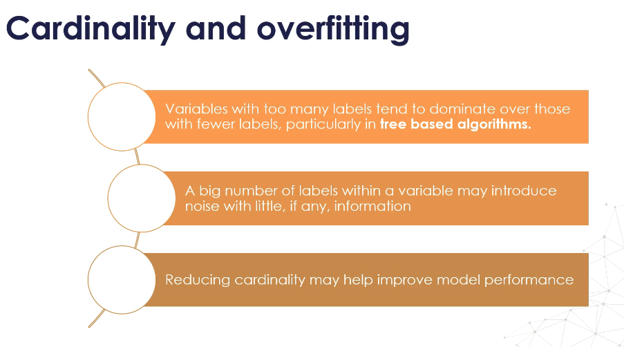

## 🚧 TODO : FIND EXAMPLES FOR MITIGATION STRATEGIES

---

## **Why High Cardinality Causes Overfitting**

---

<figure>
  
</figure>

### 1. **Uneven Category Distribution Between Train/Test**

* When splitting data, some categories may **only appear in the training set**.
* Tree-based models may “memorize” these rare categories, making **perfect splits** that don’t generalize.
* On unseen data (test or production), these overfit splits fail because the category pattern doesn’t exist there.

**Example:**

* Train: Mercedes, Citroen, Nissan only in train.
* Test: Toyota, BMW only in test.
* Model learns Mercedes → Survived = 1 (perfect split in training), but fails when Toyota appears in test.

---

### 2. **Dominance in Tree-Based Algorithms**

* In decision trees, variables with **many unique labels** can generate **more possible splits** than low-cardinality variables.
* This increases the chance the model finds **spurious patterns** that don’t generalize.

---

### 3. **Noise Introduction**

* Many unique categories can introduce **random variation** without meaningful predictive power.
* Model mistakes random noise for a signal.

---

## **Mitigation Strategies**

### **A. During Data Split**

* **Stratified Sampling** on important categorical variables to keep category proportions consistent in train and test.
* For very rare categories, **ensure they appear in both sets** (custom split logic).

---

### **B. Encoding Choices**

* **Target Encoding** or **Frequency Encoding**
  Replace category with a numeric statistic (mean target, frequency) rather than one-hot encoding, reducing dimensionality.
* **Group Rare Categories** into `"Other"` to ensure categories are well-represented.
* **Domain Grouping** — merge categories logically (e.g., ZIP → Region).

---

### **C. Reduce Cardinality**

* Drop categories with extremely low frequency if they don’t carry meaningful signal.
* Combine them into broader buckets.

---

### **D. Model-Aware Handling**

* For tree-based models:

  * Use **regularization** (min\_samples\_leaf, max\_depth, gamma in XGBoost) to prevent overfitting to small groups.
* For linear models:

  * Avoid one-hot encoding for massive category sets — use hashing trick or embeddings.

---

### **E. Operational Safety**

* Maintain a **category mapping dictionary** for deployment.
* Assign unseen categories to a default bucket like `"Unknown"` to avoid runtime errors.

---

✅ **Key takeaway:**
High cardinality = higher risk of **overfitting** in training and **errors** in production.
The fix is **thoughtful splitting + encoding + grouping** so the model sees enough examples of each category and avoids learning noise.

---

