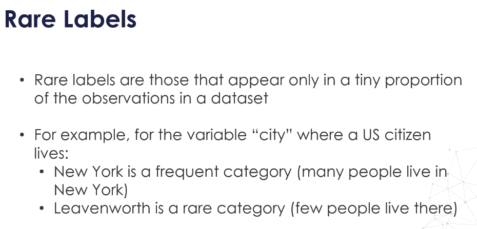
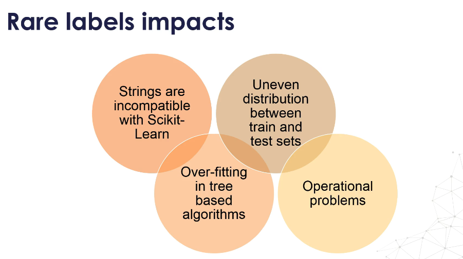
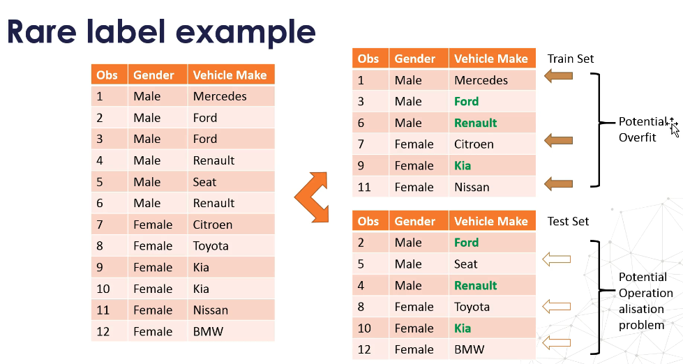
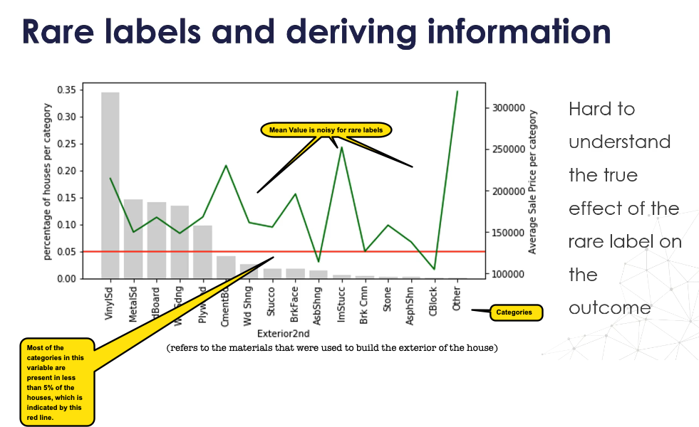
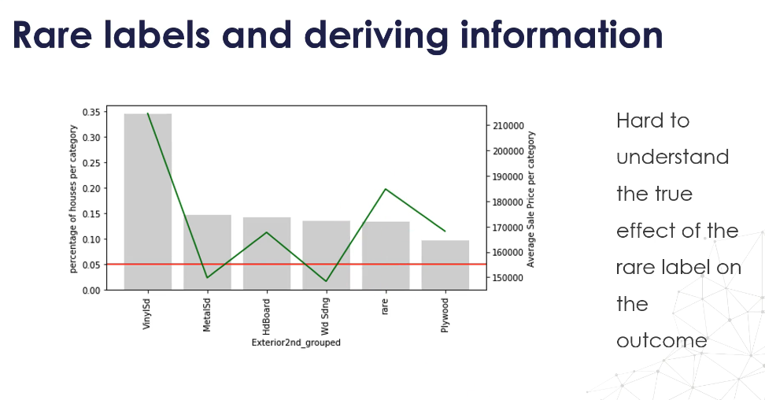
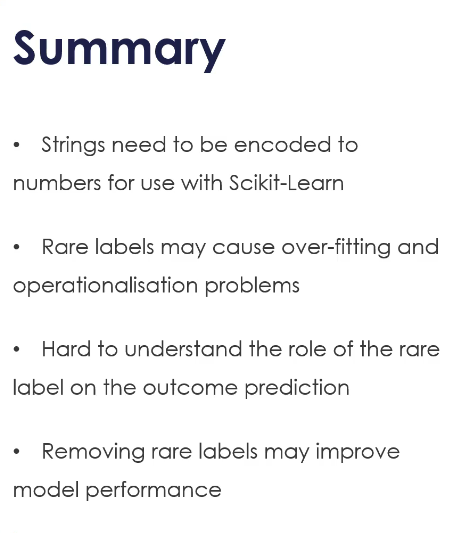

# 18. Rare labels

## **What Are Rare Labels?**

Rare labels are categories in a categorical variable that appear only in a **tiny proportion** of the dataset.

* Example: For the variable **"city"** (where a US citizen lives):

  * **Frequent category**: New York – many people live there.
  * **Rare category**: Leavenworth – very few people live there.

These categories are "rare" because their frequency is significantly smaller compared to other labels in the same variable.

---

## **How Do Rare Labels Affect Training?**

Rare labels have **similar challenges as high-cardinality features**:

1. **Strings are incompatible with Scikit-learn** → must be encoded into numbers before training.
2. **Overfitting risk**:

   * If a rare label appears only in the **training set**, the model may memorize it (overfit) instead of generalizing.
3. **Operationalization problems**:

   * If a rare label appears only in the **test set** (or production data) but never in training, the model will not know how to handle it.
4. **Uneven distribution** between train and test sets.

**Example:**

* **Train Set**: Contains Mercedes, Citroen, Nissan (rare labels not in test set) → *potential overfitting*.
* **Test Set**: Contains Seat, Toyota, BMW (rare labels not in train set) → *operationalization problem*.

---

## **How Reliable Is Information From Rare Labels?**

* In the **House Prices** dataset (variable `Exterior2nd` – material used on the house exterior):

  * Many categories occur in **< 5% of houses** (red line threshold).
  * The **mean sale price** fluctuates wildly across these rare categories, making it **noisy**.
* Problem:

  * These differences could be **true signals** or just **random noise**.
  * Since rare labels are underrepresented, it’s hard to determine their **true effect** on the target.

---

## **Mitigation: Combine Rare Labels into ‘Other’ or ‘Rare’ Category**

* Group all infrequent categories into a single **"Rare"** category.
* Benefits:

  * Reduces overfitting risk.
  * Reduces operationalization issues.
  * Improves reliability of statistical analysis.
* In the example:

  * After grouping into "Rare", it’s easier to see that **houses with rare materials** tend to have higher average prices compared to most frequent materials.

---

## **Key Takeaways**

* Encode strings to numbers before model training.
* Rare labels may cause:

  * Overfitting.
  * Operationalization issues.
* It’s **hard to assess** the role of rare labels in predictions.
* Grouping rare labels into **‘Rare’** can improve model stability and performance.

---

If you want, I can also create a **Colab notebook** demonstrating:

1. Detecting rare labels in a dataset.
2. Visualizing frequency distribution.
3. Combining rare labels into a “Rare” category.
4. Comparing model performance before and after grouping.

Would you like me to prepare that?
