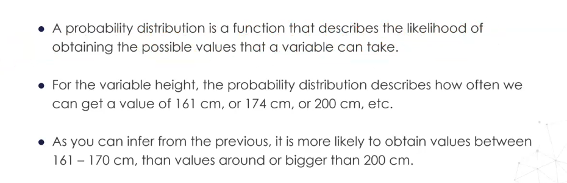
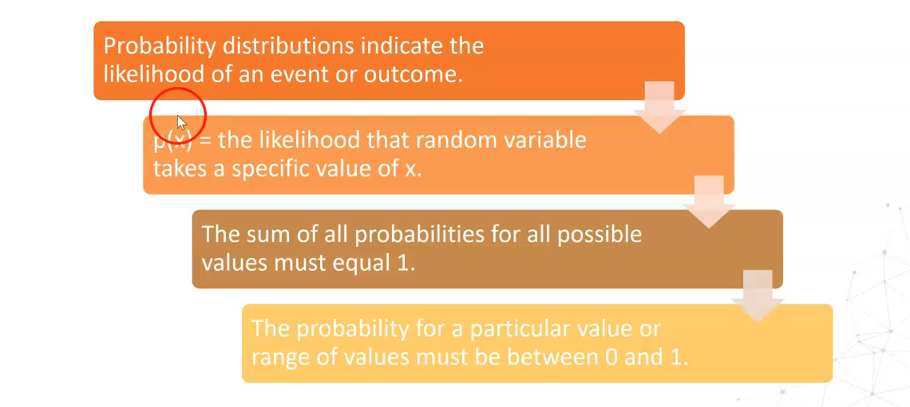
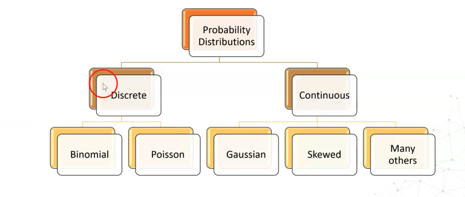
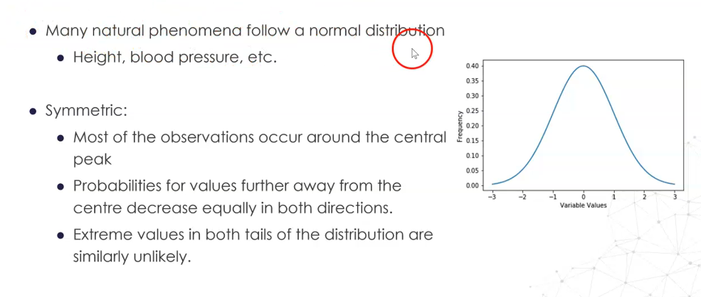
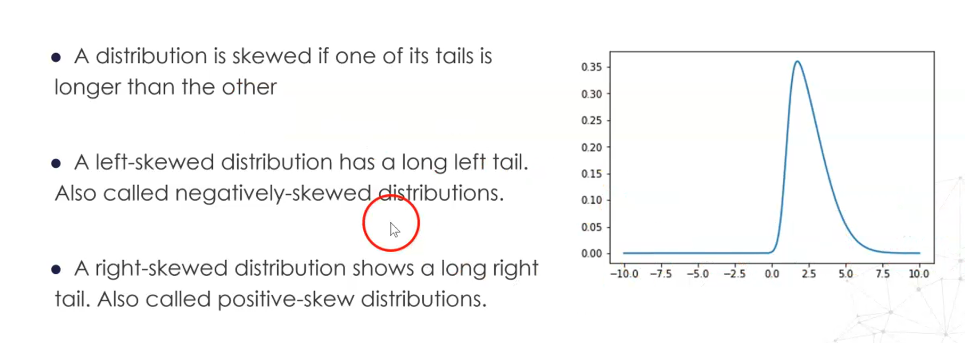
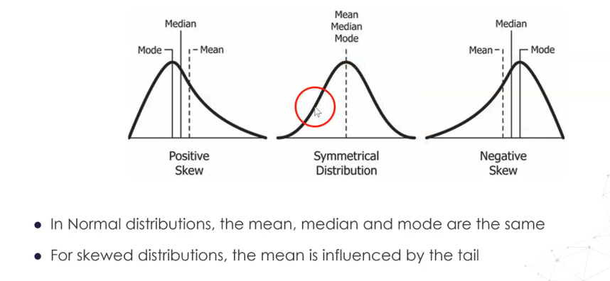
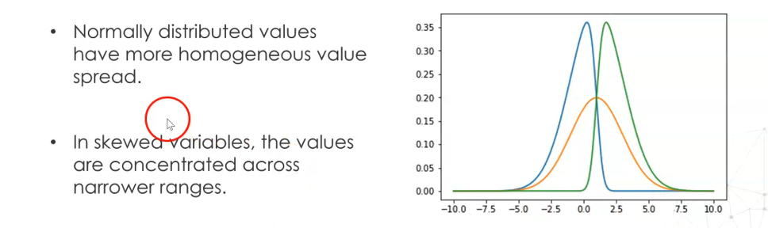

## 🎯 TODO

Review CampusX courses on PDFs etc and revisit this chapter

---

# 19. Variable distribution

### Different types of distributions

https://www.itl.nist.gov/div898/handbook/eda/section3/eda366.htm

---

## **Study Guide: Understanding Variable Distributions**

### 1. Introduction to Variable Distributions

In data analysis, especially for **numerical variables**, understanding the **distribution** is crucial.
A **distribution** describes how values of a variable are spread or concentrated across its range.
This affects:

* **Feature engineering methods** (e.g., imputation, scaling, transformation)
* **Model performance** and interpretability

We will explore:

* Probability distributions
* Distribution properties
* Common types of distributions
* Their impact on feature engineering and modeling

---

## **1. What is a Probability Distribution?**

A **probability distribution** is a function that describes the **likelihood** of obtaining each possible value of a random variable.

**Example:**

* If the variable is **height**, the distribution tells us:

  * How likely we are to get 161 cm, 174 cm, or 200 cm.
* Most people’s height is around **160–170 cm**, making those values more probable than extreme values like **200 cm**.

---

## **2. Properties of Probability Distributions**

Key properties:

1. **Indicate Likelihood** – Describe how probable an event or value is.
2. **p(x)** – Probability that the random variable takes a specific value $x$.
3. **Total Probability = 1** – Sum of all probabilities over all possible values equals 1.
4. **Probability Range** – Any specific value’s probability is between 0 and 1.

---

## **3. Types of Probability Distributions**

Two main categories:

* **Discrete Distributions**

  * Variables take specific, separate values.
  * Examples: **Binomial**, **Poisson**.
* **Continuous Distributions**

  * Variables take any value within a range.
  * Examples: **Gaussian (Normal)**, **Skewed**, and many others.

---

## **4. The Normal Distribution**

**Normal (Gaussian) Distribution**:

* **Symmetric** bell-shaped curve.
* Many natural phenomena follow it (e.g., height, blood pressure).
* Most values cluster around the **mean**.
* Probability decreases equally in both directions away from the center.
* **Extreme values** in both tails are rare.

---

## **5. Skewed Distributions**

**Skewness** occurs when one tail is longer than the other:

* **Left-Skewed (Negative Skew)** – Long tail on the left.
* **Right-Skewed (Positive Skew)** – Long tail on the right.

---

## **6. Gaussian vs. Skewed Distributions**

* **Normal Distribution**:

  * Mean ≈ Median ≈ Mode.
* **Skewed Distribution**:

  * Mean is pulled toward the tail.
  * Median is a better measure of central tendency for skewed data.

---

## **7. Distributions and Model Performance**

Impact on modeling:

* **Normal distributions** have more homogeneous spread.
* **Skewed variables** have values concentrated in narrower ranges.
* This affects:

  * **Imputation choice**:

    * Gaussian → Use **mean**.
    * Skewed → Use **median**.
  * **Scaling methods**:

    * Gaussian → Standardization (z-score).
    * Skewed → Robust scaling with median/quantiles.
  * **Binning strategies**:

    * Gaussian → Equal-width bins.
    * Skewed → Equal-frequency bins.

---

### **Key Takeaways**

* Understanding a variable’s distribution is essential before applying feature engineering techniques.
* Normal and skewed distributions behave differently in terms of probability spread, central tendency, and modeling performance.
* Correctly identifying the distribution helps make informed choices for **data preprocessing**.

---

If you want, I can now **turn this into a downloadable `.ipynb` study notebook** with inline plots and examples for each type of distribution so you can **visualize them with Python**. This would make the study guide interactive and practical.
