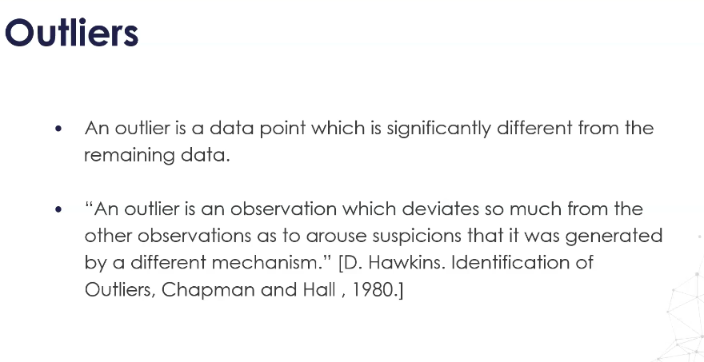
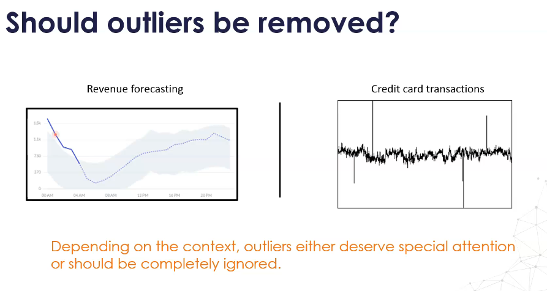
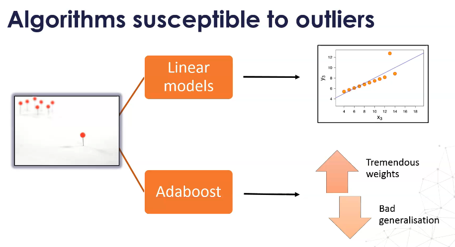
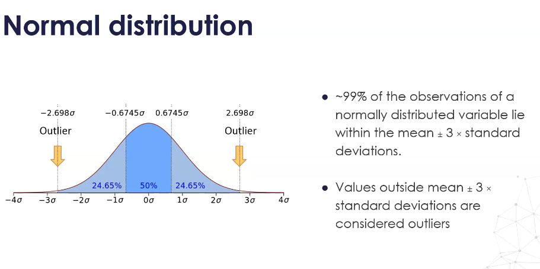
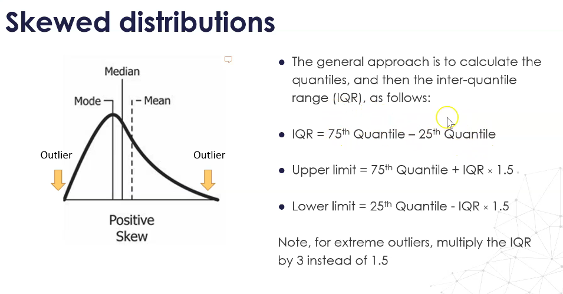
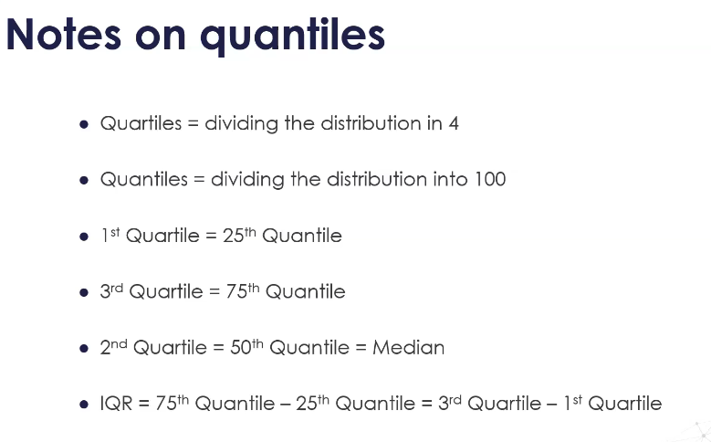
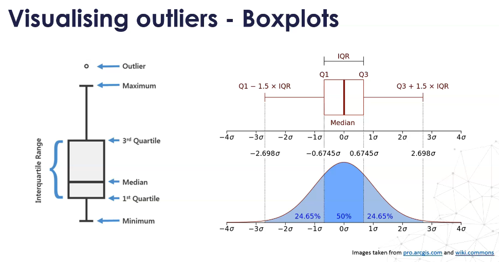
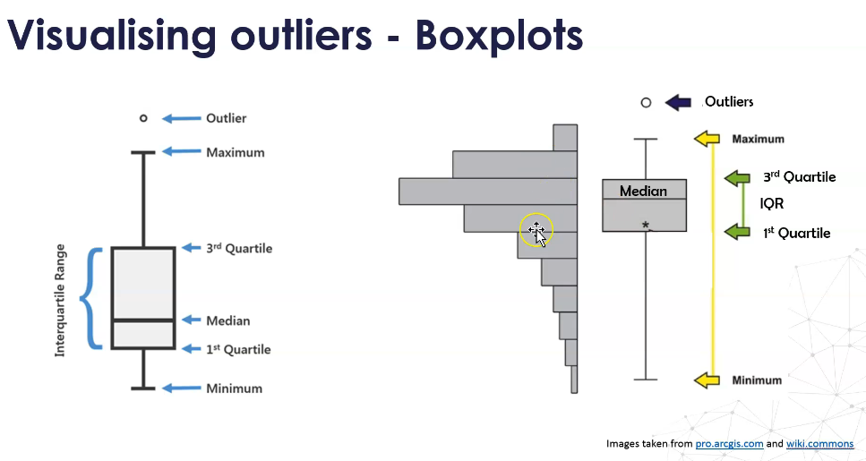

# **Outliers in Data Science & Machine Learning**

---

## **1. Introduction – What is an Outlier?**

An **outlier** is a data point that is significantly different from the remaining data.
It can signal that the data was generated by a **different mechanism** than the rest of the dataset.

> *"An outlier is an observation which deviates so much from the other observations as to arouse suspicions that it was generated by a different mechanism."*
> — D. Hawkins, *Identification of Outliers*, 1980

### Key takeaways:

* Outliers are **relative to the dataset** — a value that’s extreme in one context might be normal in another.
* They can either **distort analysis** or **provide valuable insights**, depending on cause.

---

## **2. Causes of Outliers**

### Different Ways Outliers Can Arise

1. **Mechanical or Measurement Error** *(focus of this course)*

   * Sensor malfunctions, logging errors, data corruption.
   * These **must** be identified and removed because they don’t represent reality.
2. **Fraudulent Activity**

   * Example: Unusually high credit card transaction amounts.
   * These need investigation, not automatic removal.
3. **Business-Driven Spikes**

   * Example: Sudden revenue increase due to promotions or product launches.
   * Should be diagnosed to understand cause.

---

## **3. Should Outliers Be Removed?**

The decision is **context dependent**:

* **When to Keep**:

  * If the outlier could reveal meaningful events (fraud detection, business anomalies).

* **When to Remove**:

  * If it’s due to mechanical or measurement error.
  * If it’s an extremely rare occurrence that doesn’t represent the population.

* Left graph: Revenue forecasting – spikes may be important signals.
* Right graph: Credit card transactions – anomalies could indicate fraud.

---

## **4. Impact on Machine Learning Algorithms**

### Algorithms **Susceptible** to Outliers:

1. **Linear Models** (e.g., Linear Regression, Logistic Regression)

   * Outliers can pull the regression line toward them, distorting slopes and intercepts.
   * Even a single extreme value can shift predictions for all data points.
2. **AdaBoost**

   * Sequentially boosts weak learners, giving more weight to misclassified samples.
   * Outliers get **tremendous weight** across iterations.
   * Leads to **overfitting** and poor generalization.

### Algorithms **Robust** to Outliers:

* **Tree-Based Models** (Decision Trees, Random Forest, Gradient Boosted Trees)

  * Decisions are based on threshold splits rather than averages.
  * Outliers often get isolated in small leaves without impacting main splits.

---

## **5. Mitigation Strategies**

| Model Type        | Effect of Outliers                 | Mitigation                                                              |
| ----------------- | ---------------------------------- | ----------------------------------------------------------------------- |
| **Linear Models** | Large influence on slope/intercept | Remove mechanical-error outliers; use robust regression (Huber, RANSAC) |
| **AdaBoost**      | Overweights outliers, overfits     | Pre-clean data; use robust boosting variants                            |
| **Tree-Based**    | Minimal impact                     | Optional winsorization for extreme anomalies                            |

---

## **6. Detecting Outliers in Normal Distributions**

When a variable is **normally distributed**:

* Around **99% of observations** lie within:

  $$
  \mu \pm 3\sigma
  $$

  where:

  * $\mu$ = mean
  * $\sigma$ = standard deviation

* **Rule**:
  Any value outside $\mu \pm 3\sigma$ is considered an **outlier**.

* Shaded blue = \~99% of observations.
* Values beyond ±3σ are marked as outliers.

---

## **7. Detecting Outliers in Skewed Distributions**

When a variable is **skewed**, the ±3σ rule doesn’t work well.
Instead, use the **Interquartile Range (IQR) Rule**:

### Step 1 – Calculate IQR:

$$
\text{IQR} = Q_3 - Q_1
$$

* $Q_1$ = 25th percentile
* $Q_3$ = 75th percentile

### Step 2 – Determine Outlier Limits:

* **Upper bound** = $Q_3 + 1.5 \times \text{IQR}$
* **Lower bound** = $Q_1 - 1.5 \times \text{IQR}$

For **extreme outliers**, replace 1.5 with 3.

* Median is shifted toward side opposite to the tail.
* Whiskers are asymmetrical to reflect skew.

---

## **8. Notes on Quantiles**

* **Quartiles**: Divide the dataset into 4 parts.
* **Quantiles**: Divide into 100 parts.
* Q1 (25th percentile) = 1st quartile.
* Q3 (75th percentile) = 3rd quartile.
* Q2 (50th percentile) = median.

$$
\text{IQR} = Q_3 - Q_1
$$

---

## **9. Visualising Outliers with Boxplots**

A **boxplot** is a simple way to visualize:

* **Box**: Middle 50% of data (IQR).
* **Median line**: 50th percentile.
* **Whiskers**: Extend to last value within 1.5 × IQR.
* **Dots beyond whiskers**: Outliers.

### Normal Data Boxplot:

* Symmetric whiskers, median centered.

### Skewed Data Boxplot:

* Asymmetric whiskers, median shifted toward less populated tail.

---

## **10. Summary – Choosing Outlier Detection Method**

| Distribution Type | Detection Rule   | Visualization       | Notes                               |
| ----------------- | ---------------- | ------------------- | ----------------------------------- |
| Normal            | Mean ± 3σ        | Boxplot, Bell Curve | Simple to compute, assumes symmetry |
| Skewed            | IQR (1.5× or 3×) | Boxplot             | Works with asymmetric data          |

---

If you like, I can now **extend this into a Colab Notebook** where:

* We generate normal & skewed datasets
* Plot histograms & boxplots
* Apply both ±3σ and IQR rules
* Show how Linear Regression vs Decision Tree models react to injected outliers

That would turn this theory into a fully **hands-on, interactive lab**.
