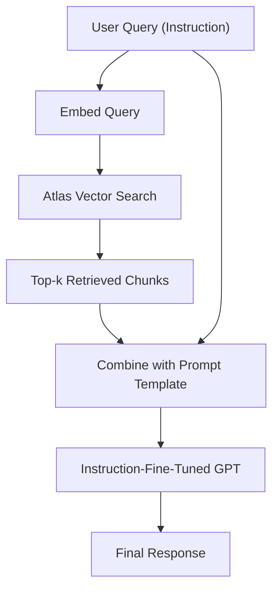

Absolutely! A hybrid approach that combines **RAG (Retrieval-Augmented Generation)** with **instruction fine-tuning** using **GPT (e.g., GPT-J, GPT-NeoX, or OpenAI GPT)** and **Atlas Vector Search (MongoDB Atlas)** can give you a powerful system that retrieves relevant data dynamically and responds in a domain-specialized way.

---

## 🧠 Hybrid Architecture Overview

**Goal**: Enhance a generative model (GPT) by combining:
- **Instruction Fine-Tuning (IFT)** for task alignment (e.g., summarization, answering, reasoning).
- **Retrieval-Augmented Generation (RAG)** using **MongoDB Atlas Vector Search** for dynamic knowledge injection.

---

## 🔧 Key Components

### 1. **Instruction Fine-Tuned GPT Model**
- Use an open-source base (e.g., `GPT-J`, `LLaMA-2`, `Mistral`, or even OpenAI GPT models via API).
- Fine-tune on your domain-specific **instruction-style data** (e.g., "Given this patient record, summarize the diagnosis.").

### 2. **MongoDB Atlas Vector Search**
- Store embeddings of documents/passages.
- Perform fast and semantic **k-NN search** using vector similarity.
- Supports dense vector storage (e.g., OpenAI or SentenceTransformers embeddings).

---

## 🛠️ Hybrid Pipeline



---

## 🔌 Implementation Steps

### Step 1: Prepare Data for Atlas Vector Search
- Chunk your corpus (e.g., patient records, legal docs).
- Embed each chunk using a model like `text-embedding-ada-002` or `all-MiniLM-L6-v2`.
- Store embeddings + metadata in MongoDB Atlas with a **vector index**.

```python
from pymongo import MongoClient
from pymongo.server_api import ServerApi
import openai

# Connect to Atlas
client = MongoClient("<your-connection-uri>", server_api=ServerApi('1'))
collection = client["db"]["vector_collection"]

# Example document with embedding
collection.insert_one({
    "text": "Symptoms include fever and chest pain...",
    "embedding": your_vector.tolist(),
    "metadata": {...}
})
```

---

### Step 2: Perform Vector Search at Query Time

```python
from pymongo.operations import Search

# Embed user query
query_embed = get_embedding("What are common symptoms of pneumonia?")

# Vector search
results = collection.aggregate([
    {
        "$search": {
            "index": "vector_index",
            "knnBeta": {
                "vector": query_embed,
                "path": "embedding",
                "k": 5
            }
        }
    }
])
```

---

### Step 3: Construct Prompt for GPT

```python
retrieved_context = "\n\n".join([doc["text"] for doc in results])
prompt = f"""
You are a medical assistant.

Context:
{retrieved_context}

Question: What are common symptoms of pneumonia?
Answer:
"""
```

### Step 4: Run Through Instruction-Fine-Tuned GPT

- If using **OpenAI GPT** (e.g., `gpt-4`), just call API.
- If using your own model, run the prompt through the fine-tuned checkpoint.

```python
response = openai.ChatCompletion.create(
    model="gpt-4",
    messages=[
        {"role": "system", "content": "You are a helpful assistant."},
        {"role": "user", "content": prompt}
    ]
)
```

---

## ✅ Benefits of Hybrid Approach

| Component                 | Role                                             |
|--------------------------|--------------------------------------------------|
| Atlas Vector Search      | Inject up-to-date or long-term domain knowledge  |
| Instruction Fine-Tuning  | Specializes the model for your task + tone       |
| GPT (base or hosted)     | Generates fluent, coherent responses             |

---

## 🧪 Optional Enhancements

- **Rerank retrieved docs** with a cross-encoder.
- Add **prompt templates** like [ReAct](https://arxiv.org/abs/2210.03629) for reasoning.
- Log user queries & responses to **continually fine-tune** on real-world data.

---

Would you like a working code template or want help fine-tuning your model for a specific domain (e.g., healthcare, legal)?

Perfect! Let’s walk through a **working RAG + Instruction Fine-Tuning pipeline** tailored for the **legal domain**, with full code snippets.

---

## 🧱 Overview of What You'll Get

1. **Legal Corpus Preprocessing**
2. **Embedding + Atlas Vector Storage**
3. **Query-time RAG using MongoDB Atlas**
4. **Prompt Construction for Legal Q&A**
5. **Instruction Fine-Tuning for Legal GPT Model**
6. **End-to-End Sample Code**

---

## 🧾 1. Prepare Legal Dataset (Preprocessing)

Use a legal dataset like:
- [CUAD](https://huggingface.co/datasets/cuad)
- SEC filings, contracts, case law (PDFs → chunks)

**Split into chunks for embeddings:**

```python
from langchain.text_splitter import RecursiveCharacterTextSplitter

splitter = RecursiveCharacterTextSplitter(chunk_size=512, chunk_overlap=50)
chunks = splitter.split_text(long_legal_document)
```

---

## 🧬 2. Embed and Store in MongoDB Atlas

### Vector Embedding + Insert

```python
from pymongo import MongoClient
from openai import OpenAIEmbeddings
import openai

openai.api_key = "your-openai-key"
client = MongoClient("your-atlas-uri")
collection = client["legalDB"]["contracts"]

def embed(text):
    res = openai.Embedding.create(
        model="text-embedding-ada-002",
        input=text
    )
    return res["data"][0]["embedding"]

for chunk in chunks:
    collection.insert_one({
        "text": chunk,
        "embedding": embed(chunk),
        "metadata": {"type": "contract", "source": "cuad"}
    })
```

Ensure you’ve created a **vector index** in Atlas with `embedding` as the vector field.

---

## 🔍 3. Vector Retrieval at Query Time

```python
def search_similar_chunks(user_query, k=5):
    query_vec = embed(user_query)

    results = collection.aggregate([
        {
            "$search": {
                "index": "vector_index",
                "knnBeta": {
                    "vector": query_vec,
                    "path": "embedding",
                    "k": k
                }
            }
        }
    ])
    return [doc["text"] for doc in results]
```

---

## 🧠 4. Build Legal Prompt

```python
def build_prompt(query, context_chunks):
    context = "\n\n".join(context_chunks)
    return f"""
You are a legal assistant.

Context:
{context}

Question: {query}
Answer:
"""
```

---

## 🧪 5. Instruction Fine-Tuning for Legal Tasks

### 🧾 Format Legal Instructions (Example JSONL)

```json
{"prompt": "Context:\nClause: The supplier shall maintain insurance...\n\nQuestion: Who bears the liability?\nAnswer:", "completion": " The supplier is liable for maintaining insurance as per the clause."}
```

Use tools like [`trl`](https://github.com/huggingface/trl) or LoRA for fine-tuning `LLaMA`, `GPT-J`, etc.

### 🧠 Fine-Tune with 🤗 `transformers`

```python
from transformers import AutoModelForCausalLM, Trainer, TrainingArguments, AutoTokenizer

model = AutoModelForCausalLM.from_pretrained("EleutherAI/gpt-j-6B")
tokenizer = AutoTokenizer.from_pretrained("EleutherAI/gpt-j-6B")

# Tokenize JSONL data as prompt + completion format
# Use dataset library or custom tokenization

args = TrainingArguments(
    output_dir="./legal-gpt",
    per_device_train_batch_size=2,
    gradient_accumulation_steps=4,
    num_train_epochs=2,
    fp16=True,
    save_steps=500
)

trainer = Trainer(
    model=model,
    args=args,
    train_dataset=tokenized_dataset
)

trainer.train()
```

---

## 🧑‍⚖️ 6. Full End-to-End Usage (RAG + Fine-Tuned GPT)

```python
query = "What happens if the supplier fails to maintain insurance?"

context_chunks = search_similar_chunks(query)
prompt = build_prompt(query, context_chunks)

# Use OpenAI (or your fine-tuned model)
response = openai.ChatCompletion.create(
    model="gpt-4",  # or "legal-gpt-j"
    messages=[
        {"role": "system", "content": "You are a legal assistant."},
        {"role": "user", "content": prompt}
    ]
)

print(response['choices'][0]['message']['content'])
```

---

## 📦 Folder Structure (Recommended)

```
legal-rag-finetune/
├── data/
│   └── legal_docs/
├── embed_store.py
├── fine_tune.py
├── query_rag.py
├── prompt_templates/
│   └── legal_prompt.txt
└── models/
```

---

Would you like:
- A Hugging Face trainer-ready instruction dataset for legal Q&A?
- A basic Streamlit or Flask interface for this hybrid system?

Let me know and I’ll generate it for you.