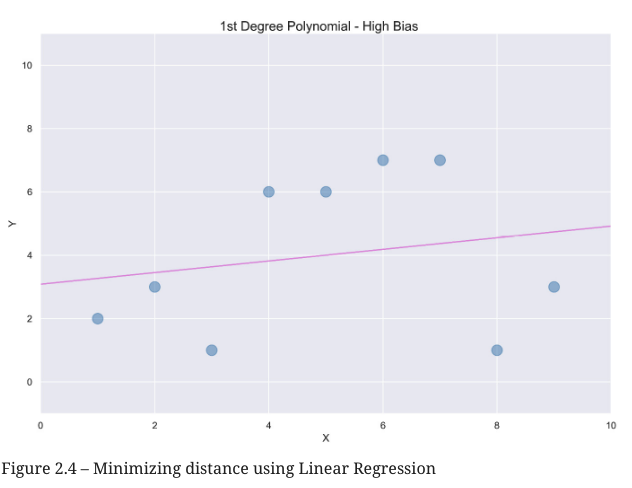
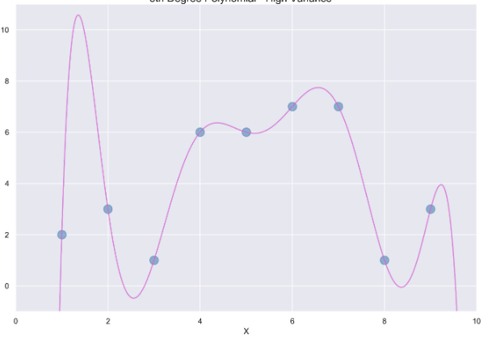
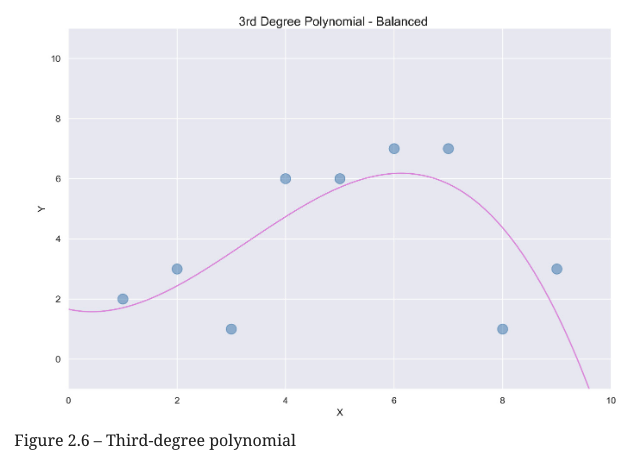

## 🔑 XGBoost, Decision Trees & Overfitting

### 🔹 What is XGBoost?

- **XGBoost** is an **ensemble method**, meaning it combines multiple models—called **base learners**—to improve prediction accuracy.
- Its base learners are usually **decision trees**.

---

### 🔹 How Decision Trees Work

- Unlike models like linear/logistic regression (which use weighted sums), **decision trees split data by asking questions** (e.g., "Is temperature > 70?").
- Each question divides the dataset further, forming a **tree-like structure**.
- This **splitting** continues until the model achieves a desired accuracy or purity.

---

### 🔹 Example

- First split: `temperature > 70` vs `≤ 70`
- Second split: `season == summer` vs `other`
- The tree continues branching, separating data into increasingly specific groups.

---

### 🔹 Accuracy vs. Generalization

- A deep decision tree can **perfectly memorize the training data** (100% accuracy).
- But such trees often **fail to generalize** on new data → this is **overfitting**.

---

## Overfitting (high Variance) vs Underfitting (High Bias)

### High Bias

<figure>
  
  <figcaption><b>Fig 2.4:</b> High Bias</figcaption>
</figure>

A straight line generally has high bias. In machine learning bias is a mathematical term that comes from estimating the error when applying the model to a real-life problem. The bias of the straight line is high because the predictions are restricted to the line and fail to account for changes in the data.

In many cases, a straight line is not complex enough to make accurate predictions. When this happens, we say that the machine learning model has underfit the data with high bias.

### High Variance

<figure>
  
  <figcaption><b>Fig 2.6:</b> High Variance</figcaption>
</figure>

This model has high variance. In machine learning, variance is a mathematical term indicating how much a model will change given a different set of training data. Formally, variance is the measure of the squared deviation between a random variable and its mean

Models with high variance often overfit the data. These models do not generalize well to new data points because they have fit the training data too closely.

### A Balance - Low Bias and Low Variance

<figure>
  
  <figcaption><b>Fig 2.7:</b> Best - Low Bias - Low Variance</figcaption>
</figure>

In machine learning, the combination of low variance and low bias is ideal.

Low variance means that a different training set will not result in a curve that differs by a significant amount. Low bias indicates that the error when applying this model to a real-world situation will not be too high.


### Additional Review

1. [Bias Variance Trade-off | Overfitting and Underfitting in Machine Learning By CampusX](https://www.youtube.com/watch?v=74DU02Fyrhk)

### 🔹 Solutions to Overfitting

1. **Hyperparameter tuning** (e.g., limiting depth, pruning)
2. **Ensemble methods** like:
   - **Random Forests** (many uncorrelated trees)
   - **XGBoost** (boosting trees sequentially with corrections)

# HyperParameters

### Difference between Parameters and hyperParameters

In machine learning, parameters are adjusted when the model is being tuned. The weights in linear and Logistic Regression, for example, are parameters adjusted during the build phase to minimize errors. Hyperparameters, by contrast, are chosen in advance of the build phase. If no hyperparameters are selected, default values are used.


### Hyperparameters

1. 📥 Step 1: finding a baseline score

Sure! Here's the formatted version with proper code blocks and explanatory comments:

---

### 📥 1: Load the dataset and split into predictors (`X_bikes`) and target (`y_bikes`)

```python
import pandas as pd

# Load the cleaned bike rentals dataset
df_bikes = pd.read_csv('bike_rentals_cleaned.csv')

# Split predictors (all columns except the last) and target (last column)
X_bikes = df_bikes.iloc[:, :-1]
y_bikes = df_bikes.iloc[:, -1]
```

---

### 🌳 2: Import necessary modules

```python
from sklearn.tree import DecisionTreeRegressor
from sklearn.model_selection import cross_val_score
import numpy as np
```

---

### 🤖 3: Initialize the model and run 5-fold cross-validation

```python
# Create a Decision Tree Regressor
reg = DecisionTreeRegressor(random_state=2)

# Evaluate using negative mean squared error (to be converted to RMSE)
scores = cross_val_score(reg, X_bikes, y_bikes, scoring='neg_mean_squared_error', cv=5)
```

---

### 📊 4: Compute and print RMSE

```python
# Convert negative MSE to RMSE
rmse = np.sqrt(-scores)

# Print average RMSE across folds
print('RMSE mean: %0.2f' % rmse.mean())
```

Note: RMSE is measure of error, not variance

---

### ✅ Output:

```
RMSE mean: 1233.36
```

---

### 🔍 Interpretation

The average RMSE for the Decision Tree Regressor is **1233.36** (measure of error, not variance), which is **worse** than:

* **Linear Regression** RMSE: **972.06**
* **XGBoost** RMSE: **887.31**

This suggests that the Decision Tree model may be **overfitting** or not capturing the patterns as effectively as the other two models.


