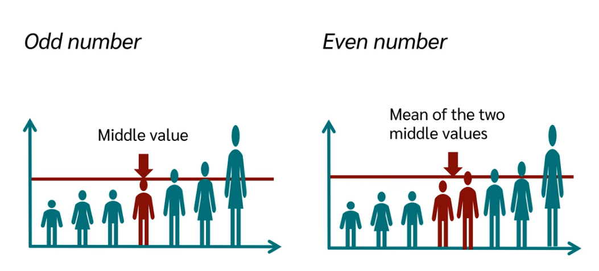

Create Study guide from https://www.youtube.com/watch?v=FzujIYo9GYo

Also see - https://medium.com/@aaryanohekar277/what-most-people-do-not-understand-about-df-describe-e927954a91e5
https://www.datacamp.com/tutorial/mean-vs-median

## To Reserach and Add

1. Is 50% quantile same as Median. See DataTab
2. Start with small dataset say 10 rows and study mean, median, std deviation, mode, quantile, crosstab
3. Deep study EDA part of Datasceicne by Amble course -https://app.pluralsight.com/ilx/video-courses/678aa3cc-a24c-45c8-b027-504999bb6178/73066942-7551-4598-93c0-16c5f9877baa/66825ef9-f7af-442c-abf8-e44b67802540
4. Understand central tendency vs dispersion
5. Why? The median is often a better choice than the mean. The median guarantees that half the data is greater than the given value and half the data is lower. The mean, by contrast, is vulnerable to outliers.
6. Understand Variance