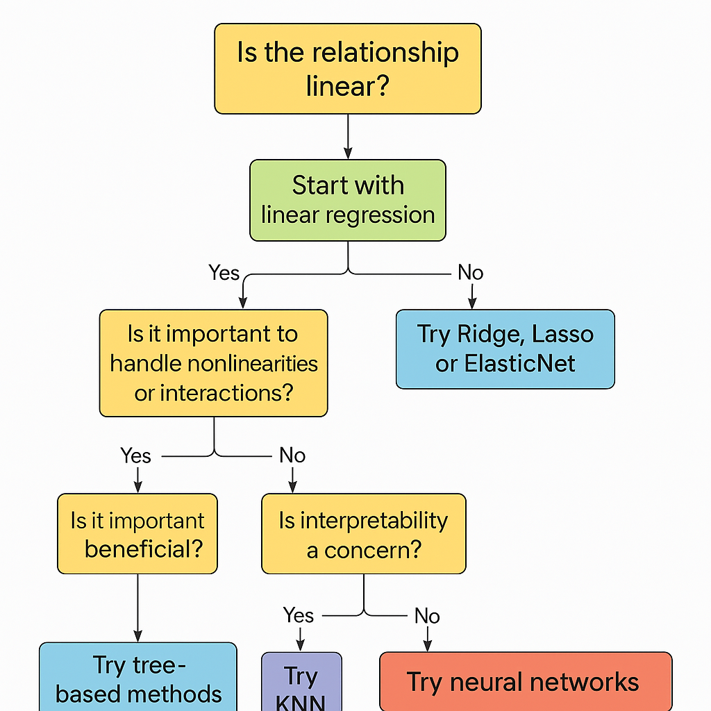

**Linear Regression** is just the beginning. There are many other powerful regression algorithms, each with strengths in different situations. Here's a categorized overview to help you understand **what the other regression algorithms are**, and **when to consider them**:

---

## 🧠 Other Regression Algorithms (Besides Linear Regression)

### 🟩 1. **Regularized Linear Models**

These improve basic linear regression by adding penalties to reduce overfitting and handle multicollinearity.

| Algorithm         | Description                                              | Library |
|------------------|----------------------------------------------------------|---------|
| **Ridge Regression (L2)** | Shrinks all coefficients (good for multicollinearity) | `sklearn.linear_model.Ridge` |
| **Lasso Regression (L1)** | Shrinks some coefficients to **zero** (feature selection) | `sklearn.linear_model.Lasso` |
| **ElasticNet**           | Combines L1 and L2 regularization                   | `sklearn.linear_model.ElasticNet` |

---

### 🟦 2. **Tree-Based Models**

These are powerful for modeling **nonlinear relationships** and feature **interactions**.

| Algorithm              | Description                                      | Library |
|------------------------|--------------------------------------------------|---------|
| **Decision Tree Regressor** | Simple, interpretable; can overfit            | `sklearn.tree.DecisionTreeRegressor` |
| **Random Forest Regressor** | Ensemble of trees (bagging)                   | `sklearn.ensemble.RandomForestRegressor` |
| **Gradient Boosting Regressor** | Builds trees sequentially to reduce error   | `sklearn.ensemble.GradientBoostingRegressor` |
| **XGBoost Regressor**       | Fast, regularized gradient boosting           | `xgboost.XGBRegressor` |
| **LightGBM Regressor**      | Fast, scalable boosting (good for large data) | `lightgbm.LGBMRegressor` |
| **CatBoost Regressor**      | Great for categorical data                    | `catboost.CatBoostRegressor` |

---

### 🟨 3. **Support Vector Regression (SVR)**

| Algorithm | Description | Library |
|----------|-------------|---------|
| **SVR** (Support Vector Regressor) | Fits within a margin; can use kernels for nonlinearities | `sklearn.svm.SVR` |

---

### 🟪 4. **K-Nearest Neighbors (KNN) Regression**

| Algorithm        | Description                                   | Library |
|------------------|-----------------------------------------------|---------|
| **KNN Regressor** | Predicts average of `k` closest neighbors     | `sklearn.neighbors.KNeighborsRegressor` |

---

### 🟧 5. **Neural Network Regressors**

| Algorithm        | Description                                  | Library |
|------------------|----------------------------------------------|---------|
| **MLP Regressor** | Feedforward neural network (shallow)         | `sklearn.neural_network.MLPRegressor` |
| **Deep Neural Networks** | Flexible, powerful for large & complex data | `tensorflow`, `keras`, `pytorch` |

---

## 🧪 When to Use Which?

| Situation                          | Consider Using...                                 |
|-----------------------------------|---------------------------------------------------|
| Linear relationship, simple model | `LinearRegression`, `Ridge`, `Lasso`              |
| Need feature selection            | `Lasso`, `ElasticNet`                             |
| High bias or underfitting         | `Polynomial Regression`, `Gradient Boosting`      |
| High variance or overfitting      | `Random Forest`, `Ridge`, `Bagging`               |
| Need to model complex patterns    | `XGBoost`, `LightGBM`, `CatBoost`, `Neural Nets`  |
| Want interpretability             | `DecisionTree`, `LinearRegression`, `Lasso`       |
| High-dimensional or noisy data    | `ElasticNet`, `GradientBoosting`, `MLPRegressor`  |

## 📌 In Code (scikit-learn or other libraries):

```python
from sklearn.linear_model import Ridge, Lasso, ElasticNet
from sklearn.tree import DecisionTreeRegressor
from sklearn.ensemble import RandomForestRegressor, GradientBoostingRegressor
from sklearn.svm import SVR
from sklearn.neighbors import KNeighborsRegressor
from sklearn.neural_network import MLPRegressor
from xgboost import XGBRegressor
```
---

Would you like a pip install command cheat sheet for these libraries too?
---

### Flowchart to help choose the right regression model for your use case


