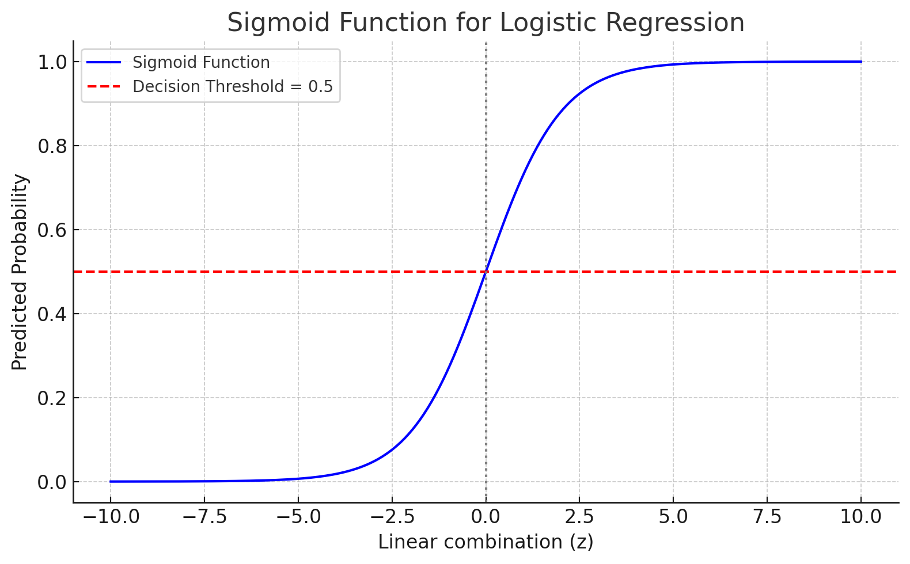

# 🧾 Study Guide: Logistic Regression in Machine Learning
### Binary & Multiclass Classification, Regularization, and Visualization

---

## 🎯 Objective

> Use **logistic regression** to predict binary or multiclass outcomes using numerical or categorical features.

---

## 🧠 What Is Logistic Regression?

> Logistic Regression is a **linear model** for **classification** that outputs **probabilities** using the **sigmoid function** (for binary) or **softmax** (for multiclass).

---

## 🔁 How Is Logistic Regression Like Linear Regression?

| Aspect         | Logistic Regression                          | Linear Regression                  |
|----------------|-----------------------------------------------|------------------------------------|
| Core math      | Uses linear combination of features: \( z = w_0 + w_1x_1 + \dots + w_nx_n \) | Same linear combination |
| Coefficients   | Learns weights per feature                    | Learns weights per feature         |
| Objective      | Predict probability of a class               | Predict a real-valued outcome      |
| Final step     | Applies **sigmoid** to squish output between 0 and 1 | Outputs value as-is                |

✅ In both cases, the model learns coefficients (weights) for features using optimization.

The **key difference** is the final step:
- **Linear Regression**: outputs \( z \) directly (any real number)
- **Logistic Regression**: applies **sigmoid** to get a **probability**

---

## 🔢 Logistic Regression Math Recap

\[
z = w_0 + w_1x_1 + w_2x_2 + \dots + w_nx_n
\]

\[
\sigma(z) = \frac{1}{1 + e^{-z}} \quad \text{(Sigmoid Function)}
\]

---

## ✅ Sigmoid Function Visualization



- **X-axis**: Linear combination output (`z`)
- **Y-axis**: Probability (0 to 1)
- Dashed red line: Threshold at 0.5 (common decision boundary)

### 🧠 How to Read the Plot:

- The **x-axis** represents `z` — the output from the linear combination of weights and features.
- The **y-axis** is the **predicted probability** after applying the sigmoid function.
- The **red dashed line** at `y = 0.5` is the **decision threshold**:
  - If output ≥ 0.5 → predict class **1**
  - If output < 0.5 → predict class **0**
- The sigmoid curve **smoothly transitions** from 0 to 1.

This visual helps explain why logistic regression outputs **probabilities** — and how those are turned into **binary class predictions**.

---

## 💡 Binary Decision Rule

```python
if sigmoid(z) ≥ 0.5:
    predict class 1
else:
    predict class 0
```

---

## 🔄 Multiclass Logistic Regression

- Uses **softmax** instead of sigmoid
- Outputs a **probability distribution** over multiple classes
- Choose class with **highest probability**

```python
model = LogisticRegression(multi_class='multinomial', solver='lbfgs')
```

---

## 🛡 Regularization in Logistic Regression

| Type  | Penalty Term                       | Effect                      |
|-------|------------------------------------|-----------------------------|
| **L2**| Sum of squares of weights          | Shrinks all weights (Ridge) |
| **L1**| Sum of absolute weights            | Can zero out weights (Lasso) |

```python
# L2 (default)
model = LogisticRegression(penalty='l2', C=1.0)

# L1
model = LogisticRegression(penalty='l1', solver='liblinear', C=1.0)
```

---

## 🧪 Code Example: Binary Classification on Titanic

```python
from sklearn.linear_model import LogisticRegression
from sklearn.model_selection import train_test_split
from sklearn.metrics import accuracy_score
import pandas as pd

df = pd.read_csv("https://raw.githubusercontent.com/datasciencedojo/datasets/master/titanic.csv")
df['Sex'] = df['Sex'].map({'male': 0, 'female': 1})
df = df[['Pclass', 'Sex', 'Age', 'Fare', 'Survived']].dropna()

X = df[['Pclass', 'Sex', 'Age', 'Fare']]
y = df['Survived']

X_train, X_test, y_train, y_test = train_test_split(X, y, random_state=2)

model = LogisticRegression()
model.fit(X_train, y_train)
print("Accuracy:", accuracy_score(y_test, model.predict(X_test)))
```

---

## 📌 TL;DR Summary Table

| Feature                | Logistic Regression                         |
|------------------------|---------------------------------------------|
| Type                   | Linear model for classification             |
| Output                 | Probability (0–1) via sigmoid or softmax    |
| Use case               | Binary or multiclass classification         |
| Final layer            | Sigmoid (binary), Softmax (multiclass)      |
| Regularization         | ✅ L1 (sparse), ✅ L2 (smooth)               |
| Decision threshold     | Commonly 0.5 (can be tuned)                 |
| Difference from Linear | Adds sigmoid; predicts class, not number    |

