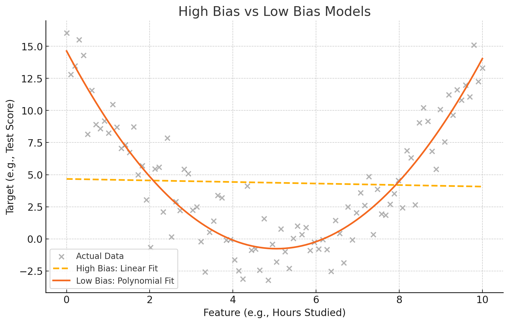

## 🧠 1. **What is a Machine Learning Model Trying to Do?**

Imagine you have some data—say, points on a graph—that show how **hours studied** affects **test score**. You want to build a model that can:
- Learn from this data (training),
- Predict test scores for new students based on how many hours they study (prediction).

---

## 📉 2. **What is a "Straight Line Model"?**

A **straight line model** is one of the simplest types of models. It looks like:

\[
\text{Predicted Score} = m \times \text{Hours Studied} + b
\]

This is a line with:
- `m`: the slope (how much the score increases with each hour),
- `b`: the y-intercept (baseline score if 0 hours studied).

It’s called a **linear model** or **linear regression**.

---

## 🚫 3. **What if the Real Data is Not a Straight Line?**

Let’s say the real data looks more like a curve:
- At very low or very high hours, the performance drops.
- In the middle, the scores peak.

This means the real relationship between hours studied and score is **non-linear**.

If you still try to fit a straight line through this curved data, it **won’t match well**.

---

## 📏 4. **What is "Bias"?**

**Bias** in machine learning refers to **how much your model’s predictions deviate from the real values due to incorrect assumptions**.

- A **high-bias model** makes strong assumptions (like "the data must follow a straight line") and fails to capture the real pattern in the data.
- A **low-bias model** is flexible enough to adapt to the true shape of the data.

---

## 🧾 5. **Explanation of the Statement**

> "The bias of the straight line is high because the predictions are restricted to the line and fail to account for changes in the data."

- A straight line can’t bend or curve.
- If the true relationship is **curved**, then the straight line **can’t capture that**.
- This mismatch causes large errors in predictions — this is called **high bias**.
- The model is **too simple** to learn the real pattern — it **underfits** the data.

---

## 🔍 6. Visual Intuition (Text-Based)

| Model Type           | Fit to Data | Error (Bias)     |
|----------------------|-------------|------------------|
| Straight Line (High Bias) | Poor fit     | High — misses curve |
| Curved Line (Low Bias)    | Good fit     | Low — captures curve |

---

## 🧪 7. Fixing High Bias

To reduce high bias:
- Use a **more flexible model**, like a **polynomial regression** (adds curve).
- Or a decision tree, or a neural network, depending on the problem.

---

## ✅ 8. Summary in Simple Terms

> A straight line makes a strong guess that all data should follow a line. If your data doesn’t follow that pattern, your predictions will be bad. This bad guess is called **high bias** — the model is too simple to learn the truth.

---

## 9. A chart comparing high-bias vs. low-bias fits

<figure>
  
  <figcaption><b>Fig 1:</b> High Bias Vs Low Bias Models</figcaption>
</figure>

Here’s the visual explanation:

- **Gray dots** = actual data points (which follow a curved pattern)
- **Dashed line** = straight line fit (**high bias**) → it cannot follow the curve, so it underfits
- **Curved line** = polynomial fit (**low bias**) → it adapts better to the data’s shape

This shows why a straight-line model has **high bias**—it’s too simple to represent the real, non-linear trend in the data.

Would you like a markdown version of this explanation with the image linked or downloadable?