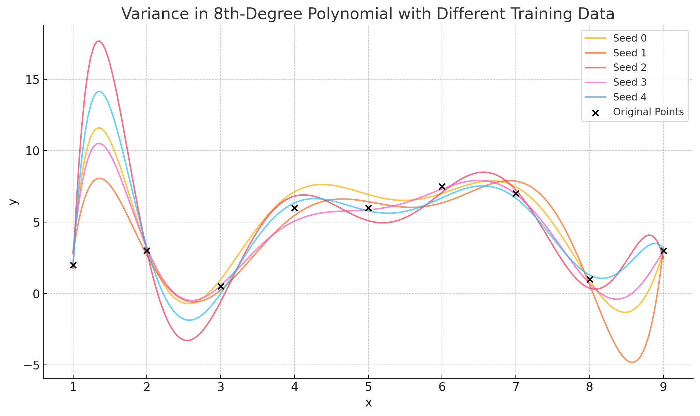

<h1>2.8-Study Guide: High Variance in Polynomial Models (8th-Degree Example)</h1>

---

### 🎯 Goal
To understand the concept of **high variance** in machine learning using an example of **8th-degree polynomial regression** fitted to just 9 data points.

---

### 🔍 Background

In machine learning, **variance** refers to how much a model's predictions **change** when trained on **different subsets of the training data**.

> "In machine learning, variance is a mathematical term indicating how much a model will change given a different set of training data."

This study guide explores this idea using an 8th-degree polynomial regression model.

---

### 🧪 Setup: 9 Data Points
We simulate 9 data points and fit an 8th-degree polynomial to them. Why degree 8?

- A polynomial of degree \( n - 1 \) can fit exactly \( n \) points.
- With 9 points, an 8th-degree polynomial can pass through all of them.

This leads to **zero training error** (perfect fit) but potentially **very high test error** — a hallmark of **overfitting**.

---

### 📈 Polynomial Equation
A general 8th-degree polynomial looks like this:

\[
y = a_8x^8 + a_7x^7 + a_6x^6 + a_5x^5 + a_4x^4 + a_3x^3 + a_2x^2 + a_1x + a_0
\]

In one of our runs, the actual fitted polynomial (with rounded coefficients) looked like:

\[
y = -0.0033x^8 + 0.192x^7 - 4.27x^6 + 53.3x^5 - 390x^4 + 1746x^3 - 4582x^2 + 6484x - 3842
\]

Such large, fluctuating coefficients are signs of **instability** — the model is trying too hard to fit every point.

---

### 📊 Demonstration: Training on Different Samples
We ran the same 8th-degree polynomial regression on multiple versions of the data, each with small random noise added.

Here is the plot of 5 such runs:

Each colored line represents a model trained on slightly different data (different seeds).

### 🧠 Interpretation
- All models have the **same degree (8)**.
- And yet, the curves differ **drastically**.
- This is because a high-degree polynomial is **very sensitive** to the exact positions of the data points.

This is **high variance**:
> The model’s predictions vary greatly with small changes in training data.

---

### 🤔 But Does Variance Mean the Degree Changes?
Not necessarily!

- If the degree is **fixed**, the **model's predictions still change** due to different data.
- If you're using **model selection**, the chosen degree **could** change based on validation performance.

In our case:
- Degree was fixed (8).
- So variance shows up in the **shape of the curve**, not the model complexity.

---

### 🧠 Summary Table
| Term                  | Meaning                                                                 |
|-----------------------|-------------------------------------------------------------------------|
| High Variance         | Model’s predictions change a lot with different data                    |
| High Degree Polynomial| More capacity to fit — tends to have high variance                      |
| Model Selection       | Process that may choose a different degree depending on dataset         |
| Fixed Degree          | Variance still exists, but only in the learned curve, not the model type|

---

### ✅ Key Takeaways
- High-degree polynomials can overfit and have high variance.
- High variance = the model’s predictions are unstable across different training sets.
- Fixing the degree doesn't eliminate variance — the fitted function still changes wildly.
- Always balance **bias vs variance** using **cross-validation**.
