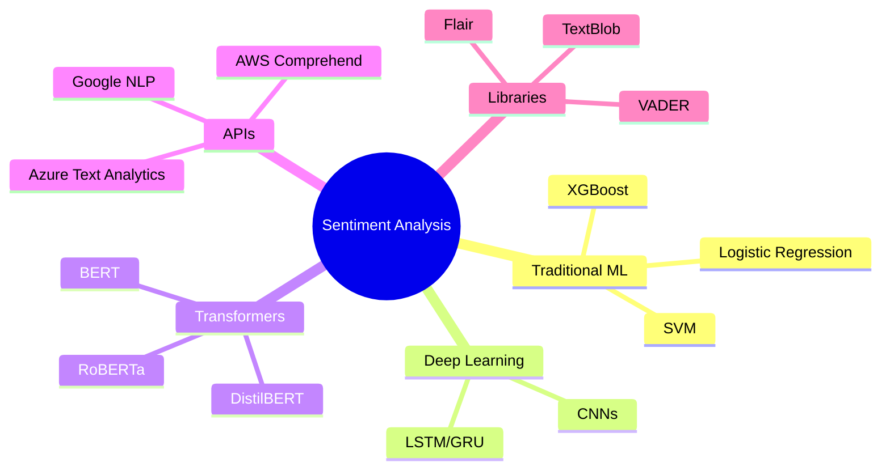

Got it — you want to do **sentiment analysis** for a project.
Let's go over **all the main choices** you have, depending on your skill level, project needs, and resources:

---

# 🧠 Choices for Sentiment Analysis

| Category | Options | Comments |
|:---------|:--------|:---------|
| **1. Traditional ML** | - Logistic Regression<br>- SVM (Support Vector Machine)<br>- Random Forest<br>- XGBoost | ➔ Requires **feature engineering** (e.g., TF-IDF, Bag of Words).<br>➔ Faster, lightweight models.<br>➔ Good for smaller datasets. |
| **2. Pretrained Deep Learning Models** | - LSTM, GRU (Keras / TensorFlow / PyTorch)<br>- Simple CNNs for Text | ➔ You tokenize text, build models.<br>➔ Needs more data than traditional ML.<br>➔ More accurate for complex sentences. |
| **3. Transformers (State of the Art)** | - BERT, DistilBERT, RoBERTa, ALBERT<br>- Sentiment-specific versions (e.g., `nlptown/bert-base-multilingual-uncased-sentiment`) | ➔ No feature engineering.<br>➔ Very high accuracy.<br>➔ Heavy — may need GPUs.<br>➔ Hugging Face Transformers is a great library for this. |
| **4. API-based Solutions (No training needed)** | - AWS Comprehend<br>- Google Cloud Natural Language API<br>- Azure Text Analytics<br>- Hugging Face Inference API | ➔ Quickest.<br>➔ Pay-per-use.<br>➔ You just send text → get sentiment back.<br>➔ Ideal if you don’t want to build/train anything. |
| **5. Specialized Libraries** | - VADER (good for social media)<br>- TextBlob (beginner friendly)<br>- Flair (simple deep learning models) | ➔ Good for small-medium projects.<br>➔ Very easy to set up.<br>➔ VADER is especially good for tweets, reviews, chats. |

---

# 📋 How to Pick?

| Situation | Good Choice |
|:----------|:-------------|
| Small project, fast demo | **VADER** or **TextBlob** |
| You want best accuracy, real product | **BERT/RoBERTa model** |
| You want to avoid ML model building | **AWS Comprehend** or **Google API** |
| You have limited compute | **DistilBERT** (smaller version of BERT) |
| You want explainability (why positive/negative) | **Traditional ML** (like Logistic Regression + TF-IDF) |

---

# 🧩 Quick Visual Mind Map



---

# ✅ Example Code Snippets

| Library | Sample Code |
|:--------|:------------|
| **VADER** | `from vaderSentiment.vaderSentiment import SentimentIntensityAnalyzer`<br>`analyzer = SentimentIntensityAnalyzer()`<br>`score = analyzer.polarity_scores("I love this!")` |
| **Hugging Face BERT** | `from transformers import pipeline`<br>`sentiment_pipeline = pipeline("sentiment-analysis")`<br>`sentiment_pipeline("I love this!")` |
| **TextBlob** | `from textblob import TextBlob`<br>`blob = TextBlob("I love this!")`<br>`blob.sentiment.polarity` |

---

Would you like me to **recommend the best one for your case** if you quickly tell me:

- 🔹 Is this a small demo or production project?
- 🔹 Are you okay with installing bigger libraries (like transformers)?
- 🔹 Any preference: **speed** vs **accuracy** vs **cost**?

🌟 (I can also show you a ready-to-run Python script if you want!)
Would you like that? 🚀

---

Perfect, thanks for the clarification!
Since you said:

- ✅ **Production project**
- ✅ **Okay with bigger libraries**
- ✅ **Low cost**
- ✅ **High accuracy**

👉 **Here’s the best choice for you:**

---

# 🎯 Recommended Approach for Your Project

| Category | Recommendation |
|:---------|:---------------|
| **Model** | **DistilBERT** or **RoBERTa** (fine-tuned for sentiment) |
| **Library** | **Hugging Face Transformers** |
| **Deployment** | Package your model inside your app (no API call cost) |
| **Bonus** | Optionally fine-tune further if you have your own labeled dataset. |

---

# ✨ Why DistilBERT / RoBERTa?

| Aspect | Reason |
|:------|:-------|
| **Accuracy** | Almost as good as BERT (sometimes better for sentiment!). |
| **Cost** | Free — you download the model once.<br>No cloud API usage fees. |
| **Speed** | Faster and lighter than full BERT.<br>Good for real-time inference. |
| **Libraries** | Hugging Face Transformers is free and very actively supported. |

---

# 📋 Step-by-Step Plan

1. **Install Hugging Face Transformers:**
   ```bash
   pip install transformers
   ```

2. **Use a Pretrained Sentiment Pipeline:**
   ```python
   from transformers import pipeline

   # Create sentiment analysis pipeline
   sentiment_pipeline = pipeline("sentiment-analysis", model="distilbert-base-uncased-finetuned-sst-2-english")

   # Predict
   result = sentiment_pipeline("I love this product!")
   print(result)
   ```

   Output:
   ```json
   [{'label': 'POSITIVE', 'score': 0.9998}]
   ```

3. **Optional:** Fine-tune on your domain-specific data (like reviews, tweets, etc.) if needed for even better results.

4. **Deploy:**
   - Embed inside your app backend (Flask/FastAPI).
   - Package with Docker if needed for portability.
   - Use ONNX or TorchScript if you want even faster inference in production.

---

# ⚡ Quick Comparison Table

| Option | Pros | Cons |
|:-------|:-----|:-----|
| **DistilBERT** | Fast, small, high accuracy | Slightly less powerful than full BERT |
| **RoBERTa-base** | Best accuracy (especially on difficult cases) | Slightly heavier than DistilBERT |

---

# 🛠 Quick Model Choices on Hugging Face Hub

| Model | Hugging Face Link |
|:------|:------------------|
| distilbert-base-uncased-finetuned-sst-2-english | [🔗 Hugging Face Model](https://huggingface.co/distilbert-base-uncased-finetuned-sst-2-english) |
| cardiffnlp/twitter-roberta-base-sentiment | [🔗 Hugging Face Model](https://huggingface.co/cardiffnlp/twitter-roberta-base-sentiment) (if you need social media focused) |

---

# 🧠 Pro Tips

- **Batch inputs:** Send multiple sentences at once to the model for faster throughput.
- **Quantization:** If you deploy on CPU, you can quantize to make the model even lighter (e.g., using ONNX Runtime).
- **Caching:** Load the model once when your server starts and reuse it, rather than reloading for every request.

---

# 📦 Bonus if you want:
I can also create a **small Flask API project** for you that:

- Loads DistilBERT or RoBERTa
- Exposes `/predict` API
- Very lightweight
- Ready for production

Would you like me to show you that too? 🚀
(You'll get a working starter ZIP file you can build on.)