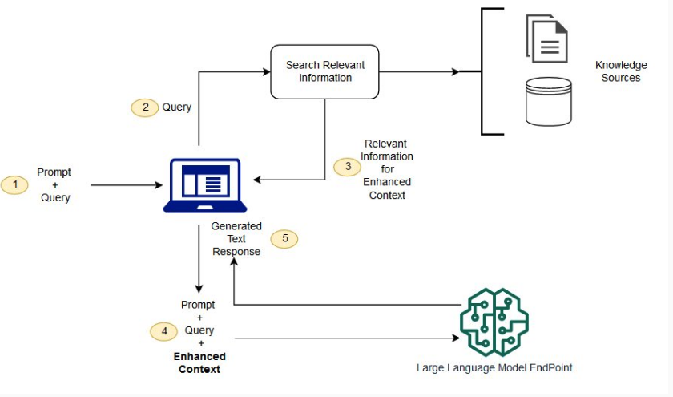

1. [How to Improve LLMs with RAG (Overview + Python Code) by Shaw Talebi](https://www.youtube.com/watch?v=Ylz779Op9Pw)
1. [Practical Retrieval Augmented Generation (RAG) by Sinan Ozdemir](https://learning.oreilly.com/videos/practical-retrieval-augmented/9780135414378/9780135414378-PRAG1_00_00_00/)
1. [Retrieval Augmented Generation (RAG) by Machine Learning Studio](https://www.youtube.com/watch?v=MJVTf63OF5o)
1. [How RAG works in 60 secs](https://www.youtube.com/shorts/xS55duPS-Pw)
1. [What is Retrieval-Augmented Generation (RAG)? By IBM](https://www.youtube.com/watch?v=T-D1OfcDW1M)
1. [What is Agentic RAG? By IBM](https://www.youtube.com/watch?v=0z9_MhcYvcY)

### RAG vs Fine Tuning

1. [RAG vs Fine-Tuning for LLMs: A Comprehensive Guide with Examples AI Rabbit](https://huggingface.co/blog/airabbitX/rag-vs-fine-tuning-for-llms-a-com)
1. [[_**START_HERE**_] RAG vs. fine-tuning by Ivan Belcic and Cole Stryker](https://www.ibm.com/think/topics/rag-vs-fine-tuning)
1. [RAG vs. Fine Tuning By IBM](https://www.youtube.com/watch?v=00Q0G84kq3M)
1. [What’s the difference between RAG and fine-tuning? by IBM](https://www.ibm.com/think/topics/rag-vs-fine-tuning)
1. [What is Retrieval-Augmented Generation? BY AWS](https://aws.amazon.com/what-is/retrieval-augmented-generation)

  