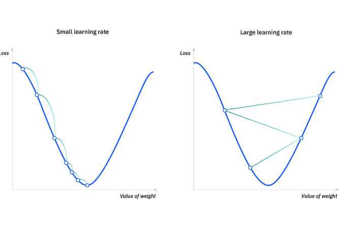
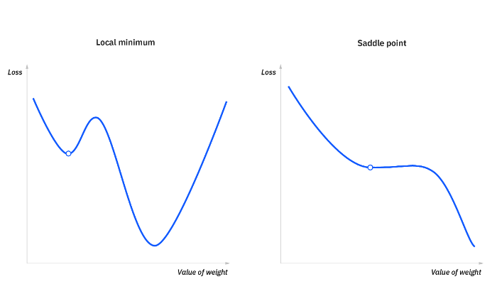

### When is Gradient Descent used

1. For optimization

### Goal of Gradient descent

1. minimize the cost function, or the error between predicted and actual y

### How does it mizimize the cost?

In order to do this, it requires two data points—a direction and a learning rate. These factors determine the partial derivative calculations of future iterations, allowing it to gradually arrive at the local or global minimum (i.e. point of convergence).

What is gradient descent?
Gradient descent is an optimization algorithm which is commonly-used to train machine learning models and neural networks. It trains machine learning models by minimizing errors between predicted and actual results.

Training data helps these models learn over time, and the cost function within gradient descent specifically acts as a barometer, gauging its accuracy with each iteration of parameter updates. Until the function is close to or equal to zero, the model will continue to adjust its parameters to yield the smallest possible error. Once machine learning models are optimized for accuracy, they can be powerful tools for artificial intelligence (AI) and computer science applications.

3D design of balls rolling on a track
The latest AI News + Insights 

Discover expertly curated insights and news on AI, cloud and more in the weekly Think Newsletter.

Subscribe today
How does gradient descent work?
Before we dive into gradient descent, it may help to review some concepts from linear regression. You may recall the following formula for the slope of a line, which is y = mx + b, where m represents the slope and b is the intercept on the y-axis.

You may also recall plotting a scatterplot in statistics and finding the line of best fit, which required calculating the error between the actual output and the predicted output (y-hat) using the mean squared error formula. The gradient descent algorithm behaves similarly, but it is based on a convex function.

The starting point is just an arbitrary point for us to evaluate the performance. From that starting point, we will find the derivative (or slope), and from there, we can use a tangent line to observe the steepness of the slope. The slope will inform the updates to the parameters—i.e. the weights and bias. The slope at the starting point will be steeper, but as new parameters are generated, the steepness should gradually reduce until it reaches the lowest point on the curve, known as the point of convergence.

Similar to finding the line of best fit in linear regression, the goal of gradient descent is to minimize the cost function, or the error between predicted and actual y. In order to do this, it requires two data points—a direction and a learning rate. These factors determine the partial derivative calculations of future iterations, allowing it to gradually arrive at the local or global minimum (i.e. point of convergence).

### Learning rate
Learning rate (also referred to as step size or the alpha) is the size of the steps that are taken to reach the minimum. This is typically a small value, and it is evaluated and updated based on the behavior of the cost function. High learning rates result in larger steps but risks overshooting the minimum. Conversely, a low learning rate has small step sizes. While it has the advantage of more precision, the number of iterations compromises overall efficiency as this takes more time and computations to reach the minimum.

### The cost (or loss) function
The cost (or loss) function measures the difference, or error, between actual y and predicted y at its current position. This improves the machine learning model's efficacy by providing feedback to the model so that it can adjust the parameters to minimize the error and find the local or global minimum. It continuously iterates, moving along the direction of steepest descent (or the negative gradient) until the cost function is close to or at zero. At this point, the model will stop learning. Additionally, while the terms, cost function and loss function, are considered synonymous, there is a slight difference between them. It’s worth noting that a loss function refers to the error of one training example, while a cost function calculates the average error across an entire training set.
Graph illustrating different learning rates within gradient descent

### Types of Gradient Descent

1. Batch Gradient descent
1. Stochastic Gradient descent
1. Mini-batch gradient descent

### What are the challenges with Gradient Descent

1. Local minima and saddle points

1. Vanishing and Exploding Gradients

## Blogs

1. [Gradient Descent From Scratch | End to End Gradient Descent | Gradient Descent Animation by CampusX](https://www.youtube.com/watch?v=ORyfPJypKuU&list=PLKnIA16_Rmvbr7zKYQuBfsVkjoLcJgxHH&index=56)
1. [What is gradient descent?](https://www.ibm.com/think/topics/gradient-descent)
1. [Gradient Descent, Step-by-Step  By StaQuest](https://www.youtube.com/watch?v=sDv4f4s2SB8)
1. [Stochastic Gradient Descent, Clearly Explained!!! By StaQuest](https://www.youtube.com/watch?v=vMh0zPT0tLI)
1. [Gradient Descent: The Smart Way to Train Neural Network  by SuperDataScience](https://www.youtube.com/watch?v=OouPxtRaMlY)
1. [Deep Learning Optimization: Stochastic Gradient Descent Explained by SuperDataScience](https://www.youtube.com/watch?v=gJFJgiFE79Y)