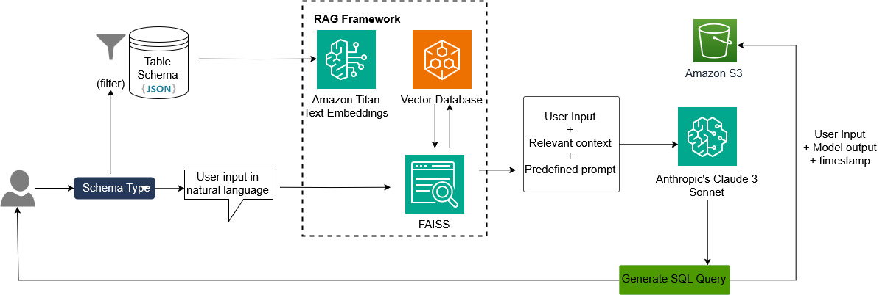
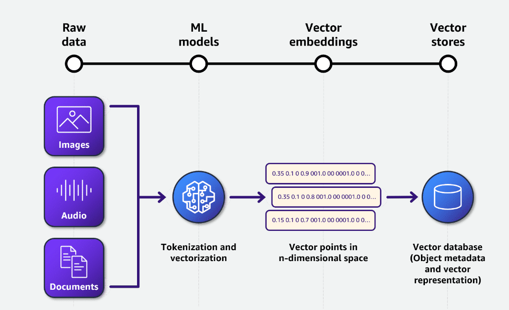

<!-- TOC -->

- [1. LLMs](#1-llms)
- [2. ML Concepts](#2-ml-concepts)
- [3. DL concepts](#3-dl-concepts)
- [4. NLP + NER Concepts](#4-nlp--ner-concepts)
- [5. Gen AI Concepts](#5-gen-ai-concepts)
- [6. Hugging Face](#6-hugging-face)
- [7. Feature Engineering](#7-feature-engineering)
- [8. Transformer Concepts](#8-transformer-concepts)
- [9. Vector Databases](#9-vector-databases)
- [10. Bedrock](#10-bedrock)
- [11. Embeddings](#11-embeddings)
- [12. Fine Tuning](#12-fine-tuning)

<!-- /TOC -->

# 1. LLMs

1. [Large Language Models (LLMs) by Shaw Talebi](https://www.youtube.com/playlist?list=PLz-ep5RbHosU2hnz5ejezwaYpdMutMVB0)
1. [[**MUST_SEE**] Choosing the Right LLM By Ed Donner](https://learning.oreilly.com/live-events/choosing-the-right-llm/0642572002832/0642572010497/)
1. [[**MUST_SEE**] [**UDEMY**] LLM Engineering: Master AI, Large Language Models & Agents by Ed Donner](https://www.udemy.com/course/llm-engineering-master-ai-and-large-language-models/)

# 2. ML Concepts

1. [Model Fit: Underfitting vs. Overfitting](https://docs.aws.amazon.com/machine-learning/latest/dg/model-fit-underfitting-vs-overfitting.html))
- Read all about Machine Learning concepts here

# 3. DL concepts
1. [How Neural Networks Learn: Exploring Architecture, Gradient Descent, and Backpropagation by Amber Israelsen](https://app.pluralsight.com/library/courses/neural-networks-exploring-architecture-gradient-descent-backpropagation/table-of-contents)

# 4. NLP + NER Concepts

1. [Fine Tuning BERT for Named Entity Recognition (NER) | NLP | Data Science | Machine Learning By Rohan Paul](https://www.youtube.com/watch?v=dzyDHMycx_c)

1. [2- Fine Tuning DistilBERT for NER Tagging using HuggingFace | NLP Hugging Face Project Tutorial By KGP Talkie](https://www.youtube.com/watch?v=Q1i4bIIFOFc)

# 5. Gen AI Concepts

1. [GenAI Foundations, Fine-Tuning, RAG, and LLM Application Development Published by Pearson](https://learning.oreilly.com/live-events/genai-foundations-fine-tuning-rag-and-llm-application-development/0642572007597/)
1. [Getting Started on Prompt Engineering with Generative AI by Amber Israelsen](https://app.pluralsight.com/library/courses/getting-started-prompt-engineering-generative-ai/table-of-contents)
1. [Build your gen AI–based text-to-SQL application using RAG, powered by Amazon Bedrock (Claude 3 Sonnet and Amazon Titan for embedding) by Rajendra Choudhary](https://aws.amazon.com/blogs/machine-learning/build-your-gen-ai-based-text-to-sql-application-using-rag-powered-by-amazon-bedrock-claude-3-sonnet-and-amazon-titan-for-embedding/)
- Amazon Titan for embedding
- Claude 3 Sonnet

# 6. Hugging Face

1. [Natural Language Processing - Transformers with Hugging Face by Lazy Programmer](https://learning.oreilly.com/course/natural-language-processing/9781836200673/)
1. [How to Fine Tune a 🤗 (Hugging Face) Transformer Model by Akis Loumpourdis](https://hackernoon.com/how-to-fine-tune-a-hugging-face-transformer-model-581137q7)

# 7. Feature Engineering

1. [Feature Encoding 101: Prepare Data For Machine Learning](https://www.youtube.com/watch?v=kGemHLOEF3w)

# 8. Transformer Concepts

1. [How Transformer LLMs Work By Jay Alamar/Andrew NG](https://learn.deeplearning.ai/courses/how-transformer-llms-work/lesson/nfshb/introduction)

# 9. Vector Databases

1. [Understanding Vector Similarity for Machine Learning](https://medium.com/advanced-deep-learning/understanding-vector-similarity-b9c10f7506de)
- Cosine Similarity, Dot Product, Manhattan Distance L1, Euclidian Distance L2.
1. [[**DONE**] Vector Databases & Embeddings for Developers by JS Padoan](https://app.pluralsight.com/library/courses/vector-databases-embeddings-developers/exercise-files)

# 10. Bedrock

1. [Using Foundation Models in Code with Amazon Bedrock By Stuatrt Clark](https://www.youtube.com/watch?v=5GAlB056yB4)

# 11. Embeddings

1. [Build your gen AI–based text-to-SQL application using RAG, powered by Amazon Bedrock (Claude 3 Sonnet and Amazon Titan for embedding) by Rajendra Choudhary](https://aws.amazon.com/blogs/machine-learning/build-your-gen-ai-based-text-to-sql-application-using-rag-powered-by-amazon-bedrock-claude-3-sonnet-and-amazon-titan-for-embedding/)
    - Amazon Titan for embedding
    - Claude 3 Sonnet
    - Architecture
        
    - RAG
        
    - Embeddings
        

# 12. Fine Tuning

1. [Fine-Tuning LLMs: A Guide With Examples By Josep Ferrer](https://www.datacamp.com/tutorial/fine-tuning-large-language-models)
1. [Fine-tune a large language model (LLM) using prompt instructions](https://docs.aws.amazon.com/sagemaker/latest/dg/jumpstart-foundation-models-fine-tuning-instruction-based.html)
- explore different forms of fine-tuning using sagemaker

