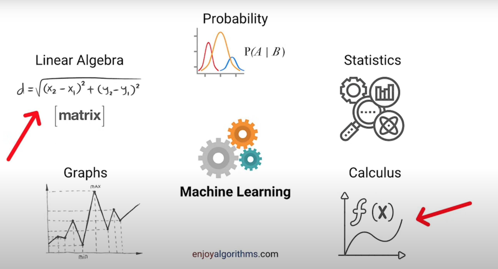
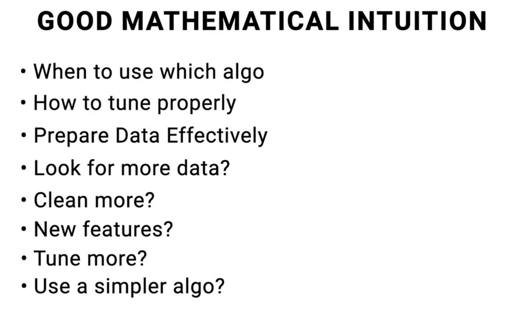
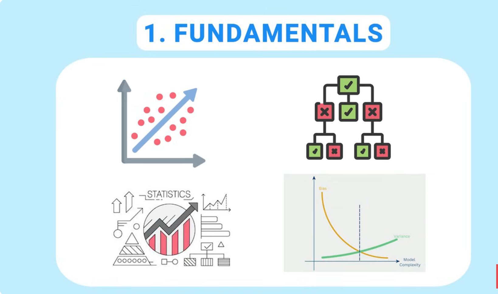
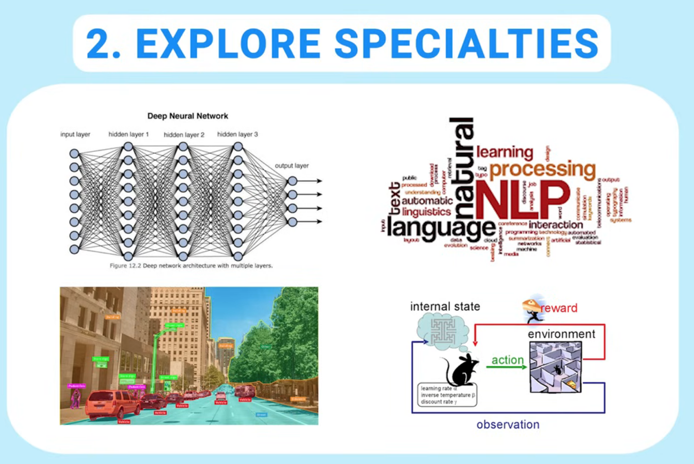

# Learn following Math subjects

src: https://youtu.be/espQDESe07w?t=135

# What I need to do in a ML project

# 10. Generalize before specializing

# References

1. https://www.youtube.com/watch?v=espQDESe07w