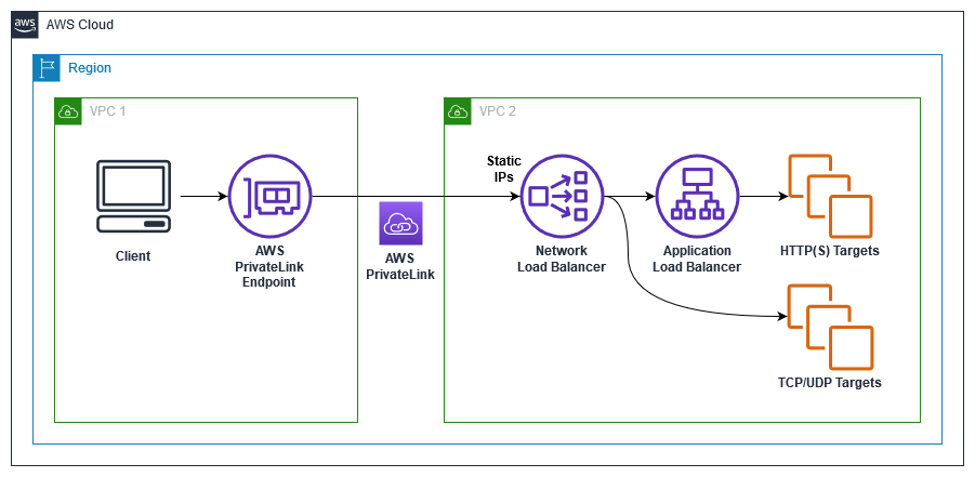
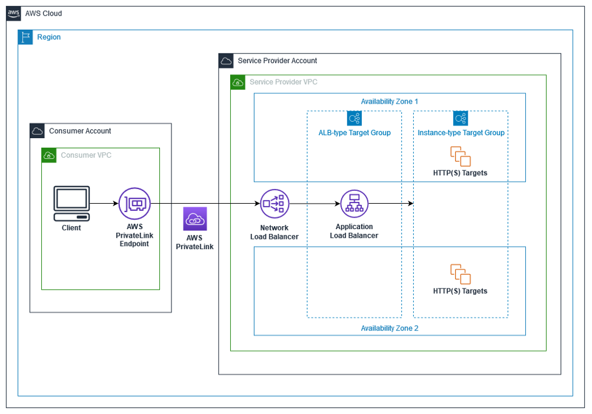
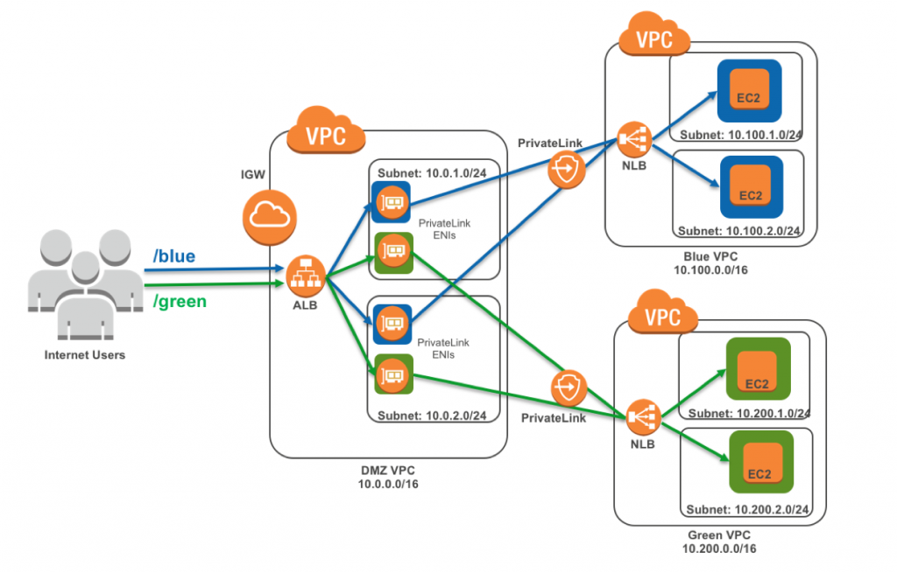

<h1>ALB Configurations</h1>

<!-- TOC -->

- [1. NLB -> ALB](#1-nlb---alb)
- [2. ALB -> NLB](#2-alb---nlb)
- [3. ALB -> IP Address](#3-alb---ip-address)
- [4. ALB -> Lambda](#4-alb---lambda)
- [5. R53 -> ALB -> Fargate](#5-r53---alb---fargate)
- [6. API-GTWY -> NLB -> EC2](#6-api-gtwy---nlb---ec2)
- [7. Demos](#7-demos)

<!-- /TOC -->

# 1. NLB -> ALB

1. [Application Load Balancer-type Target Group for Network Load Balancer by Rohit Aswani and Eugene Wiehahn](https://aws.amazon.com/blogs/networking-and-content-delivery/application-load-balancer-type-target-group-for-network-load-balancer/)

    

detailed

    

# 2. ALB -> NLB

1. [How to securely publish Internet applications at scale using Application Load Balancer and AWS PrivateLink by Tom Adamski](https://aws.amazon.com/blogs/networking-and-content-delivery/how-to-securely-publish-internet-applications-at-scale-using-application-load-balancer-and-aws-privatelink/)

    

# 3. ALB -> IP Address

1. [New – Application Load Balancing via IP Address to AWS & On-Premises Resources by Jeff Barr ](https://aws.amazon.com/blogs/aws/new-application-load-balancing-via-ip-address-to-aws-on-premises-resources/)
1. [How to securely publish Internet applications at scale using Application Load Balancer and AWS PrivateLink by Tom Adamski](https://aws.amazon.com/blogs/networking-and-content-delivery/how-to-securely-publish-internet-applications-at-scale-using-application-load-balancer-and-aws-privatelink/)

    

# 4. ALB -> Lambda

1. [[Typescript CDK] Application Load Balancer with Lambda as a target](https://serverlessland.com/patterns/alb-lambda-cdk)

# 5. R53 -> ALB -> Fargate

1. [Route53 to ALB to ECS Fargate](https://serverlessland.com/patterns/route53-alb-fargate-cdk-dotnet)
- Use ChatGPT to convert from .NET to Typescript

# 6. API-GTWY -> NLB -> EC2

1. [[Python CDK] Deploy a NGINX server on private EC2 server and proxy it via REST API](https://serverlessland.com/patterns/apigw-ec2)

# 7. Demos

1. [Elastic Load Balancing Demos](https://exampleloadbalancer.com/)

