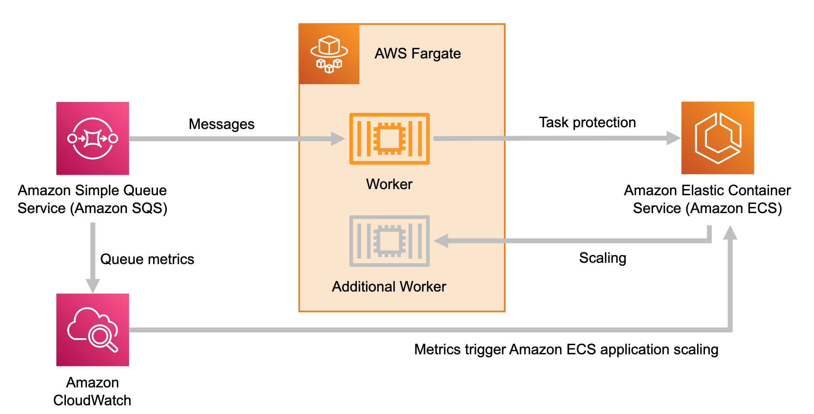

1. [Scaling an ASG using target tracking with a dynamic SQS target](https://aws.amazon.com/blogs/compute/scaling-an-asg-using-target-tracking-with-a-dynamic-sqs-target)
2. [Running Cost-effective queue workers with Amazon SQS and Amazon EC2 Spot Instances by Ben Peven ](https://aws.amazon.com/blogs/compute/running-cost-effective-queue-workers-with-amazon-sqs-and-amazon-ec2-spot-instances/)

# ECS
1. [How ECS scales using SQS cloudwatch metrics](https://containersonaws.com/pattern/background-worker-sqs-queue-container-copilot)
&nbsp;
    