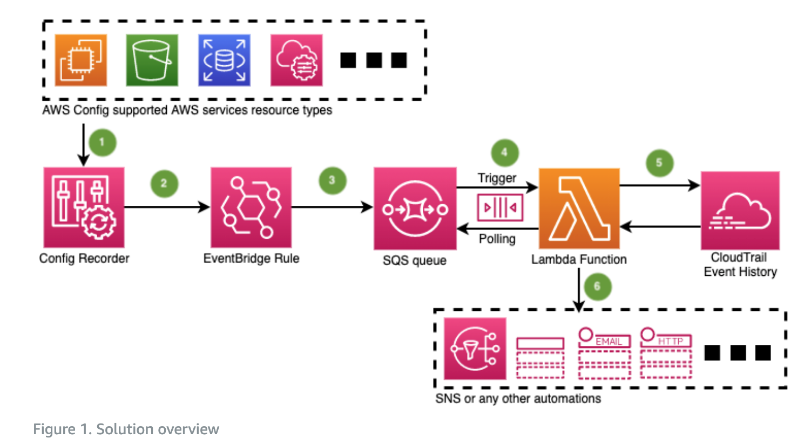
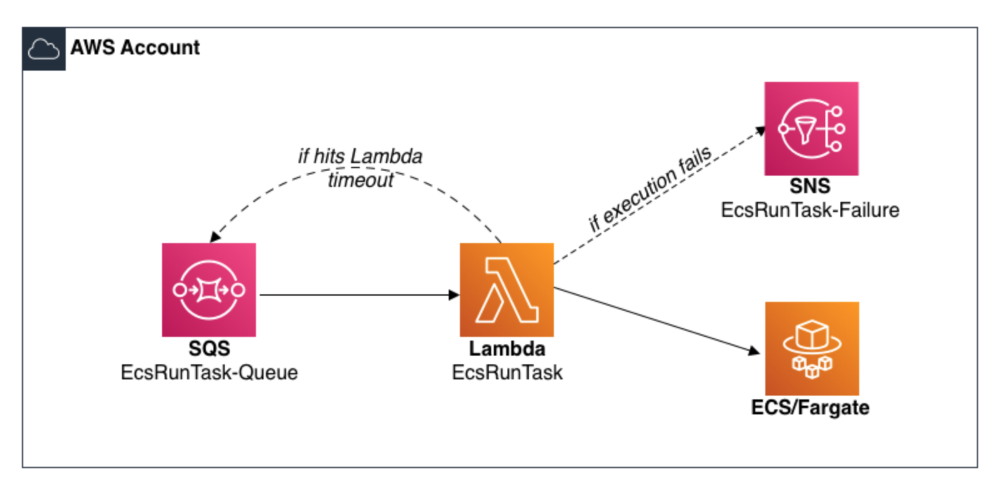
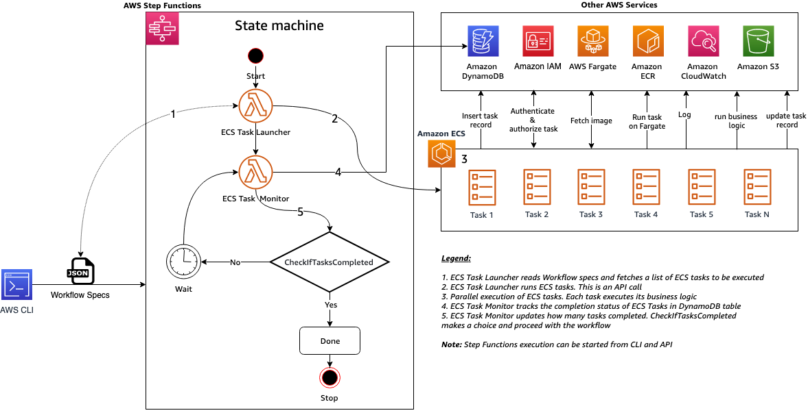

<h1>AWS Samples</h1>

<!-- TOC -->

- [1. Autoscaling,EC2](#1-autoscalingec2)
- [2. Autoscaling,ECS](#2-autoscalingecs)
- [5. Config](#5-config)
- [3. EC2-Spot-Instances-Labs](#3-ec2-spot-instances-labs)
- [4. Eventbridge,Orchestrator](#4-eventbridgeorchestrator)
- [5. ECS,Spring](#5-ecsspring)
- [6. ECS,Lambda,SQS](#6-ecslambdasqs)
- [7. ECS,EventBridge](#7-ecseventbridge)
- [8. DynamoDB,ECS,EventBridge,Lambda,SNS,SQS](#8-dynamodbecseventbridgelambdasnssqs)
- [9. Lambda](#9-lambda)
- [10. Networking](#10-networking)
- [11. SQS](#11-sqs)
- [12. Step Functions](#12-step-functions)

<!-- /TOC -->

# 1. Autoscaling,EC2

1. [Scaling an EC2 Auto Scaling group based on Amazon Simple Queue Service (SQS)](https://github.com/awslabs/ec2-spot-labs/tree/master/ec2-asg-dynamic-target-tracking)

# 2. Autoscaling,ECS

1. [[**MUST TRY**] Autoscale ECS using cloudwatch metrics for SQS](https://containersonaws.com/pattern/background-worker-sqs-queue-container-copilot)

# 5. Config

1. [[AWS-SAMPLES] How to use AWS Config and CloudTrail to find who made changes to a resource by Mohamed Attalla, Man Man Chau, Eduardo Ortiz Pineda, and Dan Urbano](https://aws.amazon.com/blogs/mt/how-to-use-aws-config-and-cloudtrail-to-find-who-made-changes-to-a-resource/)

# 3. EC2-Spot-Instances-Labs

1. [ec2-spot-labs](https://github.com/awslabs/ec2-spot-labs)

# 4. Eventbridge,Orchestrator

1. [Insurance Claims Processing using Serverless and Event-Driven Architecture](https://github.com/aws-samples/serverless-eda-insurance-claims-processing)

# 5. ECS,Spring

1. [[**MUST TRY**] Spring Pet Clinic - Deploying Java Microservices on Amazon Elastic Container Service by Huy Huynh and Magnus Bjorkman](https://aws.amazon.com/blogs/compute/deploying-java-microservices-on-amazon-ec2-container-service/)

# 6. ECS,Lambda,SQS

1. [[**MUST TRY**] aws-lambda-amazon-ecs-run-task](https://github.com/awslabs/aws-lambda-ecs-run-task)
- nice scripts to adopt
- how to integrate ecs task with SQS using Lambda
- Demos exception handling with retries

# 7. ECS,EventBridge

1. [[**MUST TRY**] Integrating Amazon EventBridge and Amazon ECS By Jakub Narloch](https://aws.amazon.com/blogs/compute/integrating-amazon-eventbridge-and-amazon-ecs/)
2. [[**MUST TRY**] Queue Integration with Third-party Services on AWS by Rostislav Markov, Justin Kuskowski, Ravindra Agrawal, Saswata Dash, and Michael Steward](https://aws.amazon.com/blogs/architecture/queue-integration-with-third-party-services-on-aws/)

# 8. DynamoDB,ECS,EventBridge,Lambda,SNS,SQS

1. [[**MUST TRY**] Building dynamic Amazon SNS subscriptions for auto scaling container workloads By Mithun Mallick](https://aws.amazon.com/blogs/compute/building-dynamic-amazon-sns-subscriptions-for-auto-scaling-container-workloads/)
    - Architecture: SNS -> SQS -> ECS (Java Polls SQS) -> EventBridge -> Lambda/Dynamodb

# 9. Lambda

1. [S3-to-Lambda Patterns Series](https://github.com/aws-samples/s3-to-lambda-patterns/tree/master)

# 10. Networking

1. [[WORKSHOP - MUST TRY] Secure Hybrid Access to S3 using VPC Endpoints](https://catalog.us-east-1.prod.workshops.aws/workshops/3a8d4ddf-66c5-4d26-ae6f-6292a517f46c/en-US)
2. [[**MUST TRY**] Centralize access using VPC interface endpoints to access AWS services across multiple VPCs by Chetan Agrawal](https://aws.amazon.com/blogs/networking-and-content-delivery/centralize-access-using-vpc-interface-endpoints/)

# 11. SQS

1. [[**MUST TRY**] Background worker that gets jobs from an SQS queue](https://containersonaws.com/pattern/background-worker-sqs-queue-container-copilot)
- Poll SQS queue for messages?

    

2. [[**MUST TRY**] aws-lambda-amazon-ecs-run-task](https://github.com/awslabs/aws-lambda-ecs-run-task)
- nice scripts to adopt
- how to integrate ecs task with SQS using Lambda
- Demos exception handling with retries

    

# 12. Step Functions

1. [[**MUST TRY**] Amazon ECS and AWS Step Functions Design Patterns Starter kit](https://github.com/aws-samples/amazon-ecs-and-aws-step-functions-design-patterns-starter-kit)

    

    

