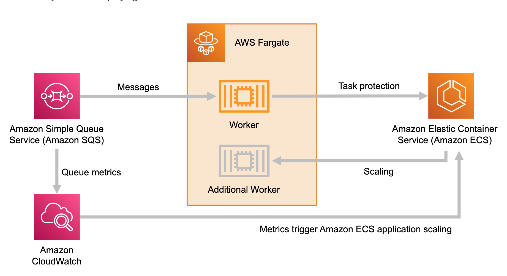

<h1>AWS Samples</h1>

<!-- TOC -->

- [1. Autoscaling,EC2](#1-autoscalingec2)
- [2. Autoscaling,ECS](#2-autoscalingecs)
- [3. Config](#3-config)
- [4. CDK](#4-cdk)
- [5. EC2-Spot-Instances-Labs](#5-ec2-spot-instances-labs)
- [6. Eventbridge,Orchestrator](#6-eventbridgeorchestrator)
- [7. ECS,Spring](#7-ecsspring)
- [8. ECS,Lambda,SQS](#8-ecslambdasqs)
- [9. ECS,EventBridge](#9-ecseventbridge)
- [10. DynamoDB,ECS,EventBridge,Lambda,SNS,SQS](#10-dynamodbecseventbridgelambdasnssqs)
- [11. Lambda](#11-lambda)
  - [11.1. Pricing](#111-pricing)
  - [11.2. Powertools](#112-powertools)
- [12. Kinesis](#12-kinesis)
- [13. Networking](#13-networking)
- [14. SQS](#14-sqs)
- [15. Step Functions](#15-step-functions)
- [16. Use cases](#16-use-cases)
- [17. Curate](#17-curate)

<!-- /TOC -->

# 1. Autoscaling,EC2

1. [Scaling an EC2 Auto Scaling group based on Amazon Simple Queue Service (SQS)](https://github.com/awslabs/ec2-spot-labs/tree/master/ec2-asg-dynamic-target-tracking)

# 2. Autoscaling,ECS

1. [[**MUST-TRY**] Autoscale ECS using cloudwatch metrics for SQS](https://containersonaws.com/pattern/background-worker-sqs-queue-container-copilot)

# 3. Config

1. [[**AWS-SAMPLES**] How to use AWS Config and CloudTrail to find who made changes to a resource by Mohamed Attalla, Man Man Chau, Eduardo Ortiz Pineda, and Dan Urbano](https://aws.amazon.com/blogs/mt/how-to-use-aws-config-and-cloudtrail-to-find-who-made-changes-to-a-resource/)

[see aws-config-and-cloudtrail.yaml](../templates/config/aws-config-and-cloudtrail.yaml)

# 4. CDK

1. [[**MUST-TRY**] See Observability workshop for advanced examples on ECS/EKS/Lambda](/Volumes/Lexar/git-repos/aws-repo/my-aws-workshops/observability/one-observability-workshop/1-workshop)

# 5. EC2-Spot-Instances-Labs

1. [ec2-spot-labs](https://github.com/awslabs/ec2-spot-labs)

# 6. Eventbridge,Orchestrator

1. [Insurance Claims Processing using Serverless and Event-Driven Architecture](https://github.com/aws-samples/serverless-eda-insurance-claims-processing)

# 7. ECS,Spring

1. [[**MUST-TRY**] Spring Pet Clinic - Deploying Java Microservices on Amazon Elastic Container Service by Huy Huynh and Magnus Bjorkman](https://aws.amazon.com/blogs/compute/deploying-java-microservices-on-amazon-ec2-container-service/)

# 8. ECS,Lambda,SQS

1. [[**MUST-TRY**] aws-lambda-amazon-ecs-run-task](https://github.com/awslabs/aws-lambda-ecs-run-task)
- nice scripts to adopt
- how to integrate ecs task with SQS using Lambda
- Demos exception handling with retries

# 9. ECS,EventBridge

1. [[**MUST-TRY**] Integrating Amazon EventBridge and Amazon ECS By Jakub Narloch](https://aws.amazon.com/blogs/compute/integrating-amazon-eventbridge-and-amazon-ecs/)
2. [[**MUST-TRY**] Queue Integration with Third-party Services on AWS by Rostislav Markov, Justin Kuskowski, Ravindra Agrawal, Saswata Dash, and Michael Steward](https://aws.amazon.com/blogs/architecture/queue-integration-with-third-party-services-on-aws/)

# 10. DynamoDB,ECS,EventBridge,Lambda,SNS,SQS

1. [[**MUST-TRY**] Building dynamic Amazon SNS subscriptions for auto scaling container workloads By Mithun Mallick](https://aws.amazon.com/blogs/compute/building-dynamic-amazon-sns-subscriptions-for-auto-scaling-container-workloads/)
    - Architecture: SNS -> SQS -> ECS (Java Polls SQS) -> EventBridge -> Lambda/Dynamodb

# 11. Lambda

1. [S3-to-Lambda Patterns Series](https://github.com/aws-samples/s3-to-lambda-patterns/tree/master)
1. [Ask Around Me](https://github.com/aws-samples/ask-around-me)
- [Building a location-based, scalable, serverless web app – part 1 by James Beswick ](https://aws.amazon.com/blogs/compute/building-a-location-based-scalable-serverless-web-app-part-1/)
- [Building a location-based, scalable, serverless web app – part 2 by James Beswick ](https://aws.amazon.com/blogs/compute/building-a-location-based-scalable-serverless-web-app-part-2/)
- [Building a location-based, scalable, serverless web app – part 3 by James Beswick](https://aws.amazon.com/blogs/compute/building-a-location-based-scalable-serverless-web-app-part-3/)
- [Youtube - Ask Me Around](https://serverlessland.com/learn/ask-around-me)

## 11.1. Pricing

1. [Estimating cost for Amazon SQS message processing using AWS Lambda By Sabha Parameswaran](https://aws.amazon.com/blogs/compute/estimating-cost-for-amazon-sqs-message-processing-using-aws-lambda/)

## 11.2. Powertools

1. [Powertools for AWS Lambda (Java)](https://github.com/aws-powertools/powertools-lambda-java/tree/main)

# 12. Kinesis

1. [See Alleycat and Leaderboard Examples](../amazon-kinesis.md#5-lambda)

# 13. Networking

1. [[**MUST-TRY**] Workshop-Secure Hybrid Access to S3 using VPC Endpoints](https://catalog.us-east-1.prod.workshops.aws/workshops/3a8d4ddf-66c5-4d26-ae6f-6292a517f46c/en-US)
2. [[**MUST-TRY**] Centralize access using VPC interface endpoints to access AWS services across multiple VPCs by Chetan Agrawal](https://aws.amazon.com/blogs/networking-and-content-delivery/centralize-access-using-vpc-interface-endpoints/)

# 14. SQS

1. [[**MUST-TRY**] Background worker that gets jobs from an SQS queue](https://containersonaws.com/pattern/background-worker-sqs-queue-container-copilot)
- Poll SQS queue for messages?

    

2. [[**MUST-TRY**] aws-lambda-amazon-ecs-run-task](https://github.com/awslabs/aws-lambda-ecs-run-task)
- nice scripts to adopt
- how to integrate ecs task with SQS using Lambda
- Demos exception handling with retries

    

# 15. Step Functions

1. [[**MUST-TRY**] Amazon ECS and AWS Step Functions Design Patterns Starter kit](https://github.com/aws-samples/amazon-ecs-and-aws-step-functions-design-patterns-starter-kit)

    

    

# 16. Use cases

1. [Build a fault-tolerant, serverless data aggregation pipeline with exactly-once processing by Lucas Rettenmeier and Kirill Bogdanov](https://aws.amazon.com/blogs/database/build-a-fault-tolerant-serverless-data-aggregation-pipeline-with-exactly-once-processing/)
1. [Insurance Claims Processing using Serverless and Event-Driven Architecture](https://github.com/aws-samples/serverless-eda-insurance-claims-processing)

# 17. Curate

1. aws-samples/serverless-test-samples · README.md
2. aws-samples/sessions-with-aws-sam · governance/README.MD
3. aws-samples/aws-lambda-ddns-function · README.md
4. aws-samples/serverless-patterns · apigw-lambda-sls/src/handler.ts
5. aws-samples/lambda-refarch-webapp · template.yaml
6. aws-samples/aws-cdk-examples · python/serverless-backend/app.py
7. aws-samples/step-functions-workflows-collection · PUBLISHING.md

8. https://github.com/aws-quickstart
9. https://github.com/awslabs
10. https://github.com/aws-samples