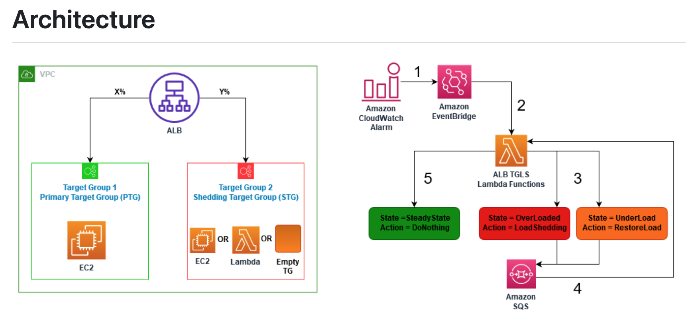

1. [Using load balancer target group health thresholds to improve availability by Luis Felipe Silveira da Silva](https://aws.amazon.com/blogs/networking-and-content-delivery/using-load-balancer-target-group-health-thresholds-to-improve-availability/)
1. [Using load balancer target group health thresholds to improve availability by Luis Felipe Silveira da Silva](https://aws.amazon.com/blogs/networking-and-content-delivery/using-load-balancer-target-group-health-thresholds-to-improve-availability/)
1. [Application Load Balancer-type Target Group for Network Load Balancer by Rohit Aswani and Eugene Wiehahn](https://aws.amazon.com/blogs/networking-and-content-delivery/application-load-balancer-type-target-group-for-network-load-balancer/)
1. [[**MUST-SEE**] Application Load Balancer Target Group Load Shedding](https://github.com/aws-samples/aws-alb-target-group-load-shedding/blob/main/README.md)
 