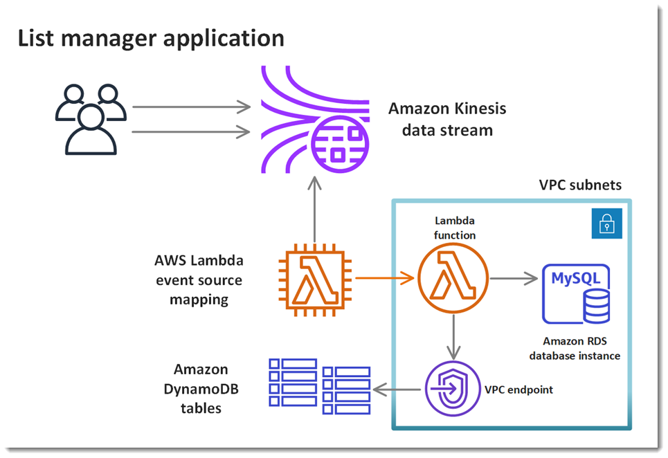

# AWS Sample

1. [Processing a Kinesis stream with database resources in a VPC](https://github.com/awsdocs/aws-lambda-developer-guide/tree/master/sample-apps/list-manager)

This sample application processes records from an Amazon Kinesis stream to create and update lists. It uses a private VPC to connect to an Amazon Relational Database Service (Amazon RDS) database. It uses a VPC endpoint to connect to Amazon DynamoDB.