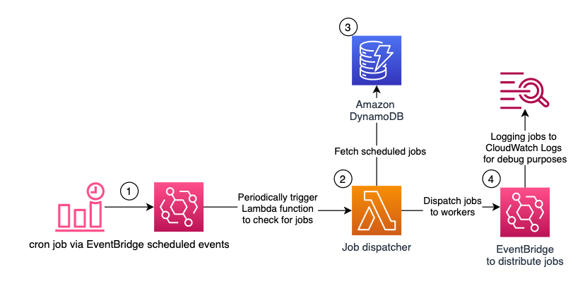

1. [Serverless Scheduling with Amazon EventBridge, AWS Lambda, and Amazon DynamoDB by Peter Grman](https://aws.amazon.com/blogs/architecture/serverless-scheduling-with-amazon-eventbridge-aws-lambda-and-amazon-dynamodb/)

- Has cloudformation