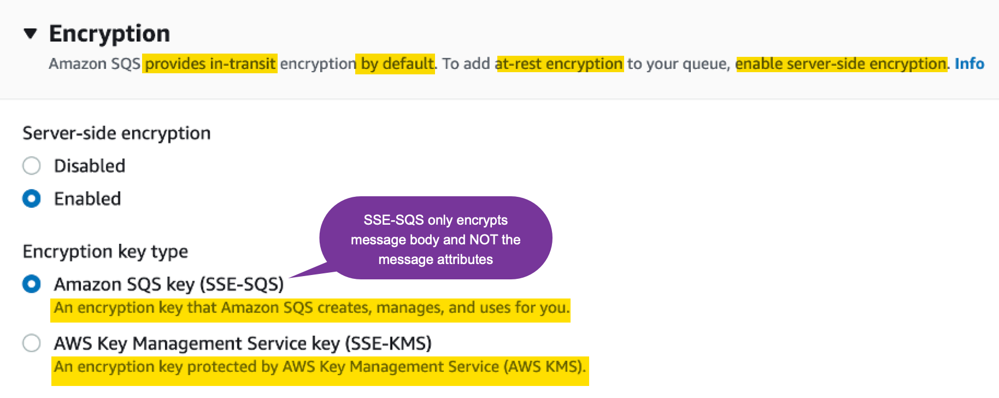
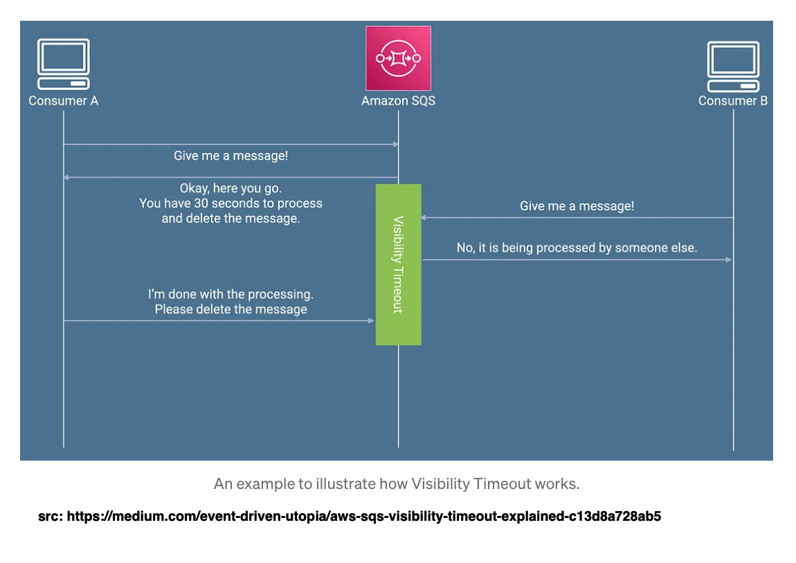
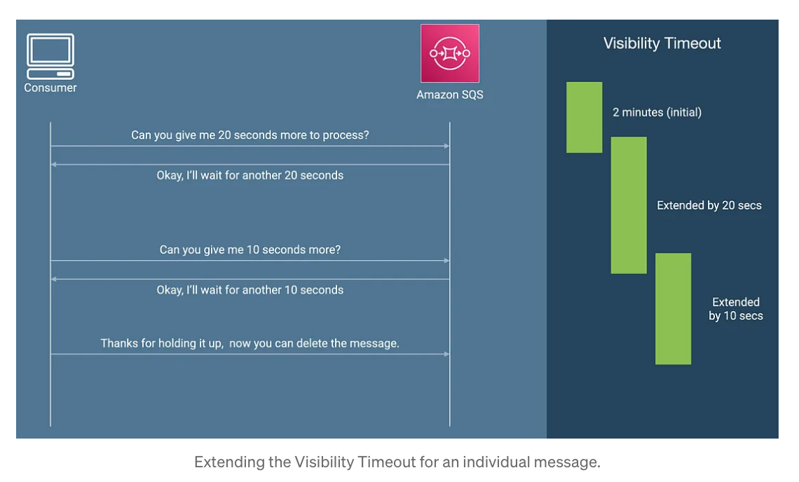

# 1. Operational Excellence Pillar

## 1.1. Create a Queue using CDK

```py
from aws_cdk import (
    Duration,
    Stack,
    aws_sqs as sqs,
)
from constructs import Construct


class SqsCdBlogStack(Stack):
    def __init__(self, scope: Construct, construct_id: str, **kwargs) -> None:
        super().__init__(scope, construct_id, **kwargs)

        # The code that defines your stack goes here

        # example resource
        queue = sqs.Queue(
            self,
            "InventoryUpdatesQueue",
            visibility_timeout=Duration.seconds(300),
        )
```

## 1.2. Best practice: Configure CloudWatch alarms for ApproximateAgeofOldestMessage

```py
# Create a CloudWatch alarm for ApproximateAgeOfOldestMessage metric
alarm = cloudwatch.Alarm(
	self,
	"OldInventoryUpdatesAlarm",
	alarm_name="OldInventoryUpdatesAlarm",
	metric=queue.metric_approximate_age_of_oldest_message(),
	threshold=600,  # Specify your desired threshold value in seconds
	evaluation_periods=1,
	comparison_operator=cloudwatch.ComparisonOperator.GREATER_THAN_OR_EQUAL_TO_THRESHOLD,
)
```

## 1.3. Best practice: Add a tracing header while sending a message to the queue to provide distributed tracing capabilities for faster troubleshooting

```py
# Create pre-processing Lambda function
csv_processing_to_sqs_function = _lambda.Function(
    self,
    "CSVProcessingToSQSFunction",
    runtime=_lambda.Runtime.PYTHON_3_8,
    code=_lambda.Code.from_asset("sqs_blog/lambda"),
    handler="CSVProcessingToSQSFunction.lambda_handler",
    role=role,
    tracing=Tracing.ACTIVE,  # Enable active tracing with X-Ray
)

# Create a post-processing Lambda function with the specified role
sqs_to_dynamodb_function = _lambda.Function(
    self,
    "SQSToDynamoDBFunction",
    runtime=_lambda.Runtime.PYTHON_3_8,
    code=_lambda.Code.from_asset("sqs_blog/lambda"),
    handler="SQSToDynamoDBFunction.lambda_handler",
    role=role,
    tracing=Tracing.ACTIVE,  # Enable active tracing with X-Ray
)
```

# 2. Security Pillar

## 2.1. Best practice: Configure server-side encryption



1. In transist (ie when you make a https call (internally) to send message) encryption is provided by default.  But if you need encryption at rest you need to enable
2. Thru' AWS console you can enable encryption in 2 ways - SSE-SQS and SSE-KMS
3. How to enable server-side encryption in CDK?
    &nbsp;
    The AWS CDK code sets `SSE-SQS` as the default encryption key type. However, the following AWS CDK code shows how to encrypt the queue with `SSE-KMS`.
    &nbsp;

        ```py
        # Create the SQS queue with DLQ setting
        queue = sqs.Queue(
            self,
            "InventoryUpdatesQueue",
            visibility_timeout=Duration.seconds(300),
            encryption=sqs.QueueEncryption.KMS_MANAGED,
        )
        ```

## 2.2. Best practice: Implement least-privilege access using access policy

Give enough permissions to allow Lambda to interact with SQS and only allow Lambda to access the queue

```py

# Create the SQS queue with DLQ setting
queue = sqs.Queue(
    self, "InventoryUpdatesQueue",
    visibility_timeout=Duration.seconds(300),
    #encryption=sqs.QueueEncryption.KMS_MANAGED,
    dead_letter_queue=sqs.DeadLetterQueue(
        max_receive_count=5,  # Number of retries before sending the message to the DLQ
        queue=dlq
    )
)

# Create a role for the Lambda function
role = iam.Role(
    self, "InventoryFunctionRole",
    assumed_by=iam.ServicePrincipal("lambda.amazonaws.com"),
    role_name="InventoryFunctionRole",
    description="Role for Lambda functions"
)

# Allow the Lambda function to receive messages from the SQS queue
role.add_to_policy(iam.PolicyStatement(
    actions=["sqs:ReceiveMessage", "sqs:DeleteMessage", "sqs:GetQueueAttributes"],
    resources=[queue.queue_arn]
))

# Create pre-processing Lambda function
csv_processing_to_sqs_function = _lambda.Function(
    self,
    "CSVProcessingToSQSFunction",
    runtime=_lambda.Runtime.PYTHON_3_8,
    code=_lambda.Code.from_asset("sqs_blog/lambda"),
    handler="CSVProcessingToSQSFunction.lambda_handler",
    role=role,
    tracing=Tracing.ACTIVE,
)

# Define the queue policy to allow messages from the Lambda function's role only
policy = iam.PolicyStatement(
    actions=["sqs:SendMessage"],
    effect=iam.Effect.ALLOW,
    principals=[iam.ArnPrincipal(role.role_arn)],
    resources=[queue.queue_arn],
)

queue.add_to_resource_policy(policy)
```

## 2.3. Best practice: Allow only encrypted connections over HTTPS using aws:SecureTransport

Enforce HTTPS connections to the queue

```py
# Create an IAM policy statement allowing only HTTPS access to the queue
secure_transport_policy = iam.PolicyStatement(
    effect=iam.Effect.DENY,
    actions=["sqs:*"],
    resources=[queue.queue_arn],
    conditions={
        "Bool": {
            "aws:SecureTransport": "false",
        },
    },
)
```

Now, any requests made over non-secure HTTP receive a 400 InvalidSecurity error from SQS.

## 2.4. Best practice: Use attribute-based access controls (ABAC)

Attribute-based access controls (ABAC) is an authorization strategy that defines permissions based on tags attached to users and AWS resources.

**Further Reading**: https://aws.amazon.com/blogs/compute/introducing-attribute-based-access-controls-abac-for-amazon-sqs/

## 2.5. Best practice: Configure dead-letter queues

```py
# Create the Dead Letter Queue (DLQ)
dlq = sqs.Queue(self, "InventoryUpdatesDlq", visibility_timeout=Duration.seconds(300))

# Create the SQS queue with DLQ setting
queue = sqs.Queue(
    self,
    "InventoryUpdatesQueue",
    visibility_timeout=Duration.seconds(300),
    dead_letter_queue=sqs.DeadLetterQueue(
        max_receive_count=3,  # Number of retries before sending the message to the DLQ
        queue=dlq,
    ),
)

# Create an SQS queue policy to allow source queue to send messages to the DLQ
policy = iam.PolicyStatement(
    effect=iam.Effect.ALLOW,
    actions=["sqs:SendMessage"],
    resources=[dlq.queue_arn],
    conditions={"ArnEquals": {"aws:SourceArn": queue.queue_arn}},
)
queue.queue_policy = iam.PolicyDocument(statements=[policy])
```

## 2.6. Best practice: Process messages in a timely manner by configuring the right visibility timeout



1. Setting at the queue level

```py
queue = sqs.Queue(
    self,
    " InventoryUpdatesQueue",
    visibility_timeout=Duration.seconds(30),
)
```

2. Ideal amount:

```bash
SQS queue visibility timeout = 6 x function timeout + MaximumBatchingWindowInSeconds
```

3. Default visibility period

default visibility timeout for a message is `30 seconds`. The minimum is `0 seconds` and the maximum is `12 hours`.

4. 2 different ways to configure visbility time out



https://medium.com/event-driven-utopia/aws-sqs-visibility-timeout-explained-c13d8a728ab5

## 2.7. who deletes the message from queue after successful processing?

The consumer must delete the message from the queue after receiving and processing it.

Lambda service will handle it if no errors from the function

# 3. Cost Optimization Pillar

## 3.1. Use Temporary Queues

These are also called as vitual queues and have no cost associated with it
It used for short synchronoud 2 way communication

1. [When to use them?](https://aws.amazon.com/blogs/compute/simple-two-way-messaging-using-the-amazon-sqs-temporary-queue-client/)
2. [Best practice: Use temporary queues](https://aws.amazon.com/blogs/compute/implementing-aws-well-architected-best-practices-for-amazon-sqs-part-3/)

# 4. Sustainability Pillar

## 4.1. Use long polling

# 5. References

1. [Implementing AWS Well-Architected best practices for Amazon SQS – Part 1 By Chetan Makvana and Hardik Vasa](https://aws.amazon.com/blogs/compute/implementing-aws-well-architected-best-practices-for-amazon-sqs-part-1/)
2. [Implementing AWS Well-Architected best practices for Amazon SQS – Part 2 By Chetan Makvana and Hardik Vasa](https://aws.amazon.com/blogs/compute/implementing-aws-well-architected-best-practices-for-amazon-sqs-part-2/)

# 6. More notes

## 6.1. Redrive

Ref: https://aws.amazon.com/blogs/aws/a-new-set-of-apis-for-amazon-sqs-dead-letter-queue-redrive/

1. It **allows** you to reinject the message in its original queue to attempt processing it again
2. You have to manually or programatically push it from DLQ to main SQS queue
3. An example to move from DLQ to main SQS

```bash
# First, I create the dead-letter queue (notice the -dlq I choose to add at the end of the queue name)
➜ ~ aws sqs create-queue \
        --queue-name awsnewsblog-dlq
{
    "QueueUrl": "https://sqs.us-east-2.amazonaws.com/012345678900/awsnewsblog-dlq"
}

# second, I retrieve the Arn of the queue I just created
➜  ~ aws sqs get-queue-attributes \
        --queue-url https://sqs.us-east-2.amazonaws.com/012345678900/awsnewsblog-dlq \
        --attribute-names QueueArn
{
    "Attributes": {
        "QueueArn": "arn:aws:sqs:us-east-2:012345678900:awsnewsblog-dlq"
    }
}

# Third, I create the application queue. I enter a redrive policy: post messages in the DLQ after 3 delivery attempts
➜  ~ aws sqs create-queue \
        --queue-name awsnewsblog \
        --attributes '{"RedrivePolicy": "{\"deadLetterTargetArn\":\"arn:aws:sqs:us-east-2:012345678900:awsnewsblog-dlq\",\"maxReceiveCount\":\"3\"}"}'
{
    "QueueUrl": "https://sqs.us-east-2.amazonaws.com/012345678900/awsnewsblog"
}
```

Note the `maxReceiveCount = 3 `

4. Post to application queue

```bash
➜ ~ aws sqs send-message \
            --queue-url https://sqs.us-east-2.amazonaws.com/012345678900/awsnewsblog \
            --message-body "Hello World"
{
"MD5OfMessageBody": "b10a8db164e0754105b7a99be72e3fe5",
"MessageId": "fdc26778-ce9a-4782-9e33-ae73877cfcb2"
}
```

5. Now simulate a crash at the consumer by not deleting the message

```bash
➜ ~ aws sqs receive-message \
        --queue-url https://sqs.us-east-2.amazonaws.com/012345678900/awsnewsblog
{
    "Messages": [
        {
            "MessageId": "fdc26778-ce9a-4782-9e33-ae73877cfcb2",
            "ReceiptHandle": "AQEBP8yOfgBlnjlkGXjyeLROiY7xg7cZ6Znq8Aoa0d3Ar4uvTLPrHZptNotNfKRK25xm+IU8ebD3kDwZ9lja6JYs/t1kBlwiNO6TBACN5srAb/WggQiAAkYl045Tx3CvsOypbJA3y8U+MyEOQRwIz6G85i7MnR8RgKTlhOzOZOVACXC4W8J9GADaQquFaS1wVeM9VDsOxds1hDZLL0j33PIAkIrG016LOQ4sAntH0DOlEKIWZjvZIQGdlRJS65PJu+I/Ka1UPHGiFt9f8m3SR+Y34/ttRWpQANlXQi5ByA47N8UfcpFXXB5L30cUmoDtKucPewsJNG2zRCteR0bQczMMAmOPujsKq70UGOT8X2gEv2LfhlY7+5n8z3yew8sdBjWhVSegrgj6Yzwoc4kXiMddMg==",
            "MD5OfBody": "b10a8db164e0754105b7a99be72e3fe5",
            "Body": "Hello World"
        }
    ]
}

# wait 30 seconds (since default visibility timeout = 30s),
# then repeat two times (for a total of three receive-message API calls)
```

6. After failing to process 3 times the message is no longer in the queue

```bash
➜  ~ aws sqs receive-message \
        --queue-url  https://sqs.us-east-2.amazonaws.com/012345678900/awsnewsblog
{
    "Messages": []
}
```

7. SQS moved the message to DLQ, verify

```bash
➜  ~ aws sqs receive-message \
        --queue-url  https://sqs.us-east-2.amazonaws.com/012345678900/awsnewsblog-dlq
{
    "Messages": [
        {
            "MessageId": "fdc26778-ce9a-4782-9e33-ae73877cfcb2",
            "ReceiptHandle": "AQEBCLtBMoZYVMMq7fUGNHeCliqE3mFXnkuJ+nOXLK1++uoXWBG31nDejCpxElmiBZWfbcfGJrEdKj4P9HJdrQMYDbeSqB+u1ZlB7CYzQBiQps4SEG0biEoubwqjQbmDZlPrmkFsnYgLD98D1XYWk/Ik6Z2n/wxDo9ko9rbZ15izK5RFnbwveNy8dfc6ireqVB1EGbeGkHcweHGuoeKWXEab1ynZWhNqZsQgCR6pWRkgtn59lJcLv4cJ4UMewNzvt7tMHH69GvVjXdYDYvJJI2vj+6RHvcvSHWWhTNT+CuPEXguVNuNrSya8gho1fCnKpVwQre6HhMlLPjY4wvn/tXY7+5rmte9eXagCqLQXaENB2R7qWNVPiWRIJy8/cTf37NLYVzBom030DNJlH9EeceRhCQ==",
            "MD5OfBody": "b10a8db164e0754105b7a99be72e3fe5",
            "Body": "Hello World"
        }
    ]
}
```

8. Now put back (redrive) messages from DLQ back to source queue

```bash
➜ ~ aws sqs start-message-move-task \
            --source-arn arn:aws:sqs:us-east-2:012345678900:awsnewsblog-dlq
{
    "TaskHandle": "eyJ0YXNrSWQiOiI4ZGJmNjBiMy00MmUwLTQzYTYtYjg4Zi1iMTZjYWRjY2FkNmEiLCJzb3VyY2VBcm4iOiJhcm46YXdzOnNxczp1cy1lYXN0LTI6NDg2NjUyMDY2NjkzOmF3c25ld3NibG9nLWRscSJ9"
}

```

Note: You can use `MaxNumberOfMessagesPerSecond` to control the flow

9. To check the status of move task

```bash
➜ ~ aws sqs list-message-move-tasks \
        --source-arn arn:aws:sqs:us-east-2:012345678900:awsnewsblog-dlq
{
    "Results": [
        {
            "Status": "COMPLETED",
            "SourceArn": "arn:aws:sqs:us-east-2:012345678900:awsnewsblog-dlq",
            "ApproximateNumberOfMessagesMoved": 1,
            "ApproximateNumberOfMessagesToMove": 1,
            "StartedTimestamp": 1684135792239
        }
    ]
}
```

10. To cancel the move

```bash
~ aws sqs cancel-message-move-task \
        --source-arn arn:aws:sqs:us-east-2:012345678900:awsnewsblog-dlq
```

11. After moving the messages the application (consumer) can start consuming again

```bash
➜  ~ aws sqs receive-message \
             --queue-url  https://sqs.us-east-2.amazonaws.com/012345678900/awsnewsblog
{
    "Messages": [
        {
            "MessageId": "a7ae83ca-cde4-48bf-b822-3d4bc1f4dcae",
            "ReceiptHandle": "AQEB9a+Dm2nvb3VUn9+46j9UsDidU/W6qFwJtXtNWTyfoSDOKT7h73e6ctT9RVZysEw3qqzJOx1cxblTTOSrYwwwoBA2qoJMGsqsrsRGGYojBvf9X8hqi8B8MHn9rTm8diJ2wT2b7WC+TDrx3zIvUeiSEkP+EhqyYOvOs7Q9aETR+Uz02kQxZ/cUJWsN4MMSXBejwW+c5ivv5uQtpfUrfZuCWa9B9O67Kj/q52clriPHpcqCCfJwFBSZkGTXYwTpnjxD4QM7DPS+xVeVfTyM7DsKCAOtpvFBmX5m4UNKT6TROgCnGxTRglUSMWQp8ufVxXiaUyM1dwqxYekM9uX/RCb01gEyCZHas4jeNRV5nUJlhBkkqPlw3i6w9Uuc2y9nH0Df8nH3g7KTXo4lv5Bl3ayh9w==",
            "MD5OfBody": "b10a8db164e0754105b7a99be72e3fe5",
            "Body": "Hello World"
        }
    ]
}
```

### 6.1.1. Summary

1. **Billing**: Redriving the messages from the dead-letter queue to the source queue or a custom destination queue generates additional API calls billed based on existing pricing (starting at $0.40 per million API calls, after the first million, which is free every month).
2. **Moved in batches**: Amazon SQS batches the messages while redriving them from one queue to another. This makes moving messages from one queue to another a simple and low-cost option.

## Retry

[Understanding SQS retries](https://docs.aws.amazon.com/lambda/latest/operatorguide/sqs-retries.html)