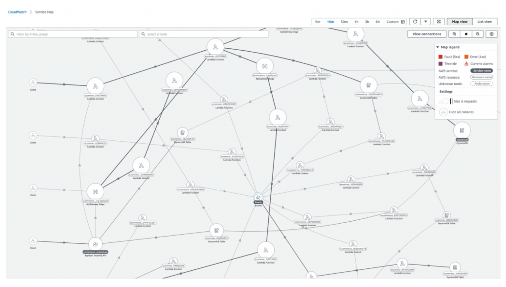

<!-- TOC -->

- [1. Governance Best Practices](#1-governance-best-practices)
  - [1.1. Best practices for creating tags for serverless resources](#11-best-practices-for-creating-tags-for-serverless-resources)
  - [1.2. How to maintain tags on serverless resources?](#12-how-to-maintain-tags-on-serverless-resources)
  - [1.3. How to "group related resources"](#13-how-to-group-related-resources)
  - [1.4. How to dynamically see what components make up your application?](#14-how-to-dynamically-see-what-components-make-up-your-application)
  - [1.5. How to enable tracing using sam?](#15-how-to-enable-tracing-using-sam)
- [2. Standardizing Project Organization](#2-standardizing-project-organization)
- [3. GuardRails](#3-guardrails)

<!-- /TOC -->

# 1. Governance Best Practices

[Operating serverless at scale: Implementing governance – Part 1 by Jerome Van Der Linden](https://aws.amazon.com/blogs/compute/operating-serverless-at-scale-implementing-governance-part-1/)

## 1.1. Best practices for creating tags for serverless resources

1. Indicate if service API is `public (B2C)`, `semi-public (B2B)` or `private (internal)`
2. For API Gateway or Lambda functions - Think of adding tags that indicates if public (exposition=public) or private (exposition=private). This will help adjust RTO and level of support.
3. Use Tags to indicate where the traffic is coming from - `route="POST /products"` or `route="GET /products/_id_"`(since {} is not valid here)
4. Indicate who is triggering the Lambda or Lambda is the destination: `trigger="SNS topic name"` or `destination="SQS queue name"`

## 1.2. How to maintain tags on serverless resources?

Use [propagate-cfn-tags](https://serverlessrepo.aws.amazon.com/applications/arn:aws:serverlessrepo:us-east-1:374852340823:applications~propagate-cfn-tags). Also read [How to include Serverless Repository apps in serverless.yml](https://theburningmonk.com/2019/05/how-to-include-serverless-repository-apps-in-serverless-yml/)

## 1.3. How to "group related resources"

**resource groups** helps group components belonging to an application

1. Grouping using CLI

Groups Tags where `mycompany:service-id=products`

```bash
aws resource-groups create-group \
--name products-service \
--resource-query '{"Type":"TAG_FILTERS_1_0","Query":"{\"ResourceTypeFilters\":[\"AWS::AllSupported\"],\"TagFilters\":[{\"Key\":\"mycompany:service-id\",\"Values\":[\"products\"]}]}"}'
```

2. Using SAM:

```yaml
# resource group created for a complete stack
Resources:
  ResourceGroup:
    Type: AWS::ResourceGroups::Group
    Properties:
      Name: products-service
```

3. Listing the resource groups

```bash
aws resource-groups list-group-resources --group products-service
```

ref: https://aws.amazon.com/blogs/mt/instantly-monitor-serverless-applications-aws-resource-groups/

## 1.4. How to dynamically see what components make up your application?

Use `AWS X-Ray` to get a complete map of interactions between components of your application



## 1.5. How to enable tracing using sam?

```yaml
Resources:
  MyFunction:
    Type: AWS::Serverless::Function
    Properties:
      CodeUri: function/
      Handler: app.lambda_handler
      Runtime: python3.8
      Tracing: Active

  MyApi:
    Type: AWS::Serverless::Api
    Properties:
      DefinitionBody:
        Fn::Transform:
          Name: "AWS::Include"
          Parameters:
            Location: "resources/openapi.yaml"
      EndpointConfiguration: REGIONAL
      StageName: prod
      TracingEnabled: true

  MyStateMachine:
    Type: AWS::Serverless::StateMachine
    Properties:
      DefinitionUri: statemachine/my_state_machine.asl.json
      Role: arn:aws:iam::123456123456:role/service-role/my-sample-role
      Tracing:
        Enabled: True
```

# 2. Standardizing Project Organization

1. [Operating serverless at scale: Improving consistency – Part 2 by Jerome Van Der Linden](https://aws.amazon.com/blogs/compute/operating-serverless-at-scale-improving-consistency-part-2/)

# 3. GuardRails

1. [Operating serverless at scale: Keeping control of resources – Part 3 by Jerome Van Der Linden](https://aws.amazon.com/blogs/compute/operating-serverless-at-scale-keeping-control-of-resources-part-3/)
