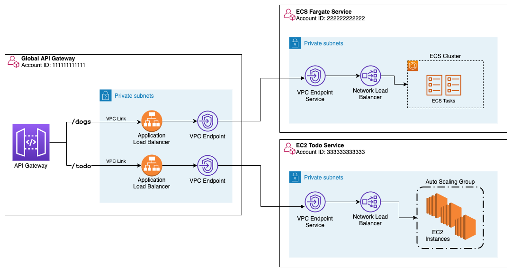

# 1. Topics not worked on but in my wishlist

<!-- TOC -->

- [1. Topics not worked on but in my wishlist](#1-topics-not-worked-on-but-in-my-wishlist)
- [2. API Gateway + PrivateLinks](#2-api-gateway--privatelinks)
- [3. Mongo](#3-mongo)
- [4. ECS](#4-ecs)
- [5. Webhooks](#5-webhooks)
- [6. SAGA](#6-saga)
- [7. Integrations](#7-integrations)
  - [7.1. EventBridge + ECS Fargate](#71-eventbridge--ecs-fargate)
- [8. Websockets](#8-websockets)
- [9. Event Bridge](#9-event-bridge)
  - [9.1. Event Routing](#91-event-routing)
  - [9.2. Schema Registry](#92-schema-registry)
  - [9.3. Private Endpoints as Targets](#93-private-endpoints-as-targets)
  - [9.4. ECS as Targets](#94-ecs-as-targets)
- [10. Lambda](#10-lambda)
  - [10.1. Secrets](#101-secrets)
  - [10.2. Error Handling](#102-error-handling)
- [11. Private Link](#11-private-link)
- [12. Refactoring](#12-refactoring)

<!-- /TOC -->

# 2. API Gateway + PrivateLinks

1. [Understanding VPC links in Amazon API Gateway private integrations by Jose Eduardo Montilla Lugo](https://aws.amazon.com/blogs/compute/understanding-vpc-links-in-amazon-api-gateway-private-integrations/)
1. [[**MAKE_NOTES**] Understanding VPC links in Amazon API Gateway private integrations by Jose Eduardo Montilla Lugo](https://aws.amazon.com/blogs/compute/understanding-vpc-links-in-amazon-api-gateway-private-integrations/)
1. [[**ACROSS_ACCOUNTS**] Building private cross-account APIs using Amazon API Gateway and AWS PrivateLink by Brian Zambrano](https://aws.amazon.com/blogs/compute/building-private-cross-account-apis-using-amazon-api-gateway-and-aws-privatelink/)
  
1. [[**ACROSS_REGIONS**] Access Private applications on AWS Fargate using Amazon API Gateway PrivateLink by Mani Chandrasekaran](https://aws.amazon.com/blogs/compute/access-private-applications-on-aws-fargate-using-amazon-api-gateway-privatelink/)
  

# 3. Mongo

1. [Recent Additions to Query and Aggregation You May Have Missed](https://www.youtube.com/watch?v=FprmF6nmkWY&list=PL4RCxklHWZ9v3eIqQeKWcoNPSiLuVPyac)

# 4. ECS

1. [Building HTTP API-based services using Amazon API Gateway, AWS PrivateLink and AWS Fargate by Irshad Buchh](https://aws.amazon.com/blogs/containers/building-http-api-based-services-using-aws-fargate/)
1. [Access Private applications on AWS Fargate using Amazon API Gateway PrivateLink by Mani Chandrasekaran ](https://aws.amazon.com/blogs/compute/access-private-applications-on-aws-fargate-using-amazon-api-gateway-privatelink/)
1. [How to securely publish Internet applications at scale using Application Load Balancer and AWS PrivateLink by Tom Adamsk](https://aws.amazon.com/blogs/networking-and-content-delivery/how-to-securely-publish-internet-applications-at-scale-using-application-load-balancer-and-aws-privatelink/)
1. [[JAVA] Building dynamic Amazon SNS subscriptions for auto scaling container workloads By Mithun Mallick](https://aws.amazon.com/blogs/compute/building-dynamic-amazon-sns-subscriptions-for-auto-scaling-container-workloads/)

# 5. Webhooks

1. [Deconstructing "The Scalable Webhook" AWS Serverless Architecture Pattern By Deconstructing AWS CDK Patterns ](https://www.youtube.com/watch?v=kRI7QJfGBI8&t=38s)
1. [Deconstructing "The EventBridge ETL" AWS Serverless Architecture Pattern by Deconstructing AWS CDK Patterns](https://www.youtube.com/watch?v=8kg5bYsdem4)

# 6. SAGA

1. [Lab 4 - Orchestration and coordination](https://catalog.us-east-1.prod.workshops.aws/workshops/e8738cf6-6eb0-4d1d-9e98-ae240d229535/en-US/orchestration-and-coordination)

# 7. Integrations

## 7.1. EventBridge + ECS Fargate

1. [Extending a serverless, event-driven architecture to existing container workloads](https://aws.amazon.com/blogs/compute/extending-a-serverless-event-driven-architecture-to-existing-container-workloads/)

# 8. Websockets

1. [Managing sessions of anonymous users in WebSocket API-based applications](https://aws.amazon.com/blogs/compute/managing-sessions-of-anonymous-users-in-websocket-api-based-applications/)

# 9. Event Bridge

## 9.1. Event Routing

1. [Implementing architectural patterns with Amazon EventBridge Pipes by David Boyne, Dominik Richter](https://aws.amazon.com/blogs/compute/implementing-architectural-patterns-with-amazon-eventbridge-pipes/)
- https://github.com/aws-samples/amazon-eventbridge-pipes-architectural-patterns
1. [Building a modern, event-driven application for insurance claims processing – Part 1 by Emily Shea and Dhiraj Mahapatro](https://aws.amazon.com/blogs/industries/building-a-modern-event-driven-application-for-insurance-claims-processing-part-1/)
1. [Building a modern, event-driven application for insurance claims processing – Part 2 by Emily Shea, Vaibhav Jain, and Dhiraj Mahapatro](https://aws.amazon.com/blogs/industries/building-a-modern-event-driven-application-for-insurance-claims-processing-part-2/)
1. [Extending a serverless, event-driven architecture to existing container workloads](https://aws.amazon.com/blogs/compute/extending-a-serverless-event-driven-architecture-to-existing-container-workloads/)

## 9.2. Schema Registry

1. [Working with events and the Amazon EventBridge schema registry](https://aws.amazon.com/blogs/compute/working-with-events-and-amazon-eventbridge-schema-registry/)

## 9.3. Private Endpoints as Targets

1. [Sending Amazon EventBridge events to private endpoints in a VPC](https://aws.amazon.com/blogs/compute/sending-amazon-eventbridge-events-to-private-endpoints-in-a-vpc/)

## 9.4. ECS as Targets

1. [Extending a serverless, event-driven architecture to existing container workloads by Dhiraj Mahapatro and Sascha Moellering](https://aws.amazon.com/blogs/compute/extending-a-serverless-event-driven-architecture-to-existing-container-workloads/)

# 10. Lambda

## 10.1. Secrets

1. [Choosing the right solution for AWS Lambda external parameters](https://aws.amazon.com/blogs/compute/choosing-the-right-solution-for-aws-lambda-external-parameters/)

## 10.2. Error Handling

1. [Implementing AWS Lambda error handling patterns](https://aws.amazon.com/blogs/compute/implementing-aws-lambda-error-handling-patterns/)
1. [**[MY_NEXT]** Implementing AWS Lambda error handling patterns by Julian Wood, Jeff Chen, and Jeff Li ](https://aws.amazon.com/blogs/compute/implementing-aws-lambda-error-handling-patterns/)
1. [**[MY_NEXT]** Using Amazon SQS dead-letter queues to replay messages By Alexandre Pinhel](https://aws.amazon.com/blogs/compute/using-amazon-sqs-dead-letter-queues-to-replay-messages/)

# 11. Private Link

1. [/Volumes/Lexar/git-repos/aws-repo/my-aws-samples/networking/privatelink/[TODO] sqs-endpoint/SQS-VPCE-Tutorial-CloudFormation.yaml](/Volumes/Lexar/git-repos/aws-repo/my-aws-samples/networking/privatelink/[TODO] sqs-endpoint/SQS-VPCE-Tutorial-CloudFormation.yaml)
- https://docs.aws.amazon.com/AWSSimpleQueueService/latest/SQSDeveloperGuide/sqs-sending-messages-from-vpc.html

# 12. Refactoring

1. [Refactoring to Serverless](https://serverlessland.com/content/guides/refactoring-serverless/introduction)

