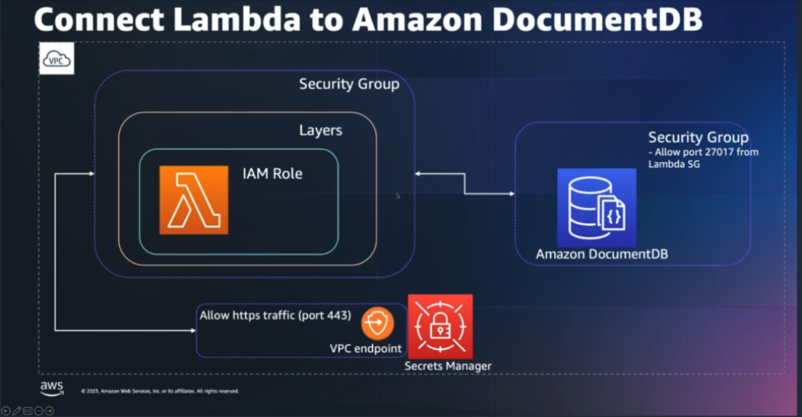

<h1>My Tasks Put on hold</h1>

# Topics

1. Step functions workshop
1. Powertool - idempotency, handling large payloads
1. Subscription filters using sam?
1. Mongo + Lambda + Spring
1. SQS trigger Lambda using ESM
1. Mongo Transactions
1. Locking for dynamodb
1. complete notes on sam nested stacks - https://aws.amazon.com/blogs/compute/speeding-up-incremental-changes-with-aws-sam-accelerate-and-nested-stacks/
1. Secrets - /Volumes/Lexar/git-repos/aws-repo/my-aws-samples/databases/security/aws-secrets-manager-secure-database-credentials
1. [Building a serverless URL shortener app without AWS Lambda – part 1 by Eric Johnson ](https://aws.amazon.com/blogs/compute/building-a-serverless-url-shortener-app-without-lambda-part-1/)
1. cdk book
1. DLQs
1. Complete notes on "Insurance processing use case"
1. Complete notes on API Gateway by Eric Johnson.
1. Complete notes on https://aws.amazon.com/blogs/compute/building-well-architected-serverless-applications-regulating-inbound-request-rates-part-2/ and part 1
1. Sam Sessions
1. AWS Fundamentals book by Tobias
1. System Design books

# Blogs in progress

1. [Sessions With SAM (S1E6): SAM templates for SQS, cross-account queue policies & Lambda event ](https://www.youtube.com/watch?v=q2rbHMyJBDY&list=PLJo-rJlep0ED198FJnTzhIB5Aut_1vDAd&index=6)
1. [Make Notes](my-github/study-guide-repo/notes-under-construction/api-gateway.md)
1. [Make Notes under Sessions with SAM](https://www.youtube.com/watch?v=IQfLHrtPW9o&list=PLJo-rJlep0ED198FJnTzhIB5Aut_1vDAd&index=26)
1. [Orchestrating dependent file uploads with AWS Step Functions by Nelson Assis](https://aws.amazon.com/blogs/compute/orchestrating-dependent-file-uploads-with-aws-step-functions/)
1. [Sending and receiving webhooks on AWS: Innovate with event notifications by by Daniel Wirjo](https://aws.amazon.com/blogs/compute/sending-and-receiving-webhooks-on-aws-innovate-with-event-notifications/)
1. [Connect AWS API Gateway directly to SNS using a service integration By Alex Debrie](https://www.alexdebrie.com/posts/aws-api-gateway-service-proxy/)

# Notes in Progress

1. /Volumes/Lexar/git-repos/aws-repo/my-github/study-guide-repo/notes-under-construction/10-Routing using Event Bridge Rules.md
1. /Volumes/Lexar/git-repos/aws-repo/my-github/study-guide-repo/notes-under-construction/webhooks-architecture.md
1. /Volumes/Lexar/git-repos/aws-repo/my-aws-samples/step-functions/[NOTES] aws-step-functions-callback-example
1. /Volumes/Lexar/git-repos/aws-repo/my-github/study-guide-repo/notes-under-construction/12-api-gateway.md
1. [1-[Use Case] Building Insurance Claims Processing]("/Volumes/Lexar/git-repos/aws-repo/my-github/study-guide-repo/notes-under-construction/1-[Use Case] Building Insurance Claims Processing.md")
1. /Volumes/Lexar/git-repos/aws-repo/my-aws-workshops/serverless/[TODO] svs-307-powertools
1. /Volumes/Lexar/git-repos/aws-repo/my-aws-workshops/dynamodb/amazon-dynamodb-labs/notes/4-Build a Serverless Event Driven Architecture with DynamoDB/4-Build a Serverless Event Driven Architecture with DynamoDB.md
1. /Volumes/Lexar/git-repos/aws-repo/my-aws-samples/documentdb/amazon-documentdb-integration-with-application-autoscaler
1. /Volumes/Lexar/git-repos/aws-repo/my-aws-samples/documentdb/quick-start/my-readme.md
1. /Volumes/Lexar/git-repos/aws-repo/my-aws-workshops/cloudformation/ha-web-app
1. [Implementing architectural patterns with Amazon EventBridge Pipes by David Boyne](https://aws.amazon.com/blogs/compute/implementing-architectural-patterns-with-amazon-eventbridge-pipes/)
1. [AWS re:Invent 2021 - Building next-gen applications with event-driven architectures By Sam Dengler and Robbie Kohler (TACO BELL)](https://www.youtube.com/watch?v=U5GZNt0iMZY)
- [Topics discussed](https://thomasstep.com/blog/reinvent-building-next-gen-applications-with-event-driven-architectures)
1. [What's the best place to cache data for serverless applications? By Yan Cui](https://www.youtube.com/watch?v=8jMPh5ukJbE)
1. [[**MAKE-NOTES**] Using AWS Application Load Balancer and Network Load Balancer with EC2 Container Service By Nathan Peck](https://medium.com/containers-on-aws/using-aws-application-load-balancer-and-network-load-balancer-with-ec2-container-service-d0cb0b1d5ae5)

# Tasks

1. Review and Close notes - `/Volumes/Lexar/git-repos/aws-repo/my-github/study-guide-repo/faqs/my-faqs-for-sqs.md` and find a permanent home
1. [Implementing AWS Well-Architected best practices for Amazon SQS – Part 3 by Pascal Vogel](https://aws.amazon.com/blogs/compute/implementing-aws-well-architected-best-practices-for-amazon-sqs-part-3/)
1. [Implementing AWS Lambda error handling patterns by Julian Wood, Jeff Chen, and Jeff Li](https://aws.amazon.com/blogs/compute/implementing-aws-lambda-error-handling-patterns/)
1. Make Notes - [AWS Auto Scaling Deep Dive By Digital Cloud Training](https://www.youtube.com/watch?v=xQeGrgQJJDc)
1. Make Notes - [AWS SQS Visibility Timeout Explained By Dunith Danushka](https://medium.com/event-driven-utopia/aws-sqs-visibility-timeout-explained-c13d8a728ab5)
1. Complete - ./notes-under-construction/4-best-practices-lambda.md that has blogs from Jerome Van Der Linden
1. Draw a diagram on how STS works
1. When would you need a role to assume itself? - https://docs.aws.amazon.com/lambda/latest/dg/lambda-intro-execution-role.html
1. Make notes on ECS - https://www.youtube.com/watch?v=5uJUmGWjRZY&list=PLhr1KZpdzukeNrcZo5aAgVPkm4UnugRX3&index=3
1. Crossplane - https://www.youtube.com/watch?v=8CdyxX7eGkA
- https://github.com/awslabs/crossplane-on-eks/tree/main/examples
1. [Data Modeling with MongoDB (Webinar)](https://www.youtube.com/watch?v=zjDkBgyGdwQ)
1. What are permission boundaries. Look for a demo. See Tamas Salli's IAM book.
1. https://docs.aws.amazon.com/IAM/latest/UserGuide/reference_policies_elements_principal.html
1. Review and Close notes - AssumeRole notes
1. Is this about role chaining? https://docs.aws.amazon.com/IAM/latest/UserGuide/tutorial_cross-account-with-roles.html
QQQ - Why did I think of this.  Which workshop used this? WAF?
1. Complete Notes on DLQ handling
1. [Complete notes on how to write Jitter/exponential backoff code](../aws-lambda.md#721-exponential-backoff-and-jitter-algorithm)
1. [You need this FREE IAM Management Tool By Be A Better Dev](https://www.youtube.com/watch?v=ryEseI_-12o)
1. Complete notes from workshop - [AWS Management and Governance Tools Workshop > AWS Config](https://mng.workshop.aws/config.html)
1. Complete notes on AWS Config Workshop/Config Rule With Lambda
1. Complete notes on AWS Config Workshop/Config Rule With remediation

1. [Stream Amazon CloudWatch Logs to a Centralized Account for Audit and Analysis by David Bailey](https://aws.amazon.com/blogs/architecture/stream-amazon-cloudwatch-logs-to-a-centralized-account-for-audit-and-analysis/)
1. Workshop - [Amazon DocumentDB (with MongoDB compatibility) Workshop](https://catalog.us-east-1.prod.workshops.aws/workshops/464d6c17-9faa-4fef-ac9f-dd49610174d3/en-US)
1. [Amazon DocumentDB (with MongoDB compatibility) read autoscaling by Randy DeFauw](https://aws.amazon.com/blogs/database/amazon-documentdb-with-mongodb-compatibility-read-autoscaling/)
1. [How to monitor Amazon DynamoDB](https://aws.amazon.com/blogs/database/how-to-use-amazon-cloudwatch-to-monitor-amazon-dynamodb-table-size-and-item-count-metrics/)

1. Complete making notes on `/Volumes/Lexar/git-repos/aws-repo/my-aws-workshops/serverless/[TODO]svs-307-powertools`. Check out the TODO section in my-readme.md
1. Complete /Volumes/Lexar/git-repos/aws-repo/my-aws-samples/cdk/sample-app/my-readme.md
1. [[**MAKE-NOTES**] Using AWS Application Load Balancer and Network Load Balancer with EC2 Container Service By Nathan Peck](https://medium.com/containers-on-aws/using-aws-application-load-balancer-and-network-load-balancer-with-ec2-container-service-d0cb0b1d5ae5)

# 1. DocumentDB

1. [Amazon EventBridge to SNS to Lambda Function](https://serverlessland.com/patterns/eventbridge-sns-lambda)
a) After completing this revisit `/Volumes/Lexar/git-repos/aws-repo/my-aws-workshops/documentdb/amazon-documentdb-workshop/resources/change-streams.yml` and understand how SNS is setup as a scheduler.
b) Update the architecture diagram
1. [Creating Amazon EventBridge rules that react to events](https://docs.aws.amazon.com/eventbridge/latest/userguide/eb-create-rule.html)
1. [Stream data from Amazon DocumentDB to Amazon Kinesis Data Firehose using AWS Lambda by Anshu Vajpayee and Sourav Biswas](https://aws.amazon.com/blogs/database/stream-data-from-amazon-documentdb-to-amazon-kinesis-data-firehose-using-aws-lambda/)
> 1. [DocumentDB Insider Hour | Episode 27 | Lambda Event Source Mapping By Sourav Biswas](https://www.youtube.com/watch?v=U8z0To80crY)
1. [DocumentDB Insider Hour | Episode 30 | Using AWS Lambda with Amazon DocumentDB](https://www.twitch.tv/videos/1936506159)

- https://github.com/aws-samples/amazon-documentdb-samples/tree/master/lambda-samples

# 2. ECS

1. [[**MUST TRY**] Spring Pet Clinic - Deploying Java Microservices on Amazon Elastic Container Service by Huy Huynh and Magnus Bjorkman](https://aws.amazon.com/blogs/compute/deploying-java-microservices-on-amazon-ec2-container-service/)
1. [[**MUST TRY**] Building dynamic Amazon SNS subscriptions for auto scaling container workloads By Mithun Mallick](https://aws.amazon.com/blogs/compute/building-dynamic-amazon-sns-subscriptions-for-auto-scaling-container-workloads/)
    - Architecture: SNS -> SQS -> ECS (Java Polls SQS) -> EventBridge -> Lambda/Dynamodb

# 3. EventBridge

1. [{Orchestrator] Insurance Claims Processing using Serverless and Event-Driven Architecture](https://github.com/aws-samples/serverless-eda-insurance-claims-processing)

> 1. [Testing Amazon EventBridge events using AWS Step Functions by Siarhei Kazhura](https://aws.amazon.com/blogs/compute/testing-amazon-eventbridge-events-using-aws-step-functions/)

# 4. Lambda

1. DLQs - why Lambda DLQs don't suport SQS? https://www.youtube.com/watch?v=hOetf6YN3zo&lc=Ugy1J5lsqtlB5mUBFVt4AaABAg.9unsQBRi0TN9unvMmRmQml
1. Destinations - Why for SQS we dont have destinations?
1. Read thru' AWS fundamentals
1. [**[MY NEXT]** Implementing AWS Lambda error handling patterns by Julian Wood, Jeff Chen, and Jeff Li ](https://aws.amazon.com/blogs/compute/implementing-aws-lambda-error-handling-patterns/)
1. [**[MY NEXT]** Using Amazon SQS dead-letter queues to replay messages By Alexandre Pinhel](https://aws.amazon.com/blogs/compute/using-amazon-sqs-dead-letter-queues-to-replay-messages/)
1. [Lambda event source mappings](https://docs.aws.amazon.com/lambda/latest/dg/invocation-eventsourcemapping.html)
1. [AWS LAMBDA OPERATOR GUIDE](https://serverlessland.com/content/service/lambda/guides/aws-lambda-operator-guide/intro)
1. [The AWS Lambda Operator's Guide | Serverless Office Hours](https://www.youtube.com/watch?v=Xofyyqq_Dvs&t=1464s)

# Networking

1. [One to Many: Evolving VPC Design by Androski Spicer ](https://aws.amazon.com/blogs/architecture/one-to-many-evolving-vpc-design/)

# 5. JSON Handling

1. [Spring Boot & JsonNode: How to use it and when to turn to creating Custom Deserializers](https://www.youtube.com/watch?v=cw0TfpcUkao)
1. [Spring Boot & JSON: A Practical Guide to reading JSON and Persisting it to a database](https://www.youtube.com/watch?v=EumLbf8WjnY)

# 6. WAF

1. [Serverless Applications Lens - AWS Well-Architected Framework](https://docs.aws.amazon.com/wellarchitected/latest/serverless-applications-lens/welcome.html)
2. [Serverless Applications Lens AWS Well-Architected Framework By AGPIAL](https://www.youtube.com/watch?v=g1WpzZHQ4Gc)
3. [AWS Serverless Multi-Tier Architectures. AWS Whitepaper AGPIAL Audio](https://www.youtube.com/watch?v=lEf9XjbHs0U)
4. [Security Overview of AWS Lambda AWS Whitepaper. AGPIAL Audiobook](https://www.youtube.com/watch?v=QjVU-WiKLo4)
5. [Maximizing Value with AWS. AGPIAL Audiobook](https://www.youtube.com/watch?v=roT6LOINf30)
3. [Reliability Pillar AWS Well-Architected Framework. AGPIAL Audiobook](https://www.youtube.com/watch?v=avp7Hb-JybU)
5. [Performance Efficiency Pillar AWS Well-Architected Framework. AGPIAL Audiobook](https://www.youtube.com/watch?v=jze2oaojNSI)
6. [Operational Excellence Pillar AWS Well-Architected Framework. AGPIAL Audiobook](https://www.youtube.com/watch?v=Vhk6a5MUhE8)
7. [Cost Optimization Pillar AWS Well-Architected Framework AGPIAL Audiobook](https://www.youtube.com/watch?v=zeLyoWund1I)

# 7. Workshop

1. [Serverless Optimization Workshop](https://catalog.us-east-1.prod.workshops.aws/workshops/2d960419-7d15-44e7-b540-fd3ebeb7ce2e/en-US)
1. CloudTrail workshop (prep - understand the cdk code in oneobservability workshop before continuing with this workshop)
1. Workshop - [AWS Serverless Developer Experience](https://catalog.workshops.aws/serverless-developer-experience/en-US/introduction/project-init)
1. AWS Control Tower workshop: Will get back to this workshop after few months.  The cost to do this workshop = $50
1. [Learn Python On AWS Workshop > Inputs > Lab 5 - Inputs > Step 1 - User input from the console](https://catalog.us-east-1.prod.workshops.aws/workshops/3d705026-9edc-40e8-b353-bdabb116c89c/en-US/inputs/lab-5/step-1)
1. [Extended CDK Workshop > JSII](https://catalog.us-east-1.prod.workshops.aws/workshops/071bbc60-6c1f-47b6-8c66-e84f5dc96b3f/en-US/40-jsii)
1. For AWS Config Workshop/Config Rule With Lambda, Update diagram for ConfigSSmLab.yml ie cloudwatch triggering lambda
1. Complete HA Web Workshop (https://catalog.us-east-1.prod.workshops.aws/workshops/5ceb632a-c07f-44a5-a3bd-b8f616a631c0/en-US)
1. Continue working thru workshop here - https://workshop-aws-account-setup.fstehle.com/
1. Workshop - [Amazon DynamoDB Labs](https://amazon-dynamodb-labs.com/)
1. /Volumes/Lexar/git-repos/aws-repo/my-aws-workshops/serverless/[TODO] svs-307-powertools

# 8. Parked on 09232023
1. https://aws.amazon.com/blogs/compute/understanding-aws-lambdas-invoke-throttle-limits/
1. [System Design Interview - Rate Limiting (local and distributed)](https://www.youtube.com/watch?v=FU4WlwfS3G0)
1. [Run any web app on Lambda | Serverless Office Hours](https://www.youtube.com/watch?v=ArsTZ2y7u80)
1. [Deploying Lambda with EKS and Crossplane | Serverless Office Hours](https://www.youtube.com/watch?v=8CdyxX7eGkA&t=2318s)
1. [Operating Lambda: Using CloudWatch Logs Insights by James Beswick](https://aws.amazon.com/blogs/compute/operating-lambda-using-cloudwatch-logs-insights/)
1. [Understanding AWS Lambda’s invoke throttling limits By Archana Srikanta](https://aws.amazon.com/blogs/compute/understanding-aws-lambdas-invoke-throttle-limits/)
1. [Get to Grips with AWS IAM Roles: Terms, Concepts, and Examples](https://blog.awsfundamentals.com/aws-iam-roles-terms-concepts-and-examples)

# 9. Topics put on hold

1. Serverless experience workshop
1. Powertools workshop
1. Powertools Github page
1. Kinesis Firehose By LearnCantril
1. DocumentDB auditing
1. FIFO Queue processing
1. Atleast once, Exactly once
1. Mongo AIM authentication
1. AWS Lambda Operator Guide
1. WAF workshop