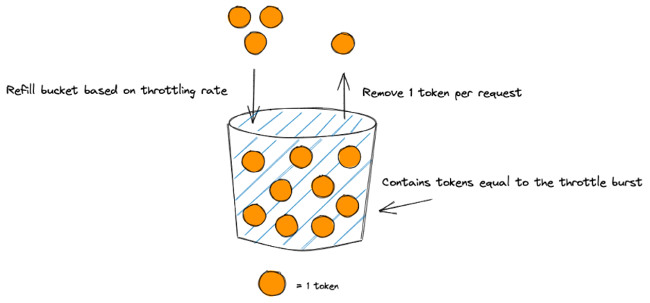

The amount of tokens that our bucket can contain is what we call the **burst limit**.

The rate at which our bucket gets refilled with tokens is called the **rate limit.**

# References

1. https://aws.amazon.com/blogs/compute/building-well-architected-serverless-applications-regulating-inbound-request-rates-part-1/