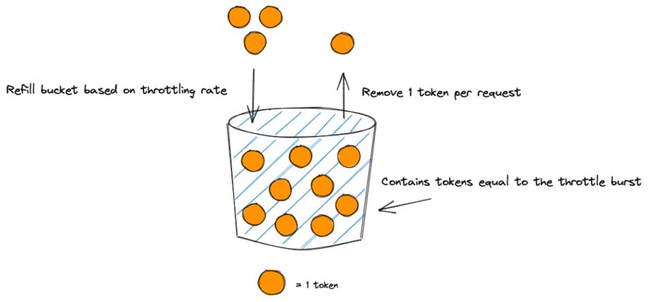

<h1>Token Bucket Example</h1>

# 1. How does Token Bucket work?

Let’s say that we set the rate limit to 3 requests per second and the burst limit to 9 requests. That means that every second, 3 new tokens are added to the bucket, up to the maximum burst limit of 9.
As long as our request rate does not exceed our token refill rate, everything is fine. However, what if we send 4 requests per second? At this point, our bucket will start to deplete by 1 token per second. After 6 seconds, all our tokens in the bucket will have been depleted and we are hit with a 429: Too Many Requests error.

The token bucket algorithm is used to manage throttling in many other AWS services, such as ECS or Kinesis

src: https://xebia.com/blog/aws-api-gateway-throttling-explained/

# 2. Examples of Token bucket in AWS

## 2.1. ECS

1. [Under the hood: Amazon Elastic Container Service and AWS Fargate increase task launch rates by Nathan Peck](https://aws.amazon.com/blogs/containers/under-the-hood-amazon-elastic-container-service-and-aws-fargate-increase-task-launch-rates/)

## 2.2. API Gateway

1. [AWS API Gateway throttling explained](https://xebia.com/blog/aws-api-gateway-throttling-explained/)
1. [Building well-architected serverless applications: Regulating inbound request rates – part 1 by Julian Wood](https://aws.amazon.com/blogs/compute/building-well-architected-serverless-applications-regulating-inbound-request-rates-part-1/)
1. [AWS re:Invent 2019: [REPEAT 2] I didn’t know Amazon API Gateway did that (SVS212-R2) By Eric Johnson](https://youtu.be/yfJZc3sJZ8E?t=2011)