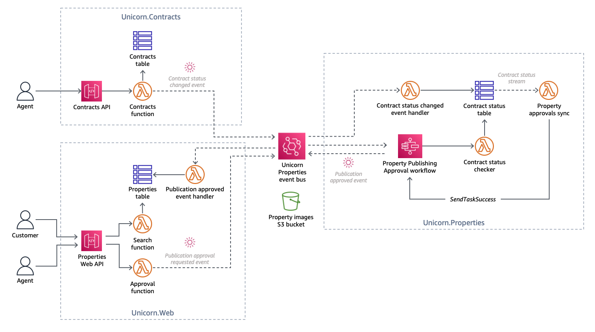
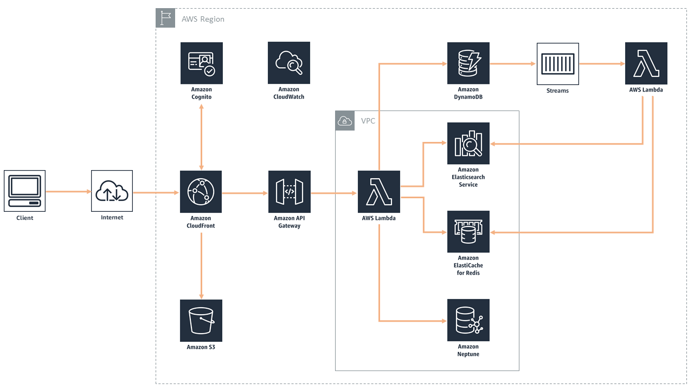
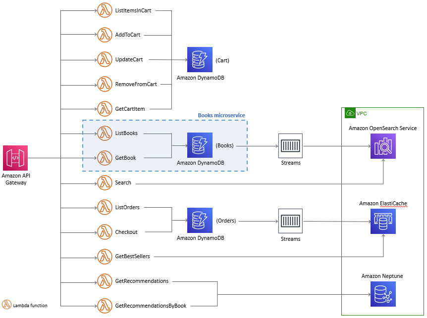
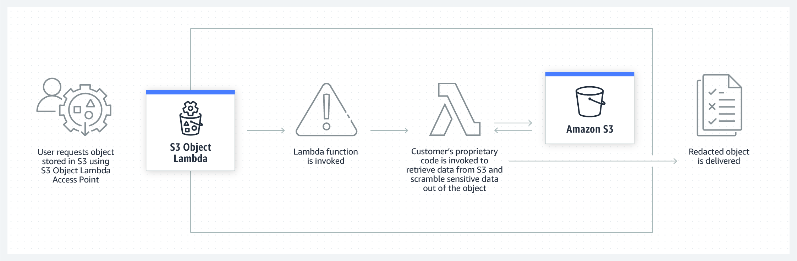

<!-- TOC -->

- [1. Account management using AWS Organizations](#1-account-management-using-aws-organizations)
- [2. Administration](#2-administration)
- [3. AWS Systems Manager](#3-aws-systems-manager)
- [4. AWS Config](#4-aws-config)
- [5. AWS Service Catalog](#5-aws-service-catalog)
- [6. AWS CloudTrail](#6-aws-cloudtrail)
- [7. Athena](#7-athena)
- [8. Cloudformation](#8-cloudformation)
- [9. Cloudwatch](#9-cloudwatch)
- [10. Developer workshops](#10-developer-workshops)
- [11. DynamoDB](#11-dynamodb)
- [12. Elastic Load Balancer](#12-elastic-load-balancer)
- [26. Event Driven](#26-event-driven)
- [13. Kinesis](#13-kinesis)
  - [13.1. Kinesis Firehose](#131-kinesis-firehose)
- [14. Microservices](#14-microservices)
- [15. Workshop Lists](#15-workshop-lists)
- [16. Full Stack](#16-full-stack)
- [17. Language Workshops](#17-language-workshops)
  - [17.1. Python](#171-python)
  - [17.2. Typescript](#172-typescript)
  - [17.3. Security](#173-security)
  - [17.4. Lambda](#174-lambda)
- [18. Serverless](#18-serverless)
  - [18.1. Performance tuning](#181-performance-tuning)
- [19. Microservices](#19-microservices)
- [20. IAM](#20-iam)
- [21. Well Architected](#21-well-architected)
- [22. Multi-service Workshops](#22-multi-service-workshops)
- [23. Networking](#23-networking)
  - [23.1. Lattice](#231-lattice)
- [24. Security](#24-security)
- [25. S3](#25-s3)
- [27. Observability](#27-observability)
- [28. Curate these workshops](#28-curate-these-workshops)
  - [28.1. Disect this workshop](#281-disect-this-workshop)
- [29. ASG Workshops to curate](#29-asg-workshops-to-curate)
- [30. Multi-service workshop to curate](#30-multi-service-workshop-to-curate)
- [31. Powertools](#31-powertools)

<!-- /TOC -->

# 1. Account management using AWS Organizations

1. [Workshop AWS Account Setup](https://workshop-aws-account-setup.fstehle.com/)
    - [Shared Services account](https://docs.aws.amazon.com/managedservices/latest/userguide/shared-services-account.html)
2. [Workshop: Getting started with Centralized Operations Management on AWS](https://catalog.workshops.aws/getting-started-with-com/en-US)

# 2. Administration

1. [Workshop: Getting started with Centralized Operations Management on AWS](https://catalog.workshops.aws/getting-started-with-com/en-US)

# 3. AWS Systems Manager

1. [[Skill Builder] Getting Started with AWS Systems Manager](https://explore.skillbuilder.aws/learn/course/13045/Getting%2520Started%2520with%2520AWS%2520Systems%2520Manager)
2. [AWS CloudWatch and Systems Manager Workshop](https://catalog.us-east-1.prod.workshops.aws/workshops/a8e9c6a6-0ba9-48a7-a90d-378a440ab8ba/en-US)
3. [AWS Management and Governance Tools Workshop > AWS Systems Manager](https://mng.workshop.aws/ssm.html)

# 4. AWS Config

[See aws-config.md#1-workshops](./aws-config.md#1-workshops)

# 5. AWS Service Catalog

1. [AWS Management and Governance Tools Workshop > AWS Service Catalog](https://mng.workshop.aws/servicecatalog.html)

# 6. AWS CloudTrail

1. [AWS Management and Governance Tools Workshop > AWS CloudTrail](https://mng.workshop.aws/cloudtrail.html)

# 7. Athena

1. [[My NEXT] Amazon Athena Workshop :: Hands on Labs](https://catalog.us-east-1.prod.workshops.aws/workshops/9981f1a1-abdc-49b5-8387-cb01d238bb78/en-US)

# 8. Cloudformation

1. [[My NEXT] Highly Available Web Application Workshop Using CFNs](https://catalog.us-east-1.prod.workshops.aws/workshops/5ceb632a-c07f-44a5-a3bd-b8f616a631c0/en-US)
    - Lab 1: Configure the network
    - Lab 2: Set up your RDS database using cfn
    - Lab 3: Set up Elasticache for Memcached using cfn
    - Lab 4: Create the shared filesystem using cfn
    - Lab 5: Create the load balancer using cfn
    - Lab 6: Create a launch configuration using cfn
    - Lab 7: Create the app server using cfn
    - Lab 8: Configure caching using cfn
    - Lab 9:: Add a Content Delivery Network using cfn
    - Lab 10: Chaos testing with AWS Fault Injection Simulator

2. [[My NEXT] Highly Available Web Application Workshop Using Console](https://catalog.us-east-1.prod.workshops.aws/workshops/3de93ad5-ebbe-4258-b977-b45cdfe661f1/en-US)
    - Lab 1: Configure the network
    - Lab 2: Set up your RDS database
    - Lab 3: Set up Elasticache for Memcached
    - Lab 4: Create the shared filesystem
    - Lab 5: Create the load balancer
    - Lab 6: Create a launch configuration
    - Lab 7: Create the app server
    - Lab 8: Configure caching

2. [AWS CloudFormation Workshop](https://catalog.workshops.aws/cfn101/en-US)
3. [AWS Management and Governance Tools Workshop > AWS CloudFormation > MAPPING AND STACKSETS](https://mng.workshop.aws/cloudformation/mappingstacksets.html)

# 9. Cloudwatch

1. [[MY NEXT] AWS CloudWatch and Systems Manager Workshop](https://catalog.us-east-1.prod.workshops.aws/workshops/a8e9c6a6-0ba9-48a7-a90d-378a440ab8ba/en-US)
2. [AWS Management and Governance Tools Workshop > Amazon CloudWatch](https://mng.workshop.aws/cloudwatch.html)

# 10. Developer workshops

1. [Improving Development Ergonomics](https://catalog.us-east-1.prod.workshops.aws/workshops/794fbedd-0fd9-4c70-92c1-9e82fbdcc383/en-US)
    - https://github.com/aws-samples/stock-trader-app (Python app)
    - Code the stock-trader application using Powertools
    - Use CDK
    - Build & Test
    - Deploy
    - Debug & Trace
    - Analyze & Optimize

2. [Cross AWS SDK workshop](https://catalog.us-east-1.prod.workshops.aws/workshops/5f605811-06e9-4970-bbab-f9725f8dae7f/en-US/)
    - API error handling
    - Paginators: How to handle paginations
    - Higher level features: Amazon S3
    - Higher level features: Amazon DynamoDB
    - Presigned URLs
    - Waiters

# 11. DynamoDB

1. [Amazon DynamoDB Labs](https://amazon-dynamodb-labs.com/)
2. [Amazon DynamoDB Labs FastTrack](https://catalog.us-east-1.prod.workshops.aws/workshops/3319b690-3a41-4921-9af8-f31c7bef4cdb/en-US)
3. [Amazon DynamoDB Labs](https://eventbox.dev/published/lesson/dynamodbs-security-101/)
    - DynamoDB Data Denormalization
    - DynamoDB Access Control
    - DynamoDB Processing Options

# 12. Elastic Load Balancer

1. [AWS Elastic Load Balancer Demos](https://exampleloadbalancer.com/)

# 26. Event Driven

1. [Asynchronous Messaging Workshop](https://github.com/aws-samples/asynchronous-messaging-workshop)

# 13. Kinesis

1. [Real Time Streaming with Amazon Kinesis](https://catalog.us-east-1.prod.workshops.aws/workshops/2300137e-f2ac-4eb9-a4ac-3d25026b235f/en-US)
    - Produce data to Kinesis Data Streams
    - Write Data to a Kinesis Data Stream using Kinesis Data Analytics Studio Notebook
    - Lambda with Kinesis Data Firehose
    - Clean, Aggregate, and Enrich Events with Kinesis Data Analytics
    - Lambda Consumer for Kinesis Data Stream
    - Consuming with Amazon KCL
2. [aws-lambda-kinesis-aggregated-event-filtering](https://github.com/aws-samples/aws-lambda-kinesis-aggregated-event-filtering)

## 13.1. Kinesis Firehose

1. [Amazon Kinesis Data Firehose Immersion Day](https://catalog.us-east-1.prod.workshops.aws/workshops/32e6bc9a-5c03-416d-be7c-4d29f40e55c4/en-US)

# 14. Microservices

1. [Decoupled Microservices with Wild Rydes service](https://catalog.us-east-1.prod.workshops.aws/workshops/e8738cf6-6eb0-4d1d-9e98-ae240d229535/en-US)
    - Lab 1 - Fan-out & message filtering
    - Lab 2 - Topic-queue chaining & load balancing
    - Lab 3 - Scatter-gather
    - Lab 4 - Orchestration and coordination
1. [Designing Cloud Native Microservices on AWS (via DDD/EventStormingWorkshop)](https://github.com/aws-samples/designing-cloud-native-microservices-on-aws)

# 15. Workshop Lists

1. [100+ free online AWS workshops](https://dev.to/eriklz/100-free-online-aws-workshops-49lh)

# 16. Full Stack

1. [Build a Modern Application on AWS Using Java](https://github.com/aws-samples/aws-modern-application-workshop)
2. [[My NEXT] Highly Available Web Application Workshop](https://catalog.us-east-1.prod.workshops.aws/workshops/3de93ad5-ebbe-4258-b977-b45cdfe661f1/en-US)

# 17. Language Workshops

## 17.1. Python

1. [Learn Python On AWS Workshop](https://catalog.us-east-1.prod.workshops.aws/workshops/3d705026-9edc-40e8-b353-bdabb116c89c/en-US)

## 17.2. Typescript

1. [Learn TypeScript on AWS Workshop](https://catalog.us-east-1.prod.workshops.aws/workshops/56ef6f79-74e2-4710-aefb-10b9807057a9/en-US)

## 17.3. Security

1. [DynamoDB Access Control](https://www.eventbox.dev/published/lesson/dynamodbs-security-101/security-labs.html)
    - [Amazon DynamoDB Permissions Workshop Code](https://github.com/aws-samples/dynamodb-permissions-workshop)

## 17.4. Lambda

[See aws-lambda.md#30-workshops](./aws-lambda.md#30-workshops)

# 18. Serverless

1. [AWS Serverless Ecommerce Platform](https://github.com/aws-samples/aws-serverless-ecommerce-platform)
    - [Scheduling AWS Lambda Provisioned Concurrency for recurring peak usage by Chris Munns](https://aws.amazon.com/blogs/compute/scheduling-aws-lambda-provisioned-concurrency-for-recurring-peak-usage/)
2. [Welcome to the Serverlesspresso workshop! ](https://workshop.serverlesscoffee.com/)
3. [[MY NEXT] AWS re:Invent 2022 - Building Serverlesspresso: Creating event-driven architectures (SVS312) BY James Beswick](https://www.youtube.com/watch?v=qs0U0LdNkV0)
3. [Welcome to Innovator Island! ](https://www.eventbox.dev/published/lesson/innovator-island/)
4. [Wild Rydes workshop](https://webapp.serverlessworkshops.io/)
5. [Serverless Data Processing on AWS](https://catalog.us-east-1.prod.workshops.aws/workshops/76d4b4eb-bff7-40c6-a925-7f101ad3bd43/en-US)
    - Real-time Streaming Data
    - Stream Processing
    - Streaming Aggregation
    - Data Lake
6. [AWS Serverless Observability Workshop](https://serverless-observability.workshop.aws/en/010_introduction.html)
    - Metrics and Dashboards
    - Synthetic Canaries
    - Centralized Logging
    - Distributed Tracing
    - Performance Bottlenecks
7. [AWS Serverless Developer Experience workshop reference architecture (Java)](https://github.com/aws-samples/aws-serverless-developer-experience-workshop-java)
    
    - /Volumes/Lexar/git-repos/aws-repo/aws-samples/serverless/aws-serverless-developer-experience-workshop-java/my-readme.md
8. [[MY NEXT] AWS Bookstore Demo App](https://github.com/aws-samples/aws-bookstore-demo-app)
    
    - [AWS re:Invent 2018: [REPEAT 1] Databases on AWS: The Right Tool for the Right Job (DAT205-R1)](https://www.youtube.com/watch?v=-pb-DkD6cWg)
9. [[MY NEXT] AWS DevOps End-to-End Workshop](https://github.com/aws-samples/aws-devops-end-to-end-workshop)
    
    - [AWS re:Invent 2018: [REPEAT 1] Databases on AWS: The Right Tool for the Right Job (DAT205-R1)](https://www.youtube.com/watch?v=-pb-DkD6cWg)
    - See this in conjuction with AWS Bookstore Demo App (link above)
10. [Decoupled Microservices](https://catalog.us-east-1.prod.workshops.aws/workshops/e8738cf6-6eb0-4d1d-9e98-ae240d229535/en-US)
- Lab 1 - Fan-out & message filtering
- Lab 2 - Topic-queue chaining & load balancing
- Lab 3 - Scatter-gather
- Lab 4 - Orchestration and coordination
11. [Module 1: Serverless Performance Tuning](https://catalog.workshops.aws/performance-tuning/en-US/40-serverless)
12. [Serverless Patterns](https://catalog.workshops.aws/serverless-patterns/en-US)

## 18.1. Performance tuning

1. [Startup optimization: Tuning application performance for maximum efficiency](https://catalog.workshops.aws/performance-tuning/en-US)
    - Module 1: Serverless Performance Tuning
    - Module 2: Container Performance Tuning
    - Module 3: AIOps for Relational Databases

# 19. Microservices

1. [Decoupled Microservices with Wild Rydes service](https://catalog.us-east-1.prod.workshops.aws/workshops/e8738cf6-6eb0-4d1d-9e98-ae240d229535/en-US)
    - Lab 1 - Fan-out & message filtering
    - Lab 2 - Topic-queue chaining & load balancing
    - Lab 3 - Scatter-gather
    - Lab 4 - Orchestration and coordination
1. [Designing Cloud Native Microservices on AWS (via DDD/EventStormingWorkshop)](https://github.com/aws-samples/designing-cloud-native-microservices-on-aws)

# 20. IAM

1. [IAM policy evaluation workshop](https://catalog.us-east-1.prod.workshops.aws/workshops/6dc3124a-6bd4-46eb-b5c4-be438a82ba3d/en-US)
2. [IAM Hands-On Lab](https://catalog.us-east-1.prod.workshops.aws/workshops/8efd4edb-2b91-49fd-b1b8-3e3b5e71aa03/en-US/iam)
3. [Builder Sessions ](https://awssecworkshops.com/builder-sessions/)
4. [Security Workshops](https://awssecworkshops.com/workshops/)

# 21. Well Architected

1. [AWS Well-Architected Labs](https://www.wellarchitectedlabs.com/)

# 22. Multi-service Workshops

1. [Enterprise Cloud Native Workshop ](http://cloudnative-immersion-day.s3-website-ap-northeast-1.amazonaws.com/)
    - Event Storming Workshop
    - Containerize Java Application
    - Java Monolithic into Microservices
    - Serverless Microservices
    - Microservices Observability
    - Automated CI/CD Pipeline
    - Mobile Application Development
    - https://github.com/aws-samples/cdk-microservices-labs

2. [AWS for Linux Workloads Immersion Day](https://catalog.us-east-1.prod.workshops.aws/workshops/a8e9c6a6-0ba9-48a7-a90d-378a440ab8ba/en-US)

# 23. Networking

## 23.1. Lattice

1. [Amazon VPC Lattice Workshop](https://catalog.us-east-1.prod.workshops.aws/workshops/9e543f60-e409-43d4-b37f-78ff3e1a07f5/en-US)
2. [AWS Gateway API Controller for VPC Lattice](https://github.com/aws/aws-application-networking-k8s)

# 24. Security

1. [Serverless Security Workshop](https://catalog.us-east-1.prod.workshops.aws/workshops/026f84fd-f589-4a59-a4d1-81dc543fcd30/en-US)
- https://github.com/aws-samples/aws-serverless-security-workshop
2. [AWS Security Workshops](https://awssecworkshops.com/)

# 25. S3

1. [S3 Object Lambda custom authorization Workshop](https://catalog.us-east-1.prod.workshops.aws/workshops/a02f594e-0618-4e6f-ba55-9355a12e0378/en-US/)

    

# 27. Observability

[see Workshop section in observability.md](./observability.md)

# 28. Curate these workshops

1. [AWS Management and Governance Tools Workshop > AWS Config](https://mng.workshop.aws/config.html)
2. [Risk & Compliance Workshop > Detective Controls with Config > Enable AWS Config](https://catalog.us-east-1.prod.workshops.aws/workshops/dd2bea89-dc7a-4bda-966a-70b4ff6e90e0/en-US/3-detective-controls-config/1-config-setup)
3. [Multi-Account Security Governance Workshop > Service and guardrails setu > Set up central AWS Config](https://catalog.us-east-1.prod.workshops.aws/workshops/d3f60827-89f2-46a8-9be7-6e7185bd7665/en-US/2-service-guardrails/config)
4. [Workshop: Getting started with Centralized Operations Management on AWS](https://catalog.workshops.aws/getting-started-with-com/en-US)
5. [Scaling cost effective architectures > Services Tips > Management & Governance > AWS Config](https://catalog.us-east-1.prod.workshops.aws/workshops/f238037c-8f0b-446e-9c15-ebcc4908901a/en-US/002-services/004-management-governance/003-config)
6. [Workshop: Cloud Operations on AWS > Compliance Management > Set up AWS Config and explore the dashboard](https://catalog.us-east-1.prod.workshops.aws/workshops/79a61310-00d6-4abd-9c96-b5f856659507/en-US/scenario2/set-up-aws-config)
7. [AWS Cloud Security Virtual Event > Workshops > Lab 4: AWS Secrets Manager with Amazon RDS and AWS Fargate](https://awscloudsecvirtualevent.com/workshops/module4/)
8. [AWS Cloud Security Virtual Event > Workshops > Lab 1: Eliminate Bastion Hosts with Systems Manager](https://awscloudsecvirtualevent.com/workshops/module1/)
9. [Scaling cost effective architectures](https://catalog.us-east-1.prod.workshops.aws/workshops/f238037c-8f0b-446e-9c15-ebcc4908901a/en-US)

## 28.1. Disect this workshop

9. [ Amazon ECS Workshop > Capacity Providers > Deploy ECS Cluster Auto Scaling](https://ecsworkshop.com/capacity_providers/ec2/)
10. [Workshop - AWS Core Services](https://aws-core-services.ws.kabits.com/)
11. [Workshop - Deploying Containers with AWS CDK v2 and React with AWS Amplify ](https://containers-cdk-react-amplify.ws.kabits.com/)

# 29. ASG Workshops to curate

1. manual scaling, scheduled scaling, dynamic scaling, and predictive scaling
2. [AWS Modernization Workshop with Gremlin > Experiment #1: Validate Autoscaling > 6.5 Create Action Items > 6.5.1 CREATE AUTO SCALING RULES](https://gremlin.awsworkshop.io/36_first_experiment/40_action_items/01_autoscaling.html)
3. [ Amazon ECS Workshop > Capacity Providers > Deploy ECS Cluster Auto Scaling](https://ecsworkshop.com/capacity_providers/ec2/)
4. [ Amazon EC2 Spot Workshops > Running EC2 Workloads at Scale with EC2 Auto Scaling > Using Scheduled Scaling in ASG](https://ec2spotworkshops.com/running-amazon-ec2-workloads-at-scale/scale_scheduled.html)
5. [ Amazon EC2 Spot Workshops > Running Efficient and Resilient Workloads with Amazon EC2 Auto Scaling > Configure Dynamic scaling](https://ec2spotworkshops.com/efficient-and-resilient-ec2-auto-scaling/lab1/50-dynamic-scaling.html)
6. [ Amazon EC2 Spot Workshops > Running Efficient and Resilient Workloads with Amazon EC2 Auto Scaling > Predictive Scaling](https://ec2spotworkshops.com/efficient-and-resilient-ec2-auto-scaling/lab1/10-predictive-scaling.html)
7. [AWS General Immersion Day > Advanced Modules - Web Application > Compute – Amazon EC2 > Deploy auto scaling web service](https://catalog.workshops.aws/general-immersionday/en-US/advanced-modules/compute/auto-scaling)

# 30. Multi-service workshop to curate

1. [AWS General Immersion Day](https://catalog.workshops.aws/general-immersionday/en-US)

# 31. Powertools

1. [SVS 307 Workshop - Easily Add Observability with AWS Lambda Powertools for Java](https://catalog.us-east-1.prod.workshops.aws/workshops/a7011c82-e4af-4a52-80fa-fcd61f1dacd9/en-US/introduction)
1. https://github.com/aws-powertools